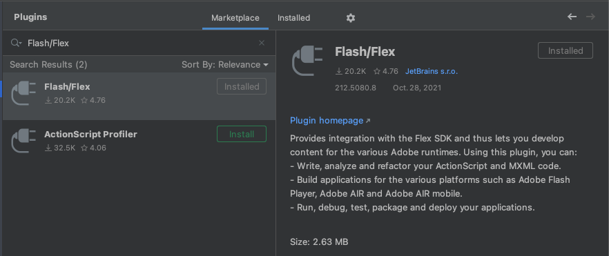

 

IntelliJ IDEA is an IDE developed by JetBrains. IntelliJ IDEA is an intelligent, context-aware IDE for working with Java 
and other JVM languages like Kotlin, Scala, and Groovy on all sorts of applications.

> Every aspect of IntelliJ IDEA is built to provide you with a seamless out-of-the-box experience. 
> It provides quick access to all the features and integrated tools that are important to your work, 
> as well as a wide range of customization options. You can fine-tune everything to support your workflow: 
> set shortcuts, install plugins, customize the interface to your liking, and more.

## Install IntelliJ

IntelliJ provides a complete integrated development environment for AIR (Flash/Flex) applications. 

You will need to purchase a license to use the IDE however it is well worth the investment. 

Download the IntelliJ installer:
 - [IntelliJ IDEA Ultimate](https://www.jetbrains.com/idea/download/)

## Install the Plugin 

The Flash/Flex plugin provides integration with the AIR SDK, including the ability to write, analyze 
and refactor your ActionScript and MXML code and comprehensive debugging tools. 

- Open the IDE settings and select **Plugins**
  - macOS: `Preferences > Plugins`
  - Windows: `File > Settings > Plugins`
- Select the **Marketplace** and search for the **Flash/Flex** plugin

- Click **Install** 

> Read [here](https://plugins.jetbrains.com/plugin/14508-flash-flex/versions) for more information on the plugin and see the [IntelliJ documentation](https://www.jetbrains.com/help/idea/2020.1/actionscript-flex-and-air.html) on using the plugin.

