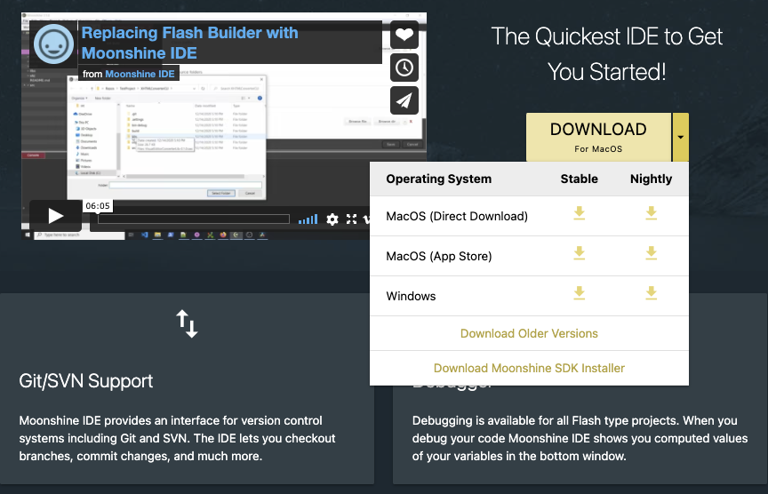

 

Moonshine is a free IDE built with [Apache Flex®](https://flex.apache.org/) and Adobe Air. You can create ActionScript 3, 
Apache Flex®, [Apache Royale®](https://royale.apache.org/) and [Feathers](https://feathersui.com/) projects from Moonshine. 
It also provides cloud support.

## Install Moonshine IDE

To install the Moonshine IDE download and run the install for your platform:

- [Download](https://moonshine-ide.com) 

If you are on macOS you may wish to download the additional [Moonshine SDK Installer](https://moonshine-ide.com/download-sdk-installer/).

For more information on the Moonshine IDE see the [website](https://moonshine-ide.com)

