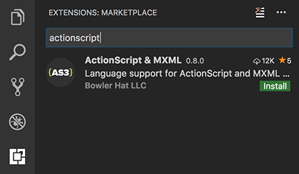

 

Visual Studio Code is a lightweight but powerful source code editor which runs on your desktop and is available for Windows, macOS and Linux. 

It has become the "go to" editor for a lot of modern developers.

## Install VS Code

To install firstly download the installer for your platform:

- [Download](https://code.visualstudio.com) 

and follow the instructions for your platform:

- [macOS](https://code.visualstudio.com/docs/setup/mac)
- [Windows](https://code.visualstudio.com/docs/setup/windows)

We highly recommend setting up launching from the command line which makes opening a VS Code editor in your project much easier.

## Install the Plugin 

Once you have installed VS Code you can install the [Actionscript & MXML extension](https://as3mxml.com) by launching Visual Studio Code and searching for the extension:

- Open the **Extensions** view.
- Search for *ActionScript*.
- Look for the **ActionScript & MXML** extension created by Bowler Hat LLC.
- Click the **Install** button.

There are details on getting your SDK setup and creating a new project [here](https://github.com/BowlerHatLLC/vscode-as3mxml/wiki/Install-the-ActionScript-and-MXML-extension-for-Visual-Studio-Code)
