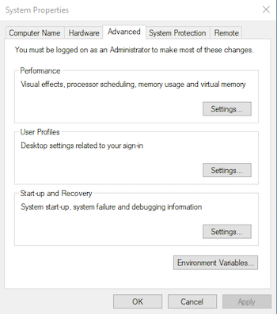
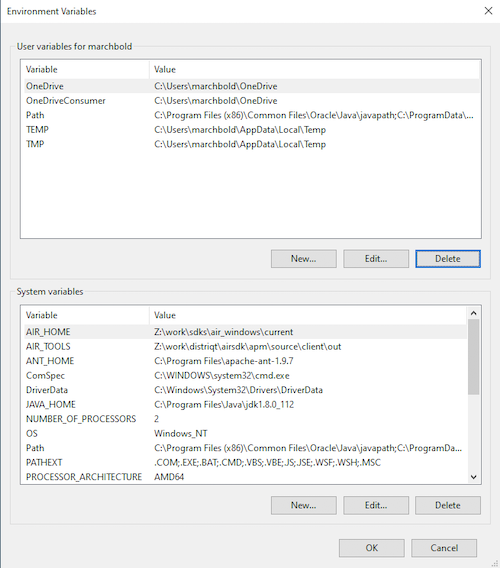
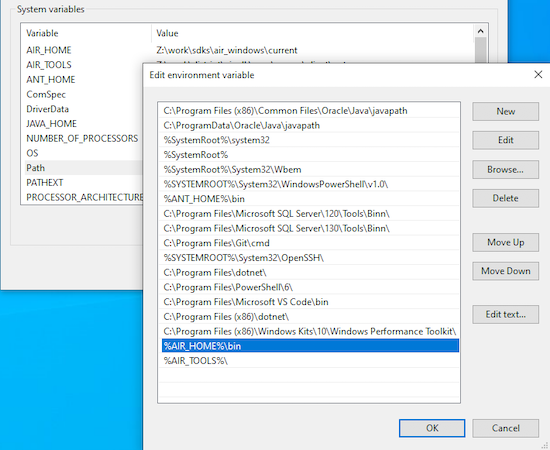

import APMDownload from '../../src/components/docs/APMDownload.tsx';

import Tabs from '@theme/Tabs';
import TabItem from '@theme/TabItem';

The AIR Package Manager (`apm`) is the AIR SDK package manager and allows management of AIR libraries and 
extensions along with a range of utilities that assist in creation of an AIR application.

While not required we highly recommend installing `apm` as it will make development of your 
AIR applications much easier.


## Download

Download the latest version of APM from github releases:

<APMDownload />

The compiled version of apm will be available as a zip asset file. Simply download this zip and extract it somewhere. (We use `~/bin/air-tools` but feel free to choose your own location).

We will reference this folder in the next step to make it accessible everywhere.


## Environment Setup

Here we are going to add some environment variables to make sure that `apm` is accessible everywhere in your terminal.

<Tabs
  groupId="operating-system"
  defaultValue="macos"
  values={[
    {label: 'macOS', value: 'macos'},
    {label: 'Windows', value: 'windows'},
  ]}>

<TabItem value="macos" >

Open your terminal application and determine the shell type you are using

```
echo $0
```

This should output something like `-zsh`, though it may output `-bash` if you are still using the older bash shell.

Once you know the shell type open the `~/.zshrc` or `~/.bashrc` script and add the following to the end.
You likely added the path to your AIR SDK (`AIR_HOME`) previously so we suggest adding this just after that information:

```
export AIR_HOME=/path/to/your/air/sdk
export AIR_TOOLS=/path/to/apmfolder

export PATH="${PATH}":"${AIR_HOME}/bin":"${AIR_TOOLS}"
```

</TabItem>
<TabItem value="windows" >

Open the "System Properties" dialog, either by searching or right clicking on your "Computer" icon and 
choose "Properties", "System", then "Advanced system settings".



On the "Advanced" tab click the "Environment Variables" button to open the environment variables dialog: 



> Note these can be added as user or system variables, we have done it as system variables above but feel free to use whatever suits your setup.

Add the `AIR_HOME` and `AIR_TOOLS` environment variables, 
- `AIR_HOME` should point to the folder of your AIR SDK and;
- `AIR_TOOLS` should be to the folder you extracted APM into. 

You can see our examples above.

Select the `Path` variable and click "Edit", then add two new entries:

```
%AIR_HOME%\bin
%AIR_TOOLS%\
```



> 
> On Windows we highly recommend using the new [Windows Terminal](https://www.microsoft.com/en-us/p/windows-terminal/9n0dx20hk701) application, this will give you the best experience with APM as it supports terminal escape control characters which allow us to do progress indicators and give better feedback from the command.
> 

</TabItem>
  
</Tabs>


## Verify Installation

Confirm you can use the `apm` client by opening up a terminal and running `apm -version`. 
You should see the version of apm output to the terminal, for example:

```
$ apm -version
1.0.0
```

