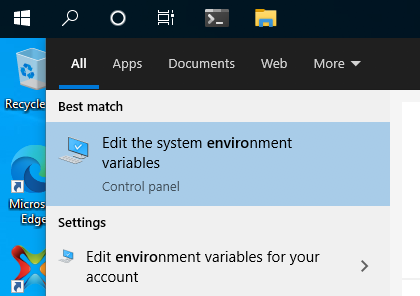

import Tabs from '@theme/Tabs';
import TabItem from '@theme/TabItem';

import AIRSDKDownload from '../../../src/components/docs/AIRSDKDownload.tsx';
import AIRSDKManagerDownload from '../../../src/components/docs/AIRSDKManagerDownload.tsx';

## System Requirements

To install and run AIR your development environment must meet these minimum requirements:

- Windows 7 or later
- 1.3GB free disk space (for the AIR SDK and does not include other tools)
- A version of Java 11 JDK


## Install the SDK

You have two options to install the AIR SDK. The recommended method is to use the AIR SDK Manager. The manager will inform you of available updates and minimise the download required for each update.

Alternatively you can manually download the AIR SDK. 

<Tabs
  groupId="airsdkmanager"
  defaultValue="airsdkmanager"
  values={[
    {label: 'AIR SDK Manager', value: 'airsdkmanager'},
    {label: 'Manual', value: 'manual'},
  ]}>

<TabItem value="airsdkmanager" >


1. Download the latest release bundle of the AIR SDK Manager:

<AIRSDKManagerDownload platform="windows" />

2. Start the installer and follow the prompts to install the application.

3. Once installed, set the **AIR SDKs Location** on your machine. 

:::note AIR SDK Location
This location will be where the AIR SDK Manager installs versions of the AIR SDK. This can be an existing directory of AIR SDKs however it is recommended to select a new location, eg `C:\Users\<your-user-name>\sdks\air`

The manager will construct a directory for each major version of the AIR SDK (eg `AIRSDK_50.2.1`), with point releases just be considered as updates. 
:::

4. Select one of the available SDK versions and click the gear icon to **Install** the SDK. Once installed you can click **Locate** to locate the installation.


</TabItem>
<TabItem value="manual" >


1. Download the latest release bundle of the AIR SDK:

<AIRSDKDownload platform="windows" />

> For older versions see the [SDK releases](https://airsdk.harman.com/release_notes) page.

2. Extract the bundle in the desired location, for example: `C:\Users\<your-user-name>\sdks\air\AIRSDK_50.2.1`.

:::warning
Warning: Do not install the AIR SDK in a directory like `C:\Program Files\`. These directories may require elevated privilages and can affect the operation of the AIR SDK.
:::

</TabItem>
</Tabs>


## Set your Environment

Next you will want to add the AIR SDK tools to your path so you can execute the build commands from any console.

1. Open the **Environment Variables** window by searching for "Edit environment variables" in the search bar:



2. Add a variable called `AIR_HOME` and set it to the location where you extracted the AIR SDK (eg `C:\Users\<your-user-name>\sdks\air\AIRSDK_50.2.1`)

3. Locate the `Path` Variable:

- If it exists, append `%AIR_HOME%\bin` using `;` as a separator (or select edit and add a **New** entry);
- If it doesn't exist, create a new variable with the name `Path` and value `%AIR_HOME%\bin`

4. Close and reopen any active console windows

5. Verify the AIR SDK `bin` directory is in your path by running:

```shell
echo %Path%
```

or if you are using Powershell:

```shell
$Env:Path
```

Verify you can access the AIR SDK commands by running:

```shell
where.exe adt
```

:::note
You can check the version of the AIR SDK by running

```shell
adt -version
```

:::

## Android setup

:::note
AIR relies on the Android SDK and build tools in order to produce AAB builds and support the latest Android functionality.

You can either install the Android SDK directly or we suggest you install Android Studio (which includes the SDK) as this makes the installation process easier and provides additional debugging tools.
:::

### Install Android Studio

1. Download [Android Studio](https://developer.android.com/studio)
2. Start Android studio and run through the setup wizard which will install the latest Android SDK, command line tools and build tools.

### Set up your Android device

If you have an Android device you intend on debugging with you must make sure you have set up the device for debugging.

1. In order to debug an application on an Android device you need to enable "Developer Mode" and then enable USB debugging. Detailed process is described in the [Android documentation](https://developer.android.com/studio/debug/dev-options).
2. Plug your device into your machine using a cable, and you should receive a prompt on the device to authorise access via the computer;
3. Run the following command and you should see a device listed:

```shell
adt -devices -platform android
```

### Java

You must make sure you have the Java Developmet Kit (JDK) installed and that your `JAVA_HOME` environment variable is set to the JDK's folder. 

We currently recommend using Java 17 but check the release notes for any changes.

- [Java SE 17 Archive Downloads](https://www.oracle.com/java/technologies/javase/jdk17-archive-downloads.html)