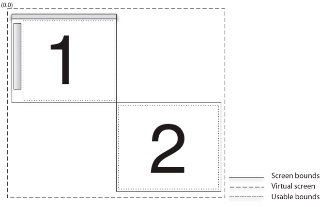

# Display screens in AIR

Use the Adobe® AIR® Screen class to access information about the display screens
attached to a computer or device.

## Basics of display screens in AIR

- [Measuring the virtual desktop](https://web.archive.org/web/20141221172408/http://www.adobe.com/devnet/air/flex/quickstart/articles/screens_virtual_desktop.html)
  (Flex)

- [Measuring the virtual desktop](https://web.archive.org/web/20141221164920/http://www.adobe.com/devnet/air/flash/quickstart/articles/screens_virtual_desktop.html)
  (Flash)

The screen API contains a single class, Screen, which provides static members
for getting system screen information, and instance members for describing a
particular screen.

A computer system can have several monitors or displays attached, which can
correspond to several desktop screens arranged in a virtual space. The AIR
Screen class provides information about the screens, their relative arrangement,
and their usable space. If more than one monitor maps to the same screen, only
one screen exists. If the size of a screen is larger than the display area of
the monitor, there is no way to determine which portion of the screen is
currently visible.

A screen represents an independent desktop display area. Screens are described
as rectangles within the virtual desktop. The upper-left corner of screen
designated as the primary display is the origin of the virtual desktop
coordinate system. All values used to describe a screen are provided in pixels.

In this screen arrangement, two screens exist on the virtual desktop. The
coordinates of the upper-left corner of the main screen (#1) are always (0,0).
If the screen arrangement is changed to designate screen \#2 as the main screen,
then the coordinates of screen \#1 become negative. Menubars, taskbars, and
docks are excluded when reporting the usable bounds for a screen.

For detailed information about the screen API class, methods, properties, and
events, see the
[Screen](https://help.adobe.com/en_US/FlashPlatform/reference/actionscript/3/flash/display/Screen.html)
class listing in the
[ActionScript 3.0 Reference for the Adobe Flash Platform](https://help.adobe.com/en_US/FlashPlatform/reference/actionscript/3/index.html).

## Enumerating the screens

You can enumerate the screens of the virtual desktop with the following screen
methods and properties:

| Method or Property              | Description                                                                                                                                                                                                                                                                                                                    |
| ------------------------------- | ------------------------------------------------------------------------------------------------------------------------------------------------------------------------------------------------------------------------------------------------------------------------------------------------------------------------------ |
| Screen.screens                  | Provides an array of Screen objects describing the available screens. The order of the array is not significant.                                                                                                                                                                                                               |
| Screen.mainScreen               | Provides a Screen object for the main screen. On Mac OS X, the main screen is the screen displaying the menu bar. On Windows, the main screen is the system-designated primary screen.                                                                                                                                         |
| Screen.getScreensForRectangle() | Provides an array of Screen objects describing the screens intersected by the given rectangle. The rectangle passed to this method is in pixel coordinates on the virtual desktop. If no screens intersect the rectangle, then the array is empty. You can use this method to find out on which screens a window is displayed. |

Do not save the values returned by the Screen class methods and properties. The
user or operating system can change the available screens and their arrangement
at any time.

The following example uses the screen API to move a window between multiple
screens in response to pressing the arrow keys. To move the window to the next
screen, the example gets the `screens` array and sorts it either vertically or
horizontally (depending on the arrow key pressed). The code then walks through
the sorted array, comparing each screen to the coordinates of the current
screen. To identify the current screen of the window, the example calls
`Screen.getScreensForRectangle()`, passing in the window bounds.

    package
    {
    	import flash.display.Sprite;
    	import flash.display.Screen;
    	import flash.events.KeyboardEvent;
    	import flash.ui.Keyboard;
    	import flash.display.StageAlign;
    	import flash.display.StageScaleMode;

    	public class ScreenExample extends Sprite
    	{
    		public function ScreenExample()
    		{
    				stage.align = StageAlign.TOP_LEFT;
    				stage.scaleMode = StageScaleMode.NO_SCALE;

    				stage.addEventListener(KeyboardEvent.KEY_DOWN,onKey);
    		}

    		private function onKey(event:KeyboardEvent):void{
    			if(Screen.screens.length > 1){
    				switch(event.keyCode){
    					case Keyboard.LEFT :
    						moveLeft();
    						break;
    					case Keyboard.RIGHT :
    						moveRight();
    						break;
    					case Keyboard.UP :
    						moveUp();
    						break;
    					case Keyboard.DOWN :
    						moveDown();
    						break;
    				}
    			}
    		}

    		private function moveLeft():void{
    			var currentScreen = getCurrentScreen();
    			var left:Array = Screen.screens;
    			left.sort(sortHorizontal);
    			for(var i:int = 0; i < left.length - 1; i++){
    				if(left[i].bounds.left < stage.nativeWindow.bounds.left){
    					stage.nativeWindow.x +=
    						left[i].bounds.left - currentScreen.bounds.left;
    					stage.nativeWindow.y += left[i].bounds.top - currentScreen.bounds.top;
    				}
    			}
    		}

    		private function moveRight():void{
    			var currentScreen:Screen = getCurrentScreen();
    			var left:Array = Screen.screens;
    			left.sort(sortHorizontal);
    			for(var i:int = left.length - 1; i > 0; i--){
    				if(left[i].bounds.left > stage.nativeWindow.bounds.left){
    					stage.nativeWindow.x +=
    						left[i].bounds.left - currentScreen.bounds.left;
    					stage.nativeWindow.y += left[i].bounds.top - currentScreen.bounds.top;
    				}
    			}
    		}

    		private function moveUp():void{
    			var currentScreen:Screen = getCurrentScreen();
    			var top:Array = Screen.screens;
    			top.sort(sortVertical);
    			for(var i:int = 0; i < top.length - 1; i++){
    				if(top[i].bounds.top < stage.nativeWindow.bounds.top){
    					stage.nativeWindow.x += top[i].bounds.left - currentScreen.bounds.left;
    					stage.nativeWindow.y += top[i].bounds.top - currentScreen.bounds.top;
    					break;
    				}
    			}
    		}

    		private function moveDown():void{
    			var currentScreen:Screen = getCurrentScreen();

    			var top:Array = Screen.screens;
    			top.sort(sortVertical);
    			for(var i:int = top.length - 1; i > 0; i--){
    				if(top[i].bounds.top > stage.nativeWindow.bounds.top){
    					stage.nativeWindow.x += top[i].bounds.left - currentScreen.bounds.left;
    					stage.nativeWindow.y += top[i].bounds.top - currentScreen.bounds.top;
    					break;
    				}
    			}
    		}

    		private function sortHorizontal(a:Screen,b:Screen):int{
    			if (a.bounds.left > b.bounds.left){
    				return 1;
    			} else if (a.bounds.left < b.bounds.left){
    				return -1;
    			} else {return 0;}
    		}

    		private function sortVertical(a:Screen,b:Screen):int{
    			if (a.bounds.top > b.bounds.top){
    				return 1;
    			} else if (a.bounds.top < b.bounds.top){
    				return -1;
    			} else {return 0;}
    		}

    		private function getCurrentScreen():Screen{
    			var current:Screen;
    			var screens:Array = Screen.getScreensForRectangle(stage.nativeWindow.bounds);
    			(screens.length > 0) ? current = screens[0] : current = Screen.mainScreen;
    			return current;
    		}
    	}
    }

More Help topics

[flash.display.Screen](https://help.adobe.com/en_US/FlashPlatform/reference/actionscript/3/flash/display/Screen.html)
