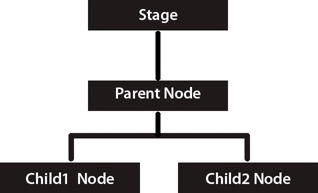
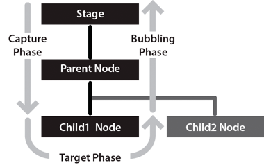

An event-handling system allows programmers to respond to user input and system events in a convenient way. The ActionScript 3.0 event model is not only convenient, but also standards-compliant, and well integrated with the display list. Based on the Document Object Model (DOM) Level 3 Events Specification, an industry-standard event-handling architecture, the new event model provides a powerful yet intuitive event-handling tool for ActionScript programmers.

The ActionScript 3.0 event-handling system interacts closely with the display list. To gain a basic understanding of the display list, read Display programming .


## Basics of handling events

You can think of events as occurrences of any kind in your SWF file that are of interest to you as a programmer. For example, most SWF files support user interaction of some sort—whether it's something as simple as responding to a mouse click or something more complex, such as accepting and processing data entered into a form. Any such user interaction with your SWF file is considered an event. Events can also occur without any direct user interaction, such as when data has finished loading from a server or when an attached camera has become active.

In ActionScript 3.0, each event is represented by an event object, which is an instance of the Event class or one of its subclasses. An event object not only stores information about a specific event, but also contains methods that facilitate manipulation of the event object. For example, when Flash Player or AIR detects a mouse click, it creates an event object (an instance of the MouseEvent class) to represent that particular mouse click event.

After creating an event object, Flash Player or AIR dispatches it, which means that the event object is passed to the object that is the target of the event. An object that serves as the destination for a dispatched event object is called an event target . For example, when an attached camera becomes active, Flash Player dispatches an event object directly to the event target, which in this case is the object that represents the camera. If the event target is on the display list, however, the event object is passed down through the display list hierarchy until it reaches the event target. In some cases, the event object then “bubbles” back up the display list hierarchy along the same route. This traversal of the display list hierarchy is called the event flow .

You can “listen” for event objects in your code using event listeners. Event listeners are the functions or methods that you write to respond to specific events. To ensure that your program responds to events, you must add event listeners either to the event target or to any display list object that is part of an event object’s event flow.

Any time you write event listener code, it follows this basic structure (elements in bold are placeholders you’d fill in for your specific case):

function eventResponse(eventObject:EventType):void 
{ 
    // Actions performed in response to the event go here. 
} 
 
eventTarget.addEventListener(EventType.EVENT_NAME, eventResponse);
This code does two things. First, it defines a function, which is the way to specify the actions that will be performed in response to the event. Next, it calls the addEventListener() method of the source object, in essence “subscribing” the function to the specified event so that when the event happens, the function’s actions are carried out. When the event actually happens, the event target checks its list of all the functions and methods that are registered as event listeners. It then calls each one in turn, passing the event object as a parameter.

You need to alter four things in this code to create your own event listener. First, you must change the name of the function to the name you want to use (this must be changed in two places, where the code says eventResponse ). Second, you must specify the appropriate class name of the event object that is dispatched by the event you want to listen for ( EventType in the code), and you must specify the appropriate constant for the specific event ( EVENT_NAME in the listing). Third, you must call the addEventListener() method on the object that will dispatch the event ( eventTarget in this code). Optionally, you can change the name of the variable used as the function’s parameter ( eventObject in this code).

Important concepts and terms
The following reference list contains important terms that you will encounter when writing event-handling routines:

Bubbling Bubbling occurs for some events so that a parent display object can respond to events dispatched by its children.
Bubbling phase The part of the event flow in which an event propagates up to parent display objects. The bubbling phase occurs after the capture and target phases.
Capture phase The part of the event flow in which an event propagates down from the most general target to the most specific target object. The capture phase occurs before the target and bubbling phases.
Default behavior Some events include a behavior that normally happens along with the event, known as the default behavior. For example, when a user types text in a text field, a text input event is raised. The default behavior for that event is to actually display the character that was typed into the text field—but you can override that default behavior (if for some reason you don’t want the typed character to be displayed).
Dispatch To notify event listeners that an event has occurred.
Event Something that happens to an object that the object can tell other objects about.
Event flow When events happen to an object on the display list (an object displayed on the screen), all the objects that contain the object are notified of the event and notify their event listeners in turn. This process starts with the Stage and proceeds through the display list to the actual object where the event occurred, and then proceeds back to the Stage again. This process is known as the event flow.
Event object An object that contains information about a particular event’s occurrence, which is sent to all listeners when an event is dispatched.
Event target The object that actually dispatches an event. For example, if the user clicks a button that is inside a Sprite that is in turn inside the Stage, all those objects dispatch events, but the event target is the one where the event actually happened—in this case, the clicked button.
Listener An object or function that has registered itself with an object, to indicate that it should be notified when a specific event takes place.
Target phase The point of the event flow at which an event has reached the most specific possible target. The target phase occurs between the capture and the bubbling phases.


## The event flow

Flash Player or AIR dispatches event objects whenever an event occurs. If the event target is not on the display list, Flash Player or AIR dispatches the event object directly to the event target. For example, Flash Player dispatches the progress event object directly to a URLStream object. If the event target is on the display list, however, Flash Player dispatches the event object into the display list, and the event object travels through the display list to the event target.

The event flow describes how an event object moves through the display list. The display list is organized in a hierarchy that can be described as a tree. At the top of the display list hierarchy is the Stage, which is a special display object container that serves as the root of the display list. The Stage is represented by the flash.display.Stage class and can only be accessed through a display object. Every display object has a property named stage that refers to the Stage for that application.

When Flash Player or AIR dispatches an event object for a display list-related event, that event object makes a round-trip journey from the Stage to the target node . The DOM Events Specification defines the target node as the node representing the event target. In other words, the target node is the display list object where the event occurred. For example, if a user clicks on a display list object named child1 , Flash Player or AIR will dispatch an event object using child1 as the target node.

The event flow is conceptually divided into three parts. The first part is called the capture phase; this phase comprises all of the nodes from the Stage to the parent of the target node. The second part is called the target phase, which consists solely of the target node. The third part is called the bubbling phase. The bubbling phase comprises the nodes encountered on the return trip from the parent of the target node back to the Stage.

The names of the phases make more sense if you conceive of the display list as a vertical hierarchy with the Stage at the top, as shown in the following diagram:



If a user clicks on Child1 Node , Flash Player or AIR dispatches an event object into the event flow. As the following image shows, the object’s journey starts at Stage , moves down to Parent Node , then moves to Child1 Node, and then “bubbles” back up to Stage , moving through Parent Node again on its journey back to Stage .




In this example, the capture phase comprises Stage and Parent Node during the initial downward journey. The target phase comprises the time spent at Child1 Node . The bubbling phase comprises Parent Node and Stage as they are encountered during the upward journey back to the root node.

The event flow contributes to a more powerful event-handling system than that previously available to ActionScript programmers. In previous versions of ActionScript, the event flow does not exist, which means that event listeners can be added only to the object that generates the event. In ActionScript 3.0, you can add event listeners not only to a target node, but also to any node along the event flow.

The ability to add event listeners along the event flow is useful when a user interface component comprises more than one object. For example, a button object often contains a text object that serves as the button’s label. Without the ability to add a listener to the event flow, you would have to add a listener to both the button object and the text object to ensure that you receive notification about click events that occur anywhere on the button. The existence of the event flow, however, allows you to place a single event listener on the button object that handles click events that occur either on the text object or on the areas of the button object that are not obscured by the text object.

Not every event object, however, participates in all three phases of the event flow. Some types of events, such as the enterFrame and init event types, are dispatched directly to the target node and participate in neither the capture phase nor the bubbling phase. Other events may target objects that are not on the display list, such as events dispatched to an instance of the Socket class. These event objects will also flow directly to the target object, without participating in the capture and bubbling phases.

To find out how a particular event type behaves, you can either check the API documentation or examine the event object's properties. Examining the event object’s properties is described in the following section.


## Event objects

Event objects serve two main purposes in the new event-handling system. First, event objects represent actual events by storing information about specific events in a set of properties. Second, event objects contain a set of methods that allow you to manipulate event objects and affect the behavior of the event-handling system.

To facilitate access to these properties and methods, the Flash Player API defines an Event class that serves as the base class for all event objects. The Event class defines a fundamental set of properties and methods that are common to all event objects.

This section begins with a discussion of the Event class properties, continues with a description of the Event class methods, and concludes with an explanation of why subclasses of the Event class exist.

### Understanding Event class properties

The Event class defines a number of read-only properties and constants that provide important information about an event object.The following are especially important:

Event object types are represented by constants and stored in the Event.type property.

Whether an event’s default behavior can be prevented is represented by a Boolean value and stored in the Event.cancelable property.

Event flow information is contained in the remaining properties.

#### Event object types

Every event object has an associated event type. Event types are stored in the Event.type property as string values. It is useful to know the type of an event object so that your code can distinguish objects of different types from one another. For example, the following code specifies that the clickHandler() listener function should respond to any mouse click event objects that are passed to myDisplayObject :

```actionscript
myDisplayObject.addEventListener(MouseEvent.CLICK, clickHandler);
```

Some two dozen event types are associated with the Event class itself and are represented by Event class constants, some of which are shown in the following excerpt from the Event class definition:

```actionscript
package flash.events 
{ 
    public class Event 
    { 
        // class constants 
        public static const ACTIVATE:String = "activate"; 
        public static const ADDED:String= "added"; 
        // remaining constants omitted for brevity 
    } 
}
```

These constants provide an easy way to refer to specific event types. You should use these constants instead of the strings they represent. If you misspell a constant name in your code, the compiler will catch the mistake, but if you instead use strings, a typographical error may not manifest at compile time and could lead to unexpected behavior that could be difficult to debug. For example, when adding an event listener, use the following code:

```actionscript
myDisplayObject.addEventListener(MouseEvent.CLICK, clickHandler);
```

rather than:

```actionscript
myDisplayObject.addEventListener("click", clickHandler);
```

#### Default behavior information

Your code can check whether the default behavior for any given event object can be prevented by accessing the cancelable property. The cancelable property holds a Boolean value that indicates whether or not a default behavior can be prevented. You can prevent, or cancel, the default behavior associated with a small number of events using the preventDefault() method. For more information, see Canceling default event behavior under Understanding Event class methods .

#### Event flow information

The remaining Event class properties contain important information about an event object and its relationship to the event flow, as described in the following list:

- The `bubbles` property contains information about the parts of the event flow in which the event object participates.
- The `eventPhase` property indicates the current phase in the event flow.
- The `target` property stores a reference to the event target.
- The `currentTarget` property stores a reference to the display list object that is currently processing the event object.


#### The `bubbles` property

An event is said to bubble if its event object participates in the bubbling phase of the event flow, which means that the event object is passed from the target node back through its ancestors until it reaches the Stage. The Event.bubbles property stores a Boolean value that indicates whether the event object participates in the bubbling phase. Because all events that bubble also participate in the capture and target phases, any event that bubbles participates in all three of the event flow phases. If the value is true , the event object participates in all three phases. If the value is false , the event object does not participate in the bubbling phase.

#### The `eventPhase` property

You can determine the event phase for any event object by investigating its eventPhase property. The eventPhase property contains an unsigned integer value that represents one of the three phases of the event flow. The Flash Player API defines a separate EventPhase class that contains three constants that correspond to the three unsigned integer values, as shown in the following code excerpt:

```actionscript
package flash.events 
{ 
    public final class EventPhase 
    { 
        public static const CAPTURING_PHASE:uint = 1; 
        public static const AT_TARGET:uint = 2; 
        public static const BUBBLING_PHASE:uint= 3; 
    } 
}
```

These constants correspond to the three valid values of the eventPhase property. You can use these constants to make your code more readable. For example, if you want to ensure that a function named myFunc() is called only if the event target is in the target stage, you can use the following code to test for this condition:

```actionscript
if (event.eventPhase == EventPhase.AT_TARGET) 
{ 
    myFunc(); 
}
```

#### The `target` property

The target property holds a reference to the object that is the target of the event. In some cases, this is straightforward, such as when a microphone becomes active, the target of the event object is the Microphone object. If the target is on the display list, however, the display list hierarchy must be taken into account. For example, if a user inputs a mouse click on a point that includes overlapping display list objects, Flash Player and AIR always choose the object that is farthest away from the Stage as the event target.

For complex SWF files, especially those in which buttons are routinely decorated with smaller child objects, the target property may not be used frequently because it will often point to a button’s child object instead of the button. In these situations, the common practice is to add event listeners to the button and use the currentTarget property because it points to the button, whereas the target property may point to a child of the button.

#### The `currentTarget` property

The currentTarget property contains a reference to the object that is currently processing the event object. Although it may seem odd not to know which node is currently processing the event object that you are examining, keep in mind that you can add a listener function to any display object in that event object's event flow, and the listener function can be placed in any location. Moreover, the same listener function can be added to different display objects. As a project increases in size and complexity, the currentTarget property becomes more and more useful.


### Understanding Event class methods

There are three categories of Event class methods:
 
- Utility methods, which can create copies of an event object or convert it to a string
- Event flow methods, which remove event objects from the event flow
- Default behavior methods, which prevent default behavior or check whether it has been prevented

#### Event class utility methods

There are two utility methods in the Event class. The clone() method allows you to create copies of an event object. The toString() method allows you to generate a string representation of the properties of an event object along with their values. Both of these methods are used internally by the event model system, but are exposed to developers for general use.

For advanced developers creating subclasses of the Event class, you must override and implement versions of both utility methods to ensure that the event subclass will work properly.

#### Stopping event flow

You can call either the `Event.stopPropagation()` method or the `Event.stopImmediatePropagation()` method to prevent an event object from continuing on its way through the event flow. The two methods are nearly identical and differ only in whether the current node’s other event listeners are allowed to execute:

The `Event.stopPropagation()` method prevents the event object from moving on to the next node, but only after any other event listeners on the current node are allowed to execute.

The `Event.stopImmediatePropagation()` method also prevents the event object from moving on to the next node, but does not allow any other event listeners on the current node to execute.

Calling either of these methods has no effect on whether the default behavior associated with an event occurs. Use the default behavior methods of the Event class to prevent default behavior.


#### Canceling default event behavior

The two methods that pertain to canceling default behavior are the `preventDefault()` method and the `isDefaultPrevented()` method. Call the `preventDefault()` method to cancel the default behavior associated with an event. To check whether `preventDefault()` has already been called on an event object, call the `isDefaultPrevented()` method, which returns a value of true if the method has already been called and false otherwise.

The `preventDefault()` method will work only if the event’s default behavior can be cancelled. You can check whether this is the case by referring to the API documentation for that event type, or by using ActionScript to examine the cancelable property of the event object.

Canceling the default behavior has no effect on the progress of an event object through the event flow. Use the event flow methods of the Event class to remove an event object from the event flow.

### Subclasses of the Event class

For many events, the common set of properties defined in the Event class is sufficient. Other events, however, have unique characteristics that cannot be captured by the properties available in the Event class. For these events, ActionScript 3.0 defines several subclasses of the Event class.

Each subclass provides additional properties and event types that are unique to that category of events. For example, events related to mouse input have several unique characteristics that cannot be captured by the properties defined in the Event class. The MouseEvent class extends the Event class by adding ten properties that contain information such as the location of the mouse event and whether specific keys were pressed during the mouse event.

An Event subclass also contains constants that represent the event types that are associated with the subclass. For example, the MouseEvent class defines constants for several mouse event types, include the click , doubleClick , mouseDown , and mouseUp event types.

As described in the section on Event class utility methods under Event objects , when creating an Event subclass you must override the clone() and toString() methods to provide functionality specific to the subclass.


## Event listeners

Event listeners, which are also called event handlers, are functions that Flash Player and AIR execute in response to specific events. Adding an event listener is a two-step process. First, you create a function or class method for Flash Player or AIR to execute in response to the event. This is sometimes called the listener function or the event handler function. Second, you use the addEventListener() method to register your listener function with the target of the event or any display list object that lies along the appropriate event flow.

### Creating a listener function

The creation of listener functions is one area where the ActionScript 3.0 event model deviates from the DOM event model. In the DOM event model, there is a clear distinction between an event listener and a listener function: an event listener is an instance of a class that implements the EventListener interface, whereas a listener function is a method of that class named handleEvent() . In the DOM event model, you register the class instance that contains the listener function rather than the actual listener function.

In the ActionScript 3.0 event model, there is no distinction between an event listener and a listener function. ActionScript 3.0 does not have an EventListener interface, and listener functions can be defined outside a class or as part of a class. Moreover, listener functions do not have to be named handleEvent() —they can be named with any valid identifier. In ActionScript 3.0, you register the name of the actual listener function.

#### Listener function defined outside of a class

The following code creates a simple SWF file that displays a red square shape. A listener function named clickHandler() , which is not part of a class, listens for mouse click events on the red square.

```actionscript
package 
{ 
    import flash.display.Sprite; 
 
    public class ClickExample extends Sprite 
    { 
        public function ClickExample() 
        { 
            var child:ChildSprite = new ChildSprite(); 
            addChild(child); 
        } 
    } 
} 
 
import flash.display.Sprite; 
import flash.events.MouseEvent; 
 
class ChildSprite extends Sprite 
{ 
    public function ChildSprite() 
    { 
        graphics.beginFill(0xFF0000); 
        graphics.drawRect(0,0,100,100); 
        graphics.endFill(); 
        addEventListener(MouseEvent.CLICK, clickHandler); 
    } 
} 
 
function clickHandler(event:MouseEvent):void 
{ 
    trace("clickHandler detected an event of type: " + event.type); 
    trace("the this keyword refers to: " + this); 
}
```

When a user interacts with the resulting SWF file by clicking on the square, Flash Player or AIR generates the following trace output:

```
clickHandler detected an event of type: click 
the this keyword refers to: [object global]
```

Notice that the event object is passed as an argument to clickHandler() . This allows your listener function to examine the event object. In this example, you use the event object's type property to ascertain that the event is a click event.

The example also checks the value of the this keyword. In this case, this represents the global object, which makes sense because the function is defined outside of any custom class or object.

#### Listener function defined as a class method

The following example is identical to the previous example that defines the ClickExample class except that the clickHandler() function is defined as a method of the ChildSprite class:

```actionscript
package 
{ 
    import flash.display.Sprite; 
 
    public class ClickExample extends Sprite 
    { 
        public function ClickExample() 
        { 
            var child:ChildSprite = new ChildSprite(); 
            addChild(child); 
        } 
    } 
} 
 
import flash.display.Sprite; 
import flash.events.MouseEvent; 
 
class ChildSprite extends Sprite 
{ 
    public function ChildSprite() 
    { 
        graphics.beginFill(0xFF0000); 
        graphics.drawRect(0,0,100,100); 
        graphics.endFill(); 
        addEventListener(MouseEvent.CLICK, clickHandler); 
    } 
    private function clickHandler(event:MouseEvent):void 
    { 
        trace("clickHandler detected an event of type: " + event.type); 
        trace("the this keyword refers to: " + this); 
    } 
}
```

When a user interacts with the resulting SWF file by clicking on the red square, Flash Player or AIR generates the following trace output:

```
clickHandler detected an event of type: click 
the this keyword refers to: [object ChildSprite]
```

Note that the this keyword refers to the ChildSprite instance named child . This is a change in behavior from ActionScript 2.0. If you used components in ActionScript 2.0, you may remember that when a class method was passed in to UIEventDispatcher.addEventListener() , the scope of the method was bound to the component that broadcast the event instead of the class in which the listener method was defined. In other words, if you used this technique in ActionScript 2.0, the this keyword would refer to the component broadcasting the event instead of the ChildSprite instance.

This was a significant issue for some programmers because it meant that they could not access other methods and properties of the class containing the listener method. As a workaround, ActionScript 2.0 programmers could use the mx.util.Delegate class to change the scope of the listener method. This is no longer necessary, however, because ActionScript 3.0 creates a bound method when addEventListener() is called. As a result, the this keyword refers to the ChildSprite instance named child , and the programmer has access to the other methods and properties of the ChildSprite class.

#### Event listener that should not be used

There is a third technique in which you create a generic object with a property that points to a dynamically assigned listener function, but it is not recommended. It is discussed here because it was commonly used in ActionScript 2.0, but should not be used in ActionScript 3.0. This technique is not recommended because the this keyword will refer to the global object instead of your listener object.

The following example is identical to the previous ClickExample class example, except that the listener function is defined as part of a generic object named myListenerObj :

```actionscript
package 
{ 
    import flash.display.Sprite; 
 
    public class ClickExample extends Sprite 
    { 
        public function ClickExample() 
        { 
            var child:ChildSprite = new ChildSprite(); 
            addChild(child); 
        } 
    } 
} 
 
import flash.display.Sprite; 
import flash.events.MouseEvent; 
 
class ChildSprite extends Sprite 
{ 
    public function ChildSprite() 
    { 
        graphics.beginFill(0xFF0000); 
        graphics.drawRect(0,0,100,100); 
        graphics.endFill(); 
        addEventListener(MouseEvent.CLICK, myListenerObj.clickHandler); 
    } 
} 
 
var myListenerObj:Object = new Object(); 
myListenerObj.clickHandler = function (event:MouseEvent):void 
{ 
        trace("clickHandler detected an event of type: " + event.type); 
        trace("the this keyword refers to: " + this); 
}
```

The results of the trace will look like this:

```
clickHandler detected an event of type: click 
the this keyword refers to: [object global]
```

You would expect that this would refer to myListenerObj and that the trace output would be [object Object] , but instead it refers to the global object. When you pass in a dynamic property name as an argument to addEventListener() , Flash Player or AIR is unable to create a bound method. This is because what you are passing as the listener parameter is nothing more than the memory address of your listener function, and Flash Player and AIR have no way to link that memory address with the myListenerObj instance .

### Managing event listeners

You can manage your listener functions using the methods of the IEventDispatcher interface. The IEventDispatcher interface is the ActionScript 3.0 version of the EventTarget interface of the DOM event model. Although the name IEventDispatcher may seem to imply that its main purpose is to send (or dispatch) event objects, the methods of this class are actually used much more frequently to register event listeners, check for event listeners, and remove event listeners. The IEventDispatcher interface defines five methods, as shown in the following code:

```actionscript
package flash.events 
{ 
    public interface IEventDispatcher 
    { 
        function addEventListener(eventName:String,  
                        listener:Object, 
                        useCapture:Boolean=false, 
                        priority:Integer=0, 
                        useWeakReference:Boolean=false):Boolean; 
 
        function removeEventListener(eventName:String,  
                    listener:Object, 
                    useCapture:Boolean=false):Boolean; 
 
        function dispatchEvent(eventObject:Event):Boolean; 
 
        function hasEventListener(eventName:String):Boolean; 
        function willTrigger(eventName:String):Boolean; 
    } 
}
```
The Flash Player API implements the IEventDispatcher interface with the EventDispatcher class, which serves as a base class for all classes that can be event targets or part of an event flow. For example, the DisplayObject class inherits from the EventDispatcher class. This means that any object on the display list has access to the methods of the IEventDispatcher interface.

#### Adding event listeners

The addEventListener() method is the workhorse of the IEventDispatcher interface. You use it to register your listener functions. The two required parameters are type and listener . You use the type parameter to specify the type of event. You use the listener parameter to specify the listener function that will execute when the event occurs. The listener parameter can be a reference to either a function or a class method.

Do not use parentheses when you specify the listener parameter. For example, the clickHandler() function is specified without parentheses in the following call to the addEventListener() method:

```actionscript
addEventListener(MouseEvent.CLICK, clickHandler)
```

The useCapture parameter of the addEventListener() method allows you to control the event flow phase on which your listener will be active. If useCapture is set to true , your listener will be active during the capture phase of the event flow. If useCapture is set to false , your listener will be active during the target and bubbling phases of the event flow. To listen for an event during all phases of the event flow, you must call addEventListener() twice, once with useCapture set to true , and then again with useCapture set to false .

The priority parameter of the addEventListener() method is not an official part of the DOM Level 3 event model. It is included in ActionScript 3.0 to provide you with more flexibility in organizing your event listeners. When you call addEventListener() , you can set the priority for that event listener by passing an integer value as the priority parameter. The default value is 0, but you can set it to negative or positive integer values. The higher the number, the sooner that event listener will be executed. Event listeners with the same priority are executed in the order that they were added, so the earlier a listener is added, the sooner it will be executed.

The useWeakReference parameter allows you to specify whether the reference to the listener function is weak or normal. Setting this parameter to true allows you to avoid situations in which listener functions persist in memory even though they are no longer needed. Flash Player and AIR use a technique called garbage collection to clear objects from memory that are no longer in use. An object is considered no longer in use if no references to it exist. The garbage collector disregards weak references, which means that a listener function that has only a weak reference pointing to it is eligible for garbage collection.

#### Removing event listeners

You can use the `removeEventListener()` method to remove an event listener that you no longer need. It is a good idea to remove any listeners that will no longer be used. Required parameters include the eventName and listener parameters, which are the same as the required parameters for the addEventListener() method. Recall that you can listen for events during all event phases by calling addEventListener() twice, once with useCapture set to true , and then again with it set to false . To remove both event listeners, you would need to call removeEventListener() twice, once with useCapture set to true , and then again with it set to false .

#### Dispatching events

The `dispatchEvent()` method can be used by advanced programmers to dispatch a custom event object into the event flow. The only parameter accepted by this method is a reference to an event object, which must be an instance of the Event class or a subclass of the Event class. Once dispatched, the target property of the event object is set to the object on which `dispatchEvent()` was called.

#### Checking for existing event listeners

The final two methods of the IEventDispatcher interface provide useful information about the existence of event listeners. The hasEventListener() method returns true if an event listener is found for a specific event type on a particular display list object. The willTrigger() method also returns true if a listener is found for a particular display list object, but willTrigger() checks for listeners not only on that display object, but also on all of that display list object’s ancestors for all phases of the event flow.

### Error events without listeners
Exceptions, rather than events, are the primary mechanism for error handling in ActionScript 3.0, but exception handling does not work for asynchronous operations such as loading files. If an error occurs during such an asynchronous operation, Flash Player and AIR dispatch an error event object. If you do not create a listener for the error event, the debugger versions of Flash Player and AIR will bring up a dialog box with information about the error. For example, the debugger version of Flash Player produces the following dialog box describing the error when the application attempts to load a file from an invalid URL:


Most error events are based on the ErrorEvent class, and as such will have a property named text that is used to store the error message that Flash Player or AIR displays. The two exceptions are the StatusEvent and NetStatusEvent classes. Both of these classes have a level property ( StatusEvent.level and NetStatusEvent.info.level ). When the value of the level property is " error ", these event types are considered to be error events.

An error event will not cause a SWF file to stop running. It will manifest only as a dialog box on the debugger versions of the browser plug-ins and stand-alone players, as a message in the output panel in the authoring player, and as an entry in the log file for Adobe Flash Builder. It will not manifest at all in the release versions of Flash Player or AIR.


## Example

TODO

