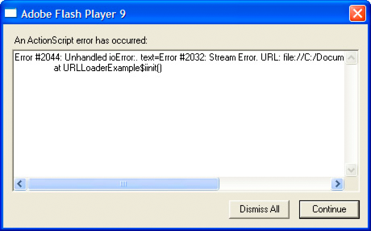

# Event listeners

Event listeners, which are also called event handlers, are functions that Flash
Player and AIR execute in response to specific events. Adding an event listener
is a two-step process. First, you create a function or class method for Flash
Player or AIR to execute in response to the event. This is sometimes called the
listener function or the event handler function. Second, you use the
`addEventListener()` method to register your listener function with the target
of the event or any display list object that lies along the appropriate event
flow.

## Creating a listener function

The creation of listener functions is one area where the ActionScript 3.0 event
model deviates from the DOM event model. In the DOM event model, there is a
clear distinction between an event listener and a listener function: an event
listener is an instance of a class that implements the EventListener interface,
whereas a listener function is a method of that class named `handleEvent()`. In
the DOM event model, you register the class instance that contains the listener
function rather than the actual listener function.

In the ActionScript 3.0 event model, there is no distinction between an event
listener and a listener function. ActionScript 3.0 does not have an
EventListener interface, and listener functions can be defined outside a class
or as part of a class. Moreover, listener functions do not have to be named
`handleEvent()` —they can be named with any valid identifier. In ActionScript
3.0, you register the name of the actual listener function.

#### Listener function defined outside of a class

The following code creates a simple SWF file that displays a red square shape. A
listener function named `clickHandler()`, which is not part of a class, listens
for mouse click events on the red square.

```actionscript
package 
{ 
    import flash.display.Sprite;

    public class ClickExample extends Sprite
    {
        public function ClickExample() 
        { 
            var child:ChildSprite = new ChildSprite(); 
            addChild(child); 
        } 
    }
} 
 
import flash.display.Sprite; 
import flash.events.MouseEvent; 
 
class ChildSprite extends Sprite 
{ 
    public function ChildSprite()
    {
        graphics.beginFill(0xFF0000); 
        graphics.drawRect(0,0,100,100); 
        graphics.endFill(); 
        addEventListener(MouseEvent.CLICK, clickHandler); 
    }
} 
 
function clickHandler(event:MouseEvent):void 
{ 
    trace("clickHandler detected an event of type: " + event.type);
    trace("the this keyword refers to: " + this);
}
```

When a user interacts with the resulting SWF file by clicking on the square,
Flash Player or AIR generates the following trace output:

```
clickHandler detected an event of type: click
the this keyword refers to: [object global]
```

Notice that the event object is passed as an argument to `clickHandler()`. This
allows your listener function to examine the event object. In this example, you
use the event object's `type` property to ascertain that the event is a click
event.

The example also checks the value of the `this` keyword. In this case, `this`
represents the global object, which makes sense because the function is defined
outside of any custom class or object.

#### Listener function defined as a class method

The following example is identical to the previous example that defines the
ClickExample class except that the `clickHandler()` function is defined as a
method of the ChildSprite class:

```actionscript
package 
{ 
    import flash.display.Sprite;

    public class ClickExample extends Sprite
    {
        public function ClickExample() 
        { 
            var child:ChildSprite = new ChildSprite(); 
            addChild(child); 
        } 
    }
} 
 
import flash.display.Sprite; 
import flash.events.MouseEvent; 
 
class ChildSprite extends Sprite 
{ 
    public function ChildSprite()
    {
        graphics.beginFill(0xFF0000); 
        graphics.drawRect(0,0,100,100); 
        graphics.endFill(); 
        addEventListener(MouseEvent.CLICK, clickHandler); 
    }
    private function clickHandler(event:MouseEvent):void
    {
        trace("clickHandler detected an event of type: " + event.type); 
        trace("the this keyword refers to: " + this); 
    }
}
```

When a user interacts with the resulting SWF file by clicking on the red square,
Flash Player or AIR generates the following trace output:

```
clickHandler detected an event of type: click
the this keyword refers to: [object ChildSprite]
```

Note that the `this` keyword refers to the ChildSprite instance named `child`.
This is a change in behavior from ActionScript 2.0. If you used components in
ActionScript 2.0, you may remember that when a class method was passed in to
`UIEventDispatcher.addEventListener()`, the scope of the method was bound to the
component that broadcast the event instead of the class in which the listener
method was defined. In other words, if you used this technique in ActionScript
2.0, the `this` keyword would refer to the component broadcasting the event
instead of the ChildSprite instance.

This was a significant issue for some programmers because it meant that they
could not access other methods and properties of the class containing the
listener method. As a workaround, ActionScript 2.0 programmers could use the
`mx.util.Delegate` class to change the scope of the listener method. This is no
longer necessary, however, because ActionScript 3.0 creates a bound method when
`addEventListener()` is called. As a result, the `this` keyword refers to the
ChildSprite instance named `child`, and the programmer has access to the other
methods and properties of the ChildSprite class.

#### Event listener that should not be used

There is a third technique in which you create a generic object with a property
that points to a dynamically assigned listener function, but it is not
recommended. It is discussed here because it was commonly used in ActionScript
2.0, but should not be used in ActionScript 3.0. This technique is not
recommended because the `this` keyword will refer to the global object instead
of your listener object.

The following example is identical to the previous ClickExample class example,
except that the listener function is defined as part of a generic object named
`myListenerObj`:

```actionscript
package 
{ 
    import flash.display.Sprite;

    public class ClickExample extends Sprite
    {
        public function ClickExample() 
        { 
            var child:ChildSprite = new ChildSprite(); 
            addChild(child); 
        } 
    }
} 
 
import flash.display.Sprite; 
import flash.events.MouseEvent; 
 
class ChildSprite extends Sprite 
{ 
    public function ChildSprite()
    {
        graphics.beginFill(0xFF0000); 
        graphics.drawRect(0,0,100,100); 
        graphics.endFill(); 
        addEventListener(MouseEvent.CLICK, myListenerObj.clickHandler); 
    }
} 
 
var myListenerObj:Object = new Object(); 
myListenerObj.clickHandler = function (event:MouseEvent):void 
{ 
        trace("clickHandler detected an event of type: " + event.type); 
        trace("the this keyword refers to: " + this); 
}
```

The results of the trace will look like this:

```
clickHandler detected an event of type: click
the this keyword refers to: [object global]
```

You would expect that `this` would refer to `myListenerObj` and that the trace
output would be `[object Object]`, but instead it refers to the global object.
When you pass in a dynamic property name as an argument to `addEventListener()`,
Flash Player or AIR is unable to create a bound method. This is because what you
are passing as the `listener` parameter is nothing more than the memory address
of your listener function, and Flash Player and AIR have no way to link that
memory address with the `myListenerObj` instance `.`

## Managing event listeners

You can manage your listener functions using the methods of the IEventDispatcher
interface. The IEventDispatcher interface is the ActionScript 3.0 version of the
EventTarget interface of the DOM event model. Although the name IEventDispatcher
may seem to imply that its main purpose is to send (or dispatch) event objects,
the methods of this class are actually used much more frequently to register
event listeners, check for event listeners, and remove event listeners. The
IEventDispatcher interface defines five methods, as shown in the following code:

```actionscript
package flash.events 
{ 
    public interface IEventDispatcher
    {

        function addEventListener(eventName:String,  
                        listener:Object, 
                        useCapture:Boolean=false, 
                        priority:Integer=0, 
                        useWeakReference:Boolean=false):Boolean; 
 
        function removeEventListener(eventName:String,  
                    listener:Object, 
                    useCapture:Boolean=false):Boolean; 
 
        function dispatchEvent(eventObject:Event):Boolean; 
 
        function hasEventListener(eventName:String):Boolean; 
        function willTrigger(eventName:String):Boolean; 
    }
}
```

The Flash Player API implements the IEventDispatcher interface with the
EventDispatcher class, which serves as a base class for all classes that can be
event targets or part of an event flow. For example, the DisplayObject class
inherits from the EventDispatcher class. This means that any object on the
display list has access to the methods of the IEventDispatcher interface.

#### Adding event listeners

The `addEventListener()` method is the workhorse of the IEventDispatcher
interface. You use it to register your listener functions. The two required
parameters are `type` and `listener`. You use the `type` parameter to specify
the type of event. You use the `listener` parameter to specify the listener
function that will execute when the event occurs. The `listener` parameter can
be a reference to either a function or a class method.

Do not use parentheses when you specify the `listener` parameter. For example,
the `clickHandler()` function is specified without parentheses in the following
call to the `addEventListener()` method:

```actionscript
addEventListener(MouseEvent.CLICK, clickHandler)
```

The `useCapture` parameter of the `addEventListener()` method allows you to
control the event flow phase on which your listener will be active. If
`useCapture` is set to `true`, your listener will be active during the capture
phase of the event flow. If `useCapture` is set to `false`, your listener will
be active during the target and bubbling phases of the event flow. To listen for
an event during all phases of the event flow, you must call `addEventListener()`
twice, once with `useCapture` set to `true`, and then again with `useCapture`
set to `false`.

The `priority` parameter of the `addEventListener()` method is not an official
part of the DOM Level 3 event model. It is included in ActionScript 3.0 to
provide you with more flexibility in organizing your event listeners. When you
call `addEventListener()`, you can set the priority for that event listener by
passing an integer value as the `priority` parameter. The default value is 0,
but you can set it to negative or positive integer values. The higher the
number, the sooner that event listener will be executed. Event listeners with
the same priority are executed in the order that they were added, so the earlier
a listener is added, the sooner it will be executed.

The `useWeakReference` parameter allows you to specify whether the reference to
the listener function is weak or normal. Setting this parameter to `true` allows
you to avoid situations in which listener functions persist in memory even
though they are no longer needed. Flash Player and AIR use a technique called
_garbage collection_ to clear objects from memory that are no longer in use. An
object is considered no longer in use if no references to it exist. The garbage
collector disregards weak references, which means that a listener function that
has only a weak reference pointing to it is eligible for garbage collection.

#### Removing event listeners

You can use the `removeEventListener()` method to remove an event listener that
you no longer need. It is a good idea to remove any listeners that will no
longer be used. Required parameters include the `eventName` and `listener`
parameters, which are the same as the required parameters for the
`addEventListener()` method. Recall that you can listen for events during all
event phases by calling `addEventListener()` twice, once with `useCapture` set
to `true`, and then again with it set to `false`. To remove both event
listeners, you would need to call `removeEventListener()` twice, once with
`useCapture` set to `true`, and then again with it set to `false`.

#### Dispatching events

The `dispatchEvent()` method can be used by advanced programmers to dispatch a
custom event object into the event flow. The only parameter accepted by this
method is a reference to an event object, which must be an instance of the Event
class or a subclass of the Event class. Once dispatched, the `target` property
of the event object is set to the object on which `dispatchEvent()` was called.

#### Checking for existing event listeners

The final two methods of the IEventDispatcher interface provide useful
information about the existence of event listeners. The `hasEventListener()`
method returns `true` if an event listener is found for a specific event type on
a particular display list object. The `willTrigger()` method also returns `true`
if a listener is found for a particular display list object, but `willTrigger()`
checks for listeners not only on that display object, but also on all of that
display list object's ancestors for all phases of the event flow.

## Error events without listeners

Exceptions, rather than events, are the primary mechanism for error handling in
ActionScript 3.0, but exception handling does not work for asynchronous
operations such as loading files. If an error occurs during such an asynchronous
operation, Flash Player and AIR dispatch an error event object. If you do not
create a listener for the error event, the debugger versions of Flash Player and
AIR will bring up a dialog box with information about the error. For example,
the debugger version of Flash Player produces the following dialog box
describing the error when the application attempts to load a file from an
invalid URL:



Most error events are based on the ErrorEvent class, and as such will have a
property named `text` that is used to store the error message that Flash Player
or AIR displays. The two exceptions are the StatusEvent and NetStatusEvent
classes. Both of these classes have a `level` property (`StatusEvent.level` and
`NetStatusEvent.info.level`). When the value of the `level` property is
`"error"`, these event types are considered to be error events.

An error event will not cause a SWF file to stop running. It will manifest only
as a dialog box on the debugger versions of the browser plug-ins and stand-alone
players, as a message in the output panel in the authoring player, and as an
entry in the log file for Adobe Flash Builder. It will not manifest at all in
the release versions of Flash Player or AIR.
