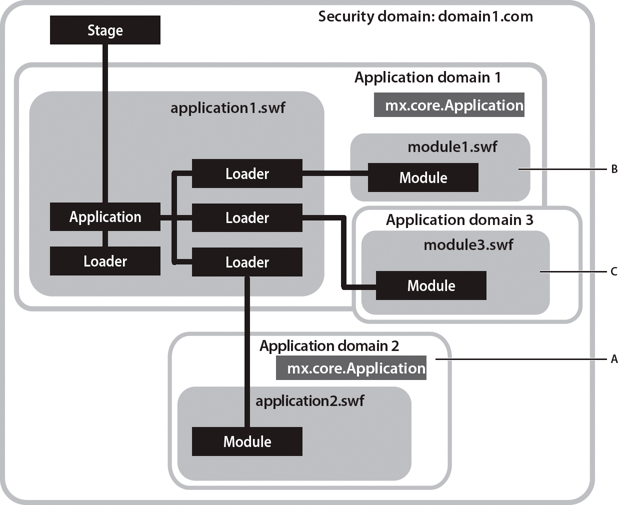

The purpose of the ApplicationDomain class is to store a table of ActionScript
3.0 definitions. All code in a SWF file is defined to exist in an application
domain. You use application domains to partition classes that are in the same
security domain. This allows multiple definitions of the same class to exist and
also lets children reuse parent definitions.

You can use application domains when loading an external SWF file written in
ActionScript 3.0 using the Loader class API. (Note that you cannot use
application domains when loading an image or SWF file written in ActionScript
1.0 or ActionScript 2.0.) All ActionScript 3.0 definitions contained in the
loaded class are stored in the application domain. When loading the SWF file,
you can specify that the file be included in the same application domain as that
of the Loader object, by setting the `applicationDomain` parameter of the
LoaderContext object to `ApplicationDomain.currentDomain`. By putting the loaded
SWF file in the same application domain, you can access its classes directly.
This can be useful if you are loading a SWF file that contains embedded media,
which you can access via their associated class names, or if you want to access
the loaded SWF file's methods.

The following example assumes it has access to a separate Greeter.swf file that
defines a public method named welcome():

```actionscript
package
{
    import flash.display.Loader;
    import flash.display.Sprite;
    import flash.events.*;
    import flash.net.URLRequest;
    import flash.system.ApplicationDomain;
    import flash.system.LoaderContext;

    public class ApplicationDomainExample extends Sprite
    {
        private var ldr:Loader;
        public function ApplicationDomainExample()
        {
            ldr = new Loader();
            var req:URLRequest = new URLRequest("Greeter.swf");
            var ldrContext:LoaderContext = new LoaderContext(false, ApplicationDomain.currentDomain);
            ldr.contentLoaderInfo.addEventListener(Event.COMPLETE, completeHandler);
            ldr.load(req, ldrContext);
        }
        private function completeHandler(event:Event):void
        {
            var myGreeter:Class = ApplicationDomain.currentDomain.getDefinition("Greeter") as Class;
            var myGreeter:Greeter = Greeter(event.target.content);
            var message:String = myGreeter.welcome("Tommy");
            trace(message); // Hello, Tommy
        }
    }
}
```

Also see the
[ApplicationDomain class example](https://airsdk.dev/reference/actionscript/3.0/flash/system/ApplicationDomain.html#includeExamplesSummary)
in the
[ActionScript 3.0 Reference for the Adobe Flash Platform](https://airsdk.dev/reference/actionscript/3.0/index.html).

Other things to keep in mind when you work with application domains include the
following:

- All code in a SWF file is defined to exist in an application domain. The
  _current domain_ is where your main application runs. The _system domain_
  contains all application domains, including the current domain, which means
  that it contains all Flash Player classes.

- All application domains, except the system domain, have an associated parent
  domain. The parent domain for your main application's application domain is
  the system domain. Loaded classes are defined only when their parent doesn't
  already define them. You cannot override a loaded class definition with a
  newer definition.

The following diagram shows an application that loads content from various SWF
files within a single domain, domain1.com. Depending on the content you load,
different application domains can be used. The text that follows describes the
logic used to set the appropriate application domain for each SWF file in the
application.



**A.** Usage A

**B.** Usage B

**C.** Usage C

The main application file is application1.swf. It contains Loader objects that
load content from other SWF files. In this scenario, the current domain is
Application domain 1. Usage A, usage B, and usage C illustrate different
techniques for setting the appropriate application domain for each SWF file in
an application.

## Usage A  

Partition the child SWF file by creating a child of the system domain. In the
diagram, Application domain 2 is created as a child of the system domain.The
application2.swf file is loaded in Application domain 2, and its class
definitions are thus partitioned from the classes defined in application1.swf.

One use of this technique is to have an old application dynamically loading a
newer version of the same application without conflict. There is no conflict
because although the same class names are used, they are partitioned into
different application domains.

The following code creates an application domain that is a child of the system
domain, and starts loading a SWF using that application domain:

```actionscript
var appDomainA:ApplicationDomain = new ApplicationDomain();

var contextA:LoaderContext = new LoaderContext(false, appDomainA);
var loaderA:Loader = new Loader();
loaderA.load(new URLRequest("application2.swf"), contextA);
```

## Usage B

Add new class definitions to current class definitions. The application domain
of module1.swf is set to the current domain (Application domain 1). This lets
you add to the application's current set of class definitions with new class
definitions. This could be used for a run-time shared library of the main
application. The loaded SWF is treated as a remote shared library (RSL). Use
this technique to load RSLs by a preloader before the application starts.

The following code loads a SWF, setting its application domain to the current
domain:

```actionscript
var appDomainB:ApplicationDomain = ApplicationDomain.currentDomain;

var contextB:LoaderContext = new LoaderContext(false, appDomainB);
var loaderB:Loader = new Loader();
loaderB.load(new URLRequest("module1.swf"), contextB);
```

## Usage C

Use the parent's class definitions by creating a new child domain of the current
domain. The application domain of module3.swf is a child of the current domain,
and the child uses the parent's versions of all classes. One use of this
technique might be a module of a multiple-screen rich Internet application
(RIA), loaded as a child of the main application, that uses the main
application's types. If you can ensure that all classes are always updated to be
backward compatible, and that the loading application is always newer than the
things it loads, the children will use the parent versions. Having a new
application domain also allows you to unload all the class definitions for
garbage collection, if you can ensure that you do not continue to have
references to the child SWF.

This technique lets loaded modules share the loader's singleton objects and
static class members.

The following code creates a new child domain of the current domain, and starts
loading a SWF using that application domain:

```actionscript
var appDomainC:ApplicationDomain = new ApplicationDomain(ApplicationDomain.currentDomain);

var contextC:LoaderContext = new LoaderContext(false, appDomainC);
var loaderC:Loader = new Loader();
loaderC.load(new URLRequest("module3.swf"), contextC);
```
