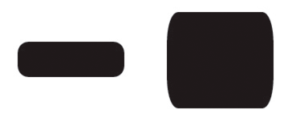
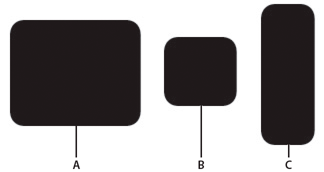

Normally when a display object is scaled (for example, stretched horizontally), the resulting distortion is spread equally across the object, so that each part is stretched the same amount. For graphics and design elements, this is probably what you want. However, sometimes it's preferable to have control over which portions of the display object stretch and which portions remain unchanged. One common example of this is a button that's a rectangle with rounded corners. With normal scaling, the corners of the button will stretch, making the corner radius change as the button resizes.


However, in this case it would be preferable to have control over the scaling—to be able to designate certain areas which should scale (the straight sides and middle) and areas which shouldn't (the corners)—so that scaling happens without visible distortion.


You can use 9-slice scaling (Scale-9) to create display objects where you have control over how the objects scale. With 9-slice scaling, the display object is divided into nine separate rectangles (a 3 by 3 grid, like the grid of a tic-tac-toe board). The rectangles aren't necessarily the same size—you designate where the grid lines are placed. Any content that lies in the four corner rectangles (such as the rounded corners of a button) will not be stretched or compressed when the display object scales. The top-center and bottom-center rectangles will scale horizontally but not vertically, while the left-middle and right-middle rectangles will scale vertically but not horizontally. The center rectangle will scale both horizontally and vertically.


Keeping this in mind, if you're creating a display object and you want certain content to never scale, you just have to make sure that the dividing lines of the 9-slice scaling grid are placed so that the content ends up in one of the corner rectangles.

In ActionScript, setting a value for the scale9Grid property of a display object turns on 9-slice scaling for the object and defines the size of the rectangles in the object's Scale-9 grid. You use an instance of the Rectangle class as the value for the scale9Grid property, as follows:

```actionscript
myButton.scale9Grid = new Rectangle(32, 27, 71, 64);
```

The four parameters of the Rectangle constructor are the x coordinate, y coordinate, width, and height. In this example, the rectangle's top-left corner is placed at the point x: 32, y: 27 on the display object named myButton . The rectangle is 71 pixels wide and 64 pixels tall (so its right edge is at the x coordinate 103 on the display object and its bottom edge is at the y coordinate 92 on the display object).


The actual area contained in the region defined by the Rectangle instance represents the center rectangle of the Scale-9 grid. The other rectangles are calculated by Flash Player and AIR by extending the sides of the Rectangle instance, as shown here:


In this case, as the button scales up or down, the rounded corners will not stretch or compress, but the other areas will adjust to accommodate the scaling.



- A. `myButton.width = 131; myButton.height = 106;`
- B. `myButton.width = 73; myButton.height = 69;`
- C. `myButton.width = 54; myButton.height = 141;`
