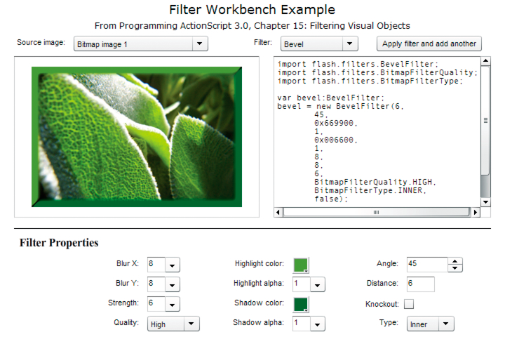

# Filtering display objects example: Filter Workbench

The Filter Workbench provides a user interface to apply different filters to
images and other visual content and see the resulting code that can be used to
generate the same effect in ActionScript. In addition to providing a tool for
experimenting with filters, this application demonstrates the following
techniques:

- Creating instances of various filters

- Applying multiple filters to a display object

To get the application files for this sample, see
[_FlashPlatformAS3DevGuideExamples.zip_](https://github.com/joshtynjala/flash-platform-as3-dev-guide-examples/releases/tag/original).
The Filter Workbench application files can be found in the
Samples/FilterWorkbench folder. The application consists of the following files:

<table>
<thead>
    <tr>
        <th><p>File</p></th>
        <th><p>Description</p></th>
    </tr>
</thead>
<tbody>
    <tr>
        <td><p>com/example/programmingas3/filterWorkbench/FilterWorkbenchController.as</p></td>
        <td><p>Class that
        provides the main functionality of the application, including switching
        content to which filters are applied, and applying filters to
        content.</p></td>
    </tr>
    <tr>
        <td><p>com/example/programmingas3/filterWorkbench/IFilterFactory.as</p></td>
        <td><p>Interface
        defining common methods that are implemented by each of the filter
        factory classes. This interface defines the common functionality that
        the FilterWorkbenchController class uses to interact with the individual
        filter factory classes.</p></td>
    </tr>
    <tr>
        <td><p>in folder
        com/example/programmingas3/filterWorkbench/:</p>
        <p>BevelFactory.as</p>
        <p>BlurFactory.as</p>
        <p>ColorMatrixFactory.as</p>
        <p>ConvolutionFactory.as</p>
        <p>DropShadowFactory.as</p>
        <p>GlowFactory.as</p>
        <p>GradientBevelFactory.as</p>
        <p>GradientGlowFactory.as</p></td>
        <td><p>Set of
        classes, each of which implements the IFilterFactory interface. Each of
        these classes provides the functionality of creating and setting values
        for a single type of filter. The filter property panels in the
        application use these factory classes to create instances of their
        particular filters, which the FilterWorkbenchController class retrieves
        and applies to the image content.</p></td>
    </tr>
    <tr>
        <td><p>com/example/programmingas3/filterWorkbench/IFilterPanel.as</p></td>
        <td><p>Interface
        defining common methods that are implemented by classes that define the
        user interface panels that are used to manipulate filter values in the
        application.</p></td>
    </tr>
    <tr>
        <td><p>com/example/programmingas3/filterWorkbench/ColorStringFormatter.as</p></td>
        <td><p>Utility class
        that includes a method to convert a numeric color value to hexadecimal
        String format</p></td>
    </tr>
    <tr>
        <td><p>com/example/programmingas3/filterWorkbench/GradientColor.as</p></td>
        <td><p>Class that
        serves as a value object, combining into a single object the three
        values (color, alpha, and ratio) that are associated with each color in
        the GradientBevelFilter and GradientGlowFilter</p></td>
    </tr>
    <tr>
        <td><p>User
        interface (Flex)</p></td>
        <td></td>
    </tr>
    <tr>
        <td><p>FilterWorkbench.mxml</p></td>
        <td><p>The main file
        defining the application's user interface.</p></td>
    </tr>
    <tr>
        <td><p>flexapp/FilterWorkbench.as</p></td>
        <td><p>Class that
        provides the functionality for the main application's user interface;
        this class is used as the code-behind class for the application MXML
        file.</p></td>
    </tr>
    <tr>
        <td><p>In folder
        flexapp/filterPanels:</p>
        <p>BevelPanel.mxml</p>
        <p>BlurPanel.mxml</p>
        <p>ColorMatrixPanel.mxml</p>
        <p>ConvolutionPanel.mxml</p>
        <p>DropShadowPanel.mxml</p>
        <p>GlowPanel.mxml</p>
        <p>GradientBevelPanel.mxml</p>
        <p>GradientGlowPanel.mxml</p></td>
        <td><p>Set of MXML
        components that provide the functionality for each panel that is used to
        set options for a single filter.</p></td>
    </tr>
    <tr>
        <td><p>flexapp/ImageContainer.as</p></td>
        <td><p>A display
        object that serves as a container for the loaded image on the
        screen</p></td>
    </tr>
    <tr>
        <td><p>flexapp/controls/BGColorCellRenderer.as</p></td>
        <td><p>Custom cell
        renderer used to change the background color of a cell in the DataGrid
        component</p></td>
    </tr>
    <tr>
        <td><p>flexapp/controls/QualityComboBox.as</p></td>
        <td><p>Custom
        control defining a combo box that can be used for the Quality setting in
        several filter panels.</p></td>
    </tr>
    <tr>
        <td><p>flexapp/controls/TypeComboBox.as</p></td>
        <td><p>Custom
        control defining a combo box that can be used for the Type setting in
        several filter panels.</p></td>
    </tr>
    <tr>
        <td><p>User
        interface (Flash)</p></td>
        <td></td>
    </tr>
    <tr>
        <td><p>FilterWorkbench.fla</p></td>
        <td><p>The main file
        defining the application's user interface.</p></td>
    </tr>
    <tr>
        <td><p>flashapp/FilterWorkbench.as</p></td>
        <td><p>Class that
        provides the functionality for the main application's user interface;
        this class is used as the document class for the application FLA
        file.</p></td>
    </tr>
    <tr>
        <td><p>In folder
        flashapp/filterPanels:</p>
        <p>BevelPanel.as</p>
        <p>BlurPanel.as</p>
        <p>ColorMatrixPanel.as</p>
        <p>ConvolutionPanel.as</p>
        <p>DropShadowPanel.as</p>
        <p>GlowPanel.as</p>
        <p>GradientBevelPanel.as</p>
        <p>GradientGlowPanel.as</p></td>
        <td><p>Set of
        classes that provide the functionality for each panel that is used to
        set options for a single filter.</p>
        <p>For each class, there is also an associated MovieClip symbol in the
        library of the main application FLA file, whose name matches the name of
        the class (for example, the symbol "BlurPanel" is linked to the class
        defined in BlurPanel.as). The components that make up the user interface
        are positioned and named within those symbols.</p></td>
    </tr>
    <tr>
        <td><p>flashapp/ImageContainer.as</p></td>
        <td><p>A display
        object that serves as a container for the loaded image on the
        screen</p></td>
    </tr>
    <tr>
        <td><p>flashapp/BGColorCellRenderer.as</p></td>
        <td><p>Custom cell
        renderer used to change the background color of a cell in the DataGrid
        component</p></td>
    </tr>
    <tr>
        <td><p>flashapp/ButtonCellRenderer.as</p></td>
        <td><p>Custom cell
        renderer used to include a button component in a cell in the DataGrid
        component</p></td>
    </tr>
    <tr>
        <td><p>Filtered
        image content</p></td>
        <td></td>
    </tr>
    <tr>
        <td><p>com/example/programmingas3/filterWorkbench/ImageType.as</p></td>
        <td><p>This class
        serves as a value object containing the type and URL of a single image
        file to which the application can load and apply filters. The class also
        includes a set of constants representing the actual image files
        available.</p></td>
    </tr>
    <tr>
        <td><p>images/sampleAnimation.swf,</p>
        <p>images/sampleImage1.jpg,</p>
        <p>images/sampleImage2.jpg</p></td>
        <td><p>Images and
        other visual content to which filters are applied in the
        application.</p></td>
    </tr>
</tbody>
</table>

## Experimenting with ActionScript filters

The Filter Workbench application is designed to help you experiment with various
filter effects and generate the relevant ActionScript code for that effect. The
application lets you select from three different files containing visual
content, including bitmap images and an animation created by Flash, and apply
eight different ActionScript filters to the selected image, either individually
or in combination with other filters. The application includes the following
filters:

- Bevel (flash.filters.BevelFilter)

- Blur (flash.filters.BlurFilter)

- Color matrix (flash.filters.ColorMatrixFilter)

- Convolution (flash.filters.ConvolutionFilter)

- Drop shadow (flash.filters.DropShadowFilter)

- Glow (flash.filters.GlowFilter)

- Gradient bevel (flash.filters.GradientBevelFilter)

- Gradient glow (flash.filters.GradientGlowFilter)

Once a user has selected an image and a filter to apply to that image, the
application displays a panel with controls for setting the specific properties
of the selected filter. For example, the following image shows the application
with the Bevel filter selected:



As the user adjusts the filter properties, the preview updates in real time. The
user can also apply multiple filters by customizing one filter, clicking the
Apply button, customizing another filter, clicking the Apply button, and so
forth.

There are a few features and limitations in the application's filter panels:

- The color matrix filter includes a set of controls for directly manipulating
  common image properties including brightness, contrasts, saturation, and hue.
  In addition, custom color matrix values can be specified.

- The convolution filter, which is only available using ActionScript, includes a
  set of commonly used convolution matrix values, or custom values can be
  specified. However, while the ConvolutionFilter class accepts a matrix of any
  size, the Filter Workbench application uses a fixed 3 x 3 matrix, the most
  commonly used filter size.

- The displacement map filter and shader filter, which are only available in
  ActionScript, are not available in the Filter Workbench application.

## Creating filter instances

The Filter Workbench application includes a set of classes, one for each of the
available filters, which are used by the individual panels to create the
filters. When a user selects a filter, the ActionScript code associated with the
filter panel creates an instance of the appropriate filter factory class. (These
classes are known as _factory classes_ because their purpose is to create
instances of other objects, much like a real-world factory creates individual
products.)

Whenever the user changes a property value on the panel, the panel's code calls
the appropriate method in the factory class. Each factory class includes
specific methods that the panel uses to create the appropriate filter instance.
For example, if the user selects the Blur filter, the application creates a
BlurFactory instance. The BlurFactory class includes a `modifyFilter()` method
that accepts three parameters: `blurX`, `blurY`, and `quality`, which together
are used to create the desired BlurFilter instance:

```
private var _filter:BlurFilter;

public function modifyFilter(blurX:Number = 4, blurY:Number = 4, quality:int = 1):void
{
    _filter = new BlurFilter(blurX, blurY, quality);
    dispatchEvent(new Event(Event.CHANGE));
}
```

On the other hand, if the user selects the Convolution filter, that filter
allows for much greater flexibility and consequently has a larger set of
properties to control. In the ConvolutionFactory class, the following code is
called when the user selects a different value on the filter panel:

```
private var _filter:ConvolutionFilter;

public function modifyFilter(matrixX:Number = 0,
                            matrixY:Number = 0,
                            matrix:Array = null,
                            divisor:Number = 1.0,
                            bias:Number = 0.0,
                            preserveAlpha:Boolean = true,
                            clamp:Boolean = true,
                            color:uint = 0,
                            alpha:Number = 0.0):void
{
    _filter = new ConvolutionFilter(matrixX, matrixY, matrix, divisor, bias, preserveAlpha, clamp, color, alpha);
    dispatchEvent(new Event(Event.CHANGE));
}
```

Notice that in each case, when the filter values are changed, the factory object
dispatches an `Event.CHANGE` event to notify listeners that the filter's values
have changed. The FilterWorkbenchController class, which does the work of
actually applying filters to the filtered content, listens for that event to
ascertain when it needs to retrieve a new copy of the filter and re-apply it to
the filtered content.

The FilterWorkbenchController class doesn't need to know specific details of
each filter factory class—it just needs to know that the filter has changed and
to be able to access a copy of the filter. To support this, the application
includes an interface, IFilterFactory, that defines the behavior a filter
factory class needs to provide so the application's FilterWorkbenchController
instance can do its job. The IFilterFactory defines the `getFilter` () method
that's used in the FilterWorkbenchController class:

```
function getFilter():BitmapFilter;
```

Notice that the `getFilter()` interface method definition specifies that it
returns a BitmapFilter instance rather than a specific type of filter. The
BitmapFilter class does not define a specific type of filter. Rather,
BitmapFilter is the base class on which all the filter classes are built. Each
filter factory class defines a specific implementation of the `getFilter()`
method in which it returns a reference to the filter object it has built. For
example, here is an abbreviated version of the ConvolutionFactory class's source
code:

```
public class ConvolutionFactory extends EventDispatcher implements IFilterFactory
{
    // ------- Private vars -------
    private var _filter:ConvolutionFilter;
    ...
    // ------- IFilterFactory implementation -------
    public function getFilter():BitmapFilter
    {
        return _filter;
    }
    ...
}
```

In the ConvolutionFactory class's implementation of the `getFilter()` method, it
returns a ConvolutionFilter instance, although any object that calls
`getFilter()` doesn't necessarily know that—according to the definition of the
`getFilter()` method that ConvolutionFactory follows, it must return any
BitmapFilter instance, which could be an instance of any of the ActionScript
filter classes.

## Applying filters to display objects

As explained previously, the Filter Workbench application uses an instance of
the FilterWorkbenchController class (hereafter referred to as the "controller
instance"), which performs the actual task of applying filters to the selected
visual object. Before the controller instance can apply a filter, it first needs
to know what image or visual content the filter should be applied to. When the
user selects an image, the application calls the `setFilterTarget()` method in
the FilterWorkbenchController class, passing in one of the constants defined in
the ImageType class:

```
public function setFilterTarget(targetType:ImageType):void
{
    ...
    _loader = new Loader();
    ...
    _loader.contentLoaderInfo.addEventListener(Event.COMPLETE, targetLoadComplete);
    ...
}
```

Using that information the controller instance loads the designated file,
storing it in an instance variable named `_currentTarget` once it loads:

```
private var _currentTarget:DisplayObject;

private function targetLoadComplete(event:Event):void
{
    ...
    _currentTarget = _loader.content;
    ...
}
```

When the user selects a filter, the application calls the controller instance's
`setFilter()` method, giving the controller a reference to the relevant filter
factory object, which it stores in an instance variable named `_filterFactory`.

```
private var _filterFactory:IFilterFactory;

public function setFilter(factory:IFilterFactory):void
{
    ...

    _filterFactory = factory;
    _filterFactory.addEventListener(Event.CHANGE, filterChange);
}
```

Notice that, as described previously, the controller instance doesn't know the
specific data type of the filter factory instance that it is given; it only
knows that the object implements the IFilterFactory instance, meaning it has a
`getFilter()` method and it dispatches a `change` (`Event.CHANGE`) event when
the filter changes.

When the user changes a filter's properties in the filter's panel, the
controller instance finds out that the filter has changed through the filter
factory's `change` event, which calls the controller instance's `filterChange()`
method. That method, in turn, calls the `applyTemporaryFilter()` method:

```
private function filterChange(event:Event):void
{
    applyTemporaryFilter();
}

private function applyTemporaryFilter():void
{
    var currentFilter:BitmapFilter = _filterFactory.getFilter();

    // Add the current filter to the set temporarily
    _currentFilters.push(currentFilter);

    // Refresh the filter set of the filter target
    _currentTarget.filters = _currentFilters;

    // Remove the current filter from the set
    // (This doesn't remove it from the filter target, since
    // the target uses a copy of the filters array internally.)
    _currentFilters.pop();
}
```

The work of applying the filter to the display object occurs within the
`applyTemporaryFilter()` method. First, the controller retrieves a reference to
the filter object by calling the filter factory's `getFilter()` method.

```
var currentFilter:BitmapFilter = _filterFactory.getFilter();
```

The controller instance has an Array instance variable named `_currentFilters`,
in which it stores all the filters that have been applied to the display object.
The next step is to add the newly updated filter to that array:

```
_currentFilters.push(currentFilter);
```

Next, the code assigns the array of filters to the display object's `filters`
property, which actually applies the filters to the image:

```
_currentTarget.filters = _currentFilters;
```

Finally, since this most recently added filter is still the "working" filter, it
shouldn't be permanently applied to the display object, so it is removed from
the `_currentFilters` array:

```
_currentFilters.pop();
```

Removing this filter from the array doesn't affect the filtered display object,
because a display object makes a copy of the filters array when it is assigned
to the `filters` property, and it uses that internal array rather than the
original one. For this reason, any changes that are made to the array of filters
don't affect the display object until the array is assigned to the display
object's `filters` property again.
