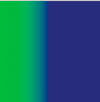
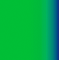

The graphics object can also draw strokes and fills with gradients rather than solid colors. A gradient stroke is created with the `lineGradientStyle()` method and a gradient fill is created with the `beginGradientFill()` method.

Both methods accept the same parameters. The first four are required: type, colors, alphas, and ratios. The remaining four are optional but are useful for advanced customizing.

- The first parameter specifies the type of gradient you are creating. Acceptable values are `GradientType.LINEAR` or `GradientType.RADIAL` .
- The second parameter specifies the array of the color values to use. In a linear gradient, the colors will be arranged from left to right. In a radial gradient, they will be arranged from inside to outside. The order of the colors of the array represents the order that the colors will be drawn in the gradient.
- The third parameter specifies the alpha transparency values of the corresponding colors in the previous parameter.
- The fourth parameter specifies ratios, or the emphasis each color has within the gradient. Acceptable values range from 0-255. These values do not represent any width or height, but rather the position within the gradient; 0 represents the beginning of the gradient, 255 represents the end of the gradient. The array of ratios must increase sequentially and have the same number of entries as both the color and alpha arrays specified in the second and third parameters.

Although the fifth parameter, the transformation matrix, is optional, it is commonly used because it provides an easy and powerful way to control the gradient’s appearance. This parameter accepts a Matrix instance. The easiest way to create a Matrix object for a gradient is to use the Matrix class’s `createGradientBox()` method.

## Defining a Matrix object for use with a gradient

You use the `beginGradientFill()` and `lineGradientStyle()` methods of the `flash.display.Graphics` class to define gradients for use in shapes. When you define a gradient, you supply a matrix as one of the parameters of these methods.

The easiest way to define the matrix is by using the Matrix class’s `createGradientBox()` method, which creates a matrix that is used to define the gradient. You define the scale, rotation, and position of the gradient using the parameters passed to the `createGradientBox()` method. The `createGradientBox()` method accepts the following parameters:

- Gradient box width: the width (in pixels) to which the gradient will spread
- Gradient box height: the height (in pixels) to which the gradient will spread
- Gradient box rotation: the rotation (in radians) that will be applied to the gradient
- Horizontal translation: how far (in pixels) the gradient is shifted horizontally
- Vertical translation: how far (in pixels) the gradient is shifted vertically

For example, consider a gradient with the following characteristics:

- `GradientType.LINEAR`
- Two colors, green and blue, with the ratios array set to `[0, 255]`
- `SpreadMethod.PAD`
- `InterpolationMethod.LINEAR_RGB`

The following examples show gradients in which the `rotation` parameter of the `createGradientBox()` method differs as indicated, but all other settings stay the same:

|                                                                    |                                                          |
| ------------------------------------------------------------------ | -------------------------------------------------------- |
| `width = 100; height = 100; rotation = 0; tx = 0; ty = 0;`         |   |
| `width = 100; height = 100; rotation = Math.PI/4; tx = 0; ty = 0;` |  |
| `width = 100; height = 100; rotation = Math.PI/2; tx = 0; ty = 0;` |  |

The following examples show the effects on a green-to-blue linear gradient in which the rotation , `tx` , and `ty` parameters of the `createGradientBox()` method differ as indicated, but all other settings stay the same:

|                                                                    |                                                          |
| ------------------------------------------------------------------ | -------------------------------------------------------- |
| `width = 50; height = 100; rotation = 0; tx = 0; ty = 0;`          |    |
| `width = 50; height = 100; rotation = 0 tx = 50; ty = 0;`          |   |
| `width = 100; height = 50; rotation = Math.PI/2; tx = 0; ty = 0;`  |   |
| `width = 100; height = 50; rotation = Math.PI/2; tx = 0; ty = 50;` |  |

The `width` , `height` , `tx` , and `ty` parameters of the `createGradientBox()` method affect the size and position of a radial gradient fill as well, as the following example shows:

|                                                            |                                                         |
| ---------------------------------------------------------- | ------------------------------------------------------- |
| `width = 50; height = 100; rotation = 0; tx = 25; ty = 0;` |  |

The following code produces the last radial gradient illustrated:

```actionscript
import flash.display.Shape;
import flash.display.GradientType;
import flash.geom.Matrix;

var type:String = GradientType.RADIAL;
var colors:Array = [0x00FF00, 0x000088];
var alphas:Array = [1, 1];
var ratios:Array = [0, 255];
var spreadMethod:String = SpreadMethod.PAD;
var interp:String = InterpolationMethod.LINEAR_RGB;
var focalPtRatio:Number = 0;

var matrix:Matrix = new Matrix();
var boxWidth:Number = 50;
var boxHeight:Number = 100;
var boxRotation:Number = Math.PI/2; // 90°
var tx:Number = 25;
var ty:Number = 0;
matrix.createGradientBox(boxWidth, boxHeight, boxRotation, tx, ty);

var square:Shape = new Shape;
square.graphics.beginGradientFill(type,
 colors,
alphas,
ratios,
 matrix,
 spreadMethod,
 interp,
 focalPtRatio);
square.graphics.drawRect(0, 0, 100, 100);
addChild(square);
```

:::note
Note that the width and height of the gradient fill is determined by the width and height of the gradient matrix rather than the width or height that is drawn using the Graphics object. When drawing with the Graphics object, you draw what exists at those coordinates in the gradient matrix. Even if you use one of the shape methods of a Graphics object such as drawRect() , the gradient does not stretch itself to the size of the shape that is drawn—the gradient’s size must be specified in the gradient matrix itself.
:::

The following illustrates the visual difference between the dimensions of the gradient matrix and the dimensions of the draw itself:

```actionscript
var myShape:Shape = new Shape();
var gradientBoxMatrix:Matrix = new Matrix();
gradientBoxMatrix.createGradientBox(100, 40, 0, 0, 0);
myShape.graphics.beginGradientFill(GradientType.LINEAR, [0xFF0000, 0x00FF00, 0x0000FF], [1, 1, 1], [0, 128, 255], gradientBoxMatrix);
myShape.graphics.drawRect(0, 0, 50, 40);
myShape.graphics.drawRect(0, 50, 100, 40);
myShape.graphics.drawRect(0, 100, 150, 40);
myShape.graphics.endFill();
this.addChild(myShape);
```

This code draws three gradients with the same fill style, specified with an equal distribution of red, green, and blue. The gradients are drawn using the `drawRect()` method with pixel widths of 50, 100, and 150 respectively. The gradient matrix which is specified in the `beginGradientFill()` method is created with a width of 100 pixels. This means that the first gradient will encompass only half of the gradient spectrum, the second will encompass all of it, and the third will encompass all of it and have an additional 50 pixels of blue extending to the right.

The `lineGradientStyle()` method works similarly to `beginGradientFill()` except that in addition to defining the gradient, you must specify the thickness of the stroke using the `lineStyle()` method before drawing. The following code draws a box with a red, green, and blue gradient stroke:

```actionscript
var myShape:Shape = new Shape();
var gradientBoxMatrix:Matrix = new Matrix();
gradientBoxMatrix.createGradientBox(200, 40, 0, 0, 0);
myShape.graphics.lineStyle(5, 0);
myShape.graphics.lineGradientStyle(GradientType.LINEAR, [0xFF0000, 0x00FF00, 0x0000FF], [1, 1, 1], [0, 128, 255], gradientBoxMatrix);
myShape.graphics.drawRect(0, 0, 200, 40);
this.addChild(myShape);
```

For more information on the Matrix class, see [Using Matrix objects](/docs/development/display/working-with-geometry/using-matrix-objects) .
