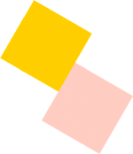

# Creating and moving 3D display objects

To convert a 2D display object into a 3D display object, you can explicitly set
its `z` property to a numeric value. When you assign a value to the `z`
property, a new Transform object is created for the display object. Setting the
`DisplayObject.rotationX` or `DisplayObject.rotationY` properties also creates a
new Transform object. The Transform object contains a `Matrix3D` property that
governs how the display object is represented in 3D space.

The following code sets the coordinates for a display object called "leaf":

```
leaf.x = 100; leaf.y = 50; leaf.z = -30;
```

You can see these values, as well as properties derived from these values, in
the `matrix3D` property of the Transform object of the leaf:

```
var leafMatrix:Matrix3D  = leaf.transform.matrix3D;

trace(leafMatrix.position.x);
trace(leafMatrix.position.y);
trace(leafMatrix.position.z);
trace(leafMatrix.position.length);
trace(leafMatrix.position.lengthSquared);
```

For information about the properties of the Transform object, see the
[Transform](https://airsdk.dev/reference/actionscript/3.0/flash/geom/Transform.html)
class. For information about the properties of the Matrix3D object, see the
[Matrix3D](https://airsdk.dev/reference/actionscript/3.0/flash/geom/Matrix3D.html)
class.

## Moving an object in 3D space

You can move an object in 3D space by changing the values of its `x, y, or z`
properties. When you change the value of the `z` property the object appears to
move closer or farther away from the viewer.

The following code moves two ellipses back and forth along their z-axes by
changing the value of their `z` properties in response to an event. `ellipse2`
moves faster than `ellipse1` : its `z` property is increased by a multiple of 20
on each Frame event while the `z` property of `ellipse1` is increased by a
multiple of 10:

```
var depth:int = 1000;

function ellipse1FrameHandler(e:Event):void
{
    ellipse1Back = setDepth(e, ellipse1Back);
    e.currentTarget.z += ellipse1Back * 10;
}
function ellipse2FrameHandler(e:Event):void
{
    ellipse2Back = setDepth(e, ellipse1Back);
    e.currentTarget.z += ellipse1Back * 20;
}
function setDepth(e:Event, d:int):int
{
    if(e.currentTarget.z > depth)
    {
        e.currentTarget.z = depth;
        d = -1;
    }
    else if (e.currentTarget.z <  0)
    {
        e.currentTarget.z = 0;
        d = 1;
    }
}
```

## Rotating an object in 3D space

You can rotate an object in three different ways, depending on how you set the
object's rotation properties: `rotationX`, `rotationY`, and `rotationZ`.

The figure below shows two squares that are not rotated:


The next figure shows the two squares when you increment the `rotationY`
property of the container of the squares to rotate them on the y- axis. Rotating
the container, or parent display object, of the two squares rotates both
squares:

```
container.rotationY += 10;
```


The next figure shows what happens when you set the `rotationX` property of the
container for the squares. This rotates the squares on the x- axis.


The next figure shows what happens when you increment the `rotationZ` property
of the container of the squares.This rotates the squares on the z-axis.



A display object can simultaneously move and rotate in 3D space.
