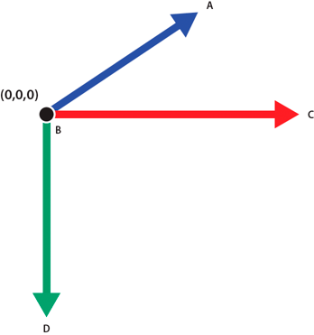

# Understanding 3D display objects in Flash Player and the AIR runtime

In Flash Player versions prior to Flash Player 10 and Adobe AIR versions prior
to Adobe AIR 1.5, display objects have two properties, `x` and `y`, for
positioning them on a 2D plane. Starting with Flash Player 10 and Adobe AIR 1.5,
every ActionScript display object has a `z` property that lets you position it
along the z-axis, which is generally used to indicate depth or distance.

Flash Player 10 and Adobe AIR 1.5 introduced support for 3D effects. However,
display objects are inherently flat. Each display object, such as a MovieClip
object or a Sprite object, ultimately renders itself in two dimensions, on a
single plane. The 3D features let you place, move, rotate, and otherwise
transform these planar objects in all three dimensions. They also let you manage
3D points and convert them to 2D x, y coordinates, so you can project 3D objects
onto a 2D view. You can simulate many kinds of 3D experiences using these
features.

The 3D coordinate system used by ActionScript differs from other systems. When
you use 2D coordinates in ActionScript, the value of x increases as you move to
the right along the x-axis, and the value of y increases as you move down along
the y-axis. The 3D coordinate system retains those conventions and adds a z-axis
whose value increases as you move away from the viewpoint.



The positive directions of the x, y, and z axes in the ActionScript 3D
coordinate system.

**A.** \+ Z axis

**B.** Origin

**C.** +X axis

**D.** +Y axis

Note: Be aware that Flash Player and AIR always represent 3D in layers. This
means that if object A is in front of object B on the display list, Flash Player
or AIR always renders A in front of B regardless of the z-axis values of the two
objects. To resolve this conflict between the display list order and the z-axis
order, use the `transform.getRelativeMatrix3D()` method to save and then
re-order the layers of 3D display objects. For more information, see
[Using Matrix3D objects for reordering display](./performing-complex-3d-transformations.md#using-matrix3d-objects-for-reordering-display).

The following ActionScript classes support the new 3D-related features:

1.  The flash.display.DisplayObject class contains the `z` property and new
```
rotation and scaling properties for manipulating display objects in 3D
space. The `DisplayObject.local3DToGlobal()` method offers a simple way to
project 3D geometry onto a 2D plane.
```

2.  The flash.geom.Vector3D class can be used as a data structure for managing
```
3D points. It also supports vector mathematics.
```

3.  The flash.geom.Matrix3D class supports complex transformations of 3D
```
geometry, such as rotation, scaling, and translation.
```

4.  The flash.geom.PerspectiveProjection class controls the parameters for
```
mapping 3D geometry onto a 2D view.
```

There are two different approaches to simulating 3D images in ActionScript:

1.  Arranging and animating planar objects in 3D space. This approach involves
```
animating display objects using the x, y and z properties of display
objects, or setting rotation and scaling properties using the DisplayObject
class. More complex motion can be achieved using the
DisplayObject.transform.matrix3D object. The
DisplayObject.transform.perspectiveProjection object customizes how the
display objects are drawn in 3D perspective. Use this approach when you want
to animate 3D objects that consist primarily of planes. Examples of this
approach include 3D image galleries or 2D animation objects arranged in 3D
space.
```

2.  Generating 2D triangles from 3D geometry, and rendering those triangles with
```
textures. To use this approach you must first define and manage data about
3D objects and then convert that data into 2D triangles for rendering.
Bitmap textures can be mapped to these triangles, and then the triangles are
drawn to a graphics object using the `Graphics.drawTriangles()` method.
Examples of this approach include loading 3D model data from a file and
rendering the model on the screen, or generating and drawing 3D terrain as
triangle meshes.
```
