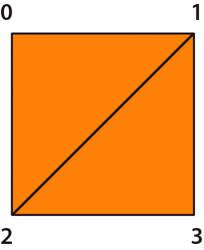
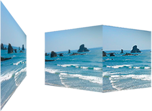
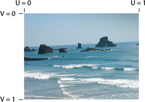
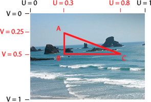
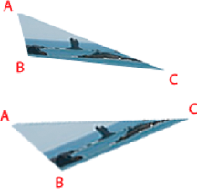
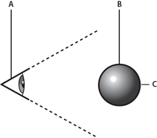

# Using triangles for 3D effects

In ActionScript, you perform bitmap transformations using the
`Graphics.drawTriangles()` method, because 3D models are represented by a
collection of triangles in space. (However, Flash Player and AIR do not support
a depth buffer, so display objects are still inherently flat, or 2D. This is
described in
[Understanding 3D display objects in Flash Player and the AIR runtime](./understanding-3d-display-objects-in-flash-player-and-the-air-runtime.md).)
The `Graphics.drawTriangles()` method is like the `Graphics.drawPath()` method,
as it takes a set of coordinates to draw a triangle path.

To familiarize yourself with using `Graphics.drawPath()`, see
[Drawing Paths](../using-the-drawing-api/drawing-paths.md).

The `Graphics.drawTriangles()` method uses a Vector.\<Number\> to specify the
point locations for the triangle path:

    drawTriangles(vertices:Vector.<Number>, indices:Vector.<int> = null, uvtData:Vector.<Number> = null, culling:String = "none"):void

The first parameter of `drawTriangles()` is the only required parameter: the
`vertices` parameter. This parameter is a vector of numbers defining the
coordinates through which your triangles are drawn. Every three sets of
coordinates (six numbers) represents a triangle path. Without the `indices`
parameter, the length of the vector should always be a factor of six, since each
triangle requires three coordinate pairs (three sets of two x/y values). For
example:

    graphics.beginFill(0xFF8000);
    graphics.drawTriangles(
    Vector.<Number>([
        10,10,  100,10,  10,100,
        110,10, 110,100, 20,100]));

Neither of these triangles share any points, but if they did, the second
`drawTriangles()` parameter, `indices`, could be used to reuse values in the
`vertices` vector for more than one triangle.

When using the `indices` parameter, be aware that the `indices` values are point
indices, not indices that relate directly to the `vertices` array elements. In
other words, an index in the `vertices` vector as defined by `indices` is
actually the real index divided by 2. For the third point of a `vertices`
vector, for example, use an `indices` value of 2, even though the first numeric
value of that point starts at the vector index of 4.

For example, merge two triangles to share the diagonal edge using the `indices`
parameter:

    graphics.beginFill(0xFF8000);
    graphics.drawTriangles(
    Vector.<Number>([10,10, 100,10, 10,100, 100,100]),
    Vector.<int>([0,1,2, 1,3,2]));

Notice that though a square has now been drawn using two triangles, only four
points were specified in the `vertices` vector. Using `indices`, the two points
shared by the two triangles are reused for each triangle. This reduces the
overall vertices count from 6 (12 numbers) to 4 (8 numbers):

A square drawn with two triangles using the vertices parameter

This technique becomes useful with larger triangle meshes where most points are
shared by multiple triangles.

All fills can be applied to triangles. The fills are applied to the resulting
triangle mesh as they would to any other shape.

## Transforming bitmaps

Bitmap transformations provide the illusion of perspective or "texture" on a
three-dimensional object. Specifically, you can distort a bitmap toward a
vanishing point so the image appears to shrink as it moves toward the vanishing
point. Or, you can use a two-dimensional bitmap to create a surface for a
three-dimensional object, providing the illusion of texture or "wrapping" on
that three-dimensional object.

A two-dimensional surface using a vanishing point and a three-dimensional object
wrapped with a bitmap.

## UV mapping

Once you start working with textures, you'll want to make use of the uvtData
parameter of `drawTriangles()`. This parameter allows you to set up UV mapping
for bitmap fills.

UV mapping is a method for texturing objects. It relies on two values, a U
horizontal (x) value and a V vertical (y) value. Rather than being based on
pixel values, they are based on percentages. 0 U and 0 V is the upper-left of an
image and 1 U and 1 V is the lower-right:

The UV 0 and 1 locations on a bitmap image

Vectors of a triangle can be given UV coordinates to associate themselves with
the respective locations on an image:

The UV coordinates of a triangular area of a bitmap image

The UV values stay consistent with the points of the triangle:

The vertices of the triangle move and the bitmap distorts to keep the UV values
for an individual point the same

As ActionScript 3D transformations are applied to the triangle associated with
the bitmap, the bitmap image is applied to the triangle based on the UV values.
So, instead of using matrix calculations, set or adjust the UV values to create
a three-dimensional effect.

The `Graphics.drawTriangles()` method also accepts an optional piece of
information for three-dimensional transformations: the T value. The T value in
uvtData represents the 3D perspective, or more specifically, the scale factor of
the associated vertex. UVT mapping adds perspective correction to UV mapping.
For example, if an object is positioned in 3D space away from the viewpoint so
that it appears to be 50% its "original" size, the T value of that object would
be 0.5. Since triangles are drawn to represent objects in 3D space, their
locations along the z-axis determine their T values. The equation that
determines the T value is:

    T = focalLength/(focalLength + z);

In this equation, focalLength represents a focal length or calculated "screen"
location which dictates the amount of perspective provided in the view.

The focal length and z value

**A.** viewpoint

**B.** screen

**C.** 3D object

**D.** focalLength value

**E.** z value

The value of T is used to scale basic shapes to make them seem further in the
distance. It is usually the value used to convert 3D points to 2D points. In the
case of UVT data, it is also used to scale a bitmap between the points within a
triangle with perspective.

When you define UVT values, the T value directly follows the UV values defined
for a vertex. With the inclusion of T, every three values in the `uvtData`
parameter (U, V, and T) match up with every two values in the `vertices`
parameter (x, and y). With UV values alone, uvtData.length == vertices.length.
With the inclusion of a T value, uvtData.length = 1.5\*vertices.length.

The following example shows a plane being rotated in 3D space using UVT data.
This example uses an image called ocean.jpg and a "helper" class, ImageLoader,
to load the ocean.jpg image so it can be assigned to the BitmapData object.

Here is the ImageLoader class source (save this code into a file named
ImageLoader.as):

    package {
        import flash.display.*
        import flash.events.*;
        import flash.net.URLRequest;
        public class ImageLoader extends Sprite {
            public var url:String;
            public var bitmap:Bitmap;
            public function ImageLoader(loc:String = null) {
                if (loc != null){
                    url = loc;
                    loadImage();
                }
            }
            public function loadImage():void{
                if (url != null){
                    var loader:Loader = new Loader();
                    loader.contentLoaderInfo.addEventListener(Event.COMPLETE, onComplete);
                    loader.contentLoaderInfo.addEventListener(IOErrorEvent.IO_ERROR, onIoError);

                    var req:URLRequest = new URLRequest(url);
                    loader.load(req);
                }
            }

            private function onComplete(event:Event):void {
                var loader:Loader = Loader(event.target.loader);
                var info:LoaderInfo = LoaderInfo(loader.contentLoaderInfo);
                this.bitmap = info.content as Bitmap;
                this.dispatchEvent(new Event(Event.COMPLETE));
            }

            private function onIoError(event:IOErrorEvent):void {
                trace("onIoError: " + event);
            }
        }
    }

And here is the ActionScript that uses triangles, UV mapping, and T values to
make the image appear as if it is shrinking toward a vanishing point and
rotating. Save this code in a file named Spinning3dOcean.as:

    package {
        import flash.display.*
        import flash.events.*;
        import flash.utils.getTimer;

        public class Spinning3dOcean extends Sprite {
            // plane vertex coordinates (and t values)
            var x1:Number = -100,    y1:Number = -100,    z1:Number = 0,    t1:Number = 0;
            var x2:Number = 100,    y2:Number = -100,    z2:Number = 0,    t2:Number = 0;
            var x3:Number = 100,    y3:Number = 100,    z3:Number = 0,    t3:Number = 0;
            var x4:Number = -100,    y4:Number = 100,    z4:Number = 0,    t4:Number = 0;
            var focalLength:Number = 200;
            // 2 triangles for 1 plane, indices will always be the same
            var indices:Vector.<int>;

            var container:Sprite;

            var bitmapData:BitmapData; // texture
            var imageLoader:ImageLoader;
            public function Spinning3dOcean():void {
                indices =  new Vector.<int>();
                indices.push(0,1,3, 1,2,3);

                container = new Sprite(); // container to draw triangles in
                container.x = 200;
                container.y = 200;
                addChild(container);

                imageLoader = new ImageLoader("ocean.jpg");
                imageLoader.addEventListener(Event.COMPLETE, onImageLoaded);
            }
            function onImageLoaded(event:Event):void {
                bitmapData = imageLoader.bitmap.bitmapData;
                // animate every frame
                addEventListener(Event.ENTER_FRAME, rotatePlane);
            }
            function rotatePlane(event:Event):void {
                // rotate vertices over time
                var ticker = getTimer()/400;
                z2 = z3 = -(z1 = z4 = 100*Math.sin(ticker));
                x2 = x3 = -(x1 = x4 = 100*Math.cos(ticker));

                // calculate t values
                t1 = focalLength/(focalLength + z1);
                t2 = focalLength/(focalLength + z2);
                t3 = focalLength/(focalLength + z3);
                t4 = focalLength/(focalLength + z4);

                // determine triangle vertices based on t values
                var vertices:Vector.<Number> = new Vector.<Number>();
                vertices.push(x1*t1,y1*t1, x2*t2,y2*t2, x3*t3,y3*t3, x4*t4,y4*t4);
                // set T values allowing perspective to change
                // as each vertex moves around in z space
                var uvtData:Vector.<Number> = new Vector.<Number>();
                uvtData.push(0,0,t1, 1,0,t2, 1,1,t3, 0,1,t4);

                // draw
                container.graphics.clear();
                container.graphics.beginBitmapFill(bitmapData);
                container.graphics.drawTriangles(vertices, indices, uvtData);
            }
        }
    }

To test this example, save these two class files in the same directory as an
image named "ocean.jpg". You can see how the original bitmap is transformed to
appear as if it is vanishing in the distance and rotating in 3D space.

## Culling

Culling is the process that determines which surfaces of a three-dimensional
object the renderer should not render because they are hidden from the current
viewpoint. In 3D space, the surface on the "back" of a three-dimensional object
is hidden from the viewpoint:

The back of a 3D object is hidden from the viewpoint.

**A.** viewpoint

**B.** 3D object

**C.** the back of a three dimensional object

Inherently all triangles are always rendered no matter their size, shape, or
position. Culling insures that Flash Player or AIR renders your 3D object
correctly. In addition, to save on rendering cycles, sometimes you want some
triangles to be skipped by the render. Consider a cube rotating in space. At any
given time, you'll never see more than three sides of that cube since the sides
not in view would be facing the other direction on the other side of the cube.
Since those sides are not going to be seen, the renderer shouldn't draw them.
Without culling, Flash Player or AIR renders both the front and back sides.

A cube has sides not visible from the current viewpoint

So, the `Graphics.drawTriangles()` method has a fourth parameter to establish a
culling value:

    public function drawTriangles(vertices:Vector.<Number>, indices:Vector.<int> = null, uvtData:Vector.<Number> = null, culling:String = "none"):void

The culling parameter is a value from the `TriangleCulling` enumeration class:
`TriangleCulling.NONE`, `TriangleCulling.POSITIVE`, and
`TriangleCulling.NEGATIVE`. These values are dependent upon the direction of the
triangle path defining the surface of the object. The ActionScript API for
determining the culling assumes that all out-facing triangles of a 3D shape are
drawn with the same path direction. Once a triangle face is turned around, the
path direction also changes. At that point, the triangle can be culled (removed
from rendering).

So, a `TriangleCulling` value of `POSITIVE` removes triangles with positive path
direction (clockwise). A `TriangleCulling` value of `NEGATIVE` removes triangles
with a negative (counterclockwise) path direction. In the case of a cube, while
the front facing surfaces have a positive path direction, the back facing
surfaces have a negative path direction:

A cube "unwrapped" to show the path direction. When "wrapped", the back side
path direction is reversed.

To see how culling works, start with the earlier example from
[UV mapping](./using-triangles-for-3d-effects.md#uv-mapping), set the culling
parameter of the `drawTriangles()` method to `TriangleCulling.NEGATIVE`:

    container.graphics.drawTriangles(vertices, indices, uvtData, TriangleCulling.NEGATIVE);

Notice the "back" side of the image is not rendered as the object rotates.
