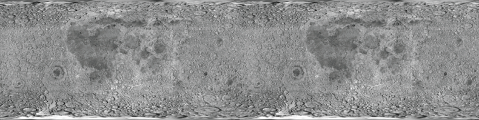
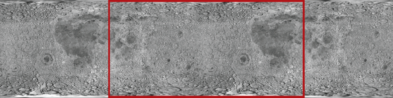
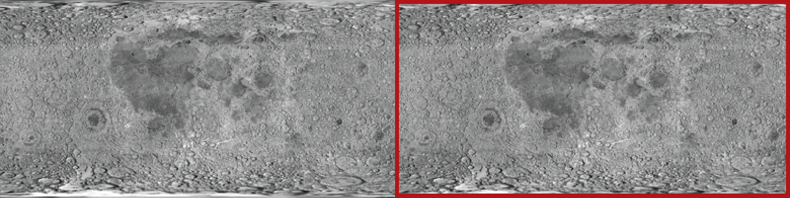
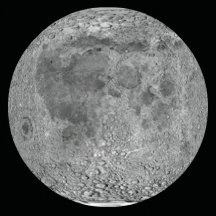
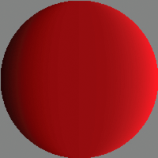

# Bitmap example: Animated spinning moon

The Animated spinning moon example demonstrates techniques for working with
Bitmap objects and bitmap image data (BitmapData objects). The example creates
an animation of a spinning, spherical moon using a flat image of the moon's
surface as the raw image data. The following techniques are demonstrated:

- Loading an external image and accessing its raw image data

- Creating animation by repeatedly copying pixels from different parts of a
  source image

- Creating a bitmap image by setting pixel values

To get the application files for this sample, see
[_FlashPlatformAS3DevGuideExamples.zip_](https://github.com/joshtynjala/flash-platform-as3-dev-guide-examples/releases/tag/original).
The Animated spinning moon application files can be found in the
Samples/SpinningMoon folder. The application consists of the following files:

<table>
<thead>
    <tr>
        <th>
File
</th>
        <th>
Description
</th>
    </tr>
</thead>
<tbody>
    <tr>
        <td>
            
SpinningMoon.mxml

            
or

            
SpinningMoon.fla

        </td>
        <td>
The main
        application file in Flex (MXML) or Flash (FLA).
</td>
    </tr>
    <tr>
        <td>
com/example/programmingas3/moon/MoonSphere.as
</td>
        <td>
Class that
        performs the functionality of loading, displaying, and animating the
        moon.
</td>
    </tr>
    <tr>
        <td>
moonMap.png
</td>
        <td>
Image file
        containing a photograph of the moon's surface, which is loaded and used
        to create the animated, spinning moon.
</td>
    </tr>
</tbody>
</table>

## Loading an external image as bitmap data

The first main task this sample performs is loading an external image file,
which is a photograph of the moon's surface. The loading operation is handled by
two methods in the MoonSphere class: the `MoonSphere()` constructor, where the
loading process is initiated, and the `imageLoadComplete()` method, which is
called when the external image is completely loaded.

Loading an external image is similar to loading an external SWF; both use an
instance of the flash.display.Loader class to perform the loading operation. The
actual code in the `MoonSphere()` method that starts loading the image is as
follows:

    var imageLoader:Loader = new Loader();
    imageLoader.contentLoaderInfo.addEventListener(Event.COMPLETE, imageLoadComplete);
    imageLoader.load(new URLRequest("moonMap.png"));

The first line declares the Loader instance named `imageLoader`. The third line
actually starts the loading process by calling the Loader object's `load()`
method, passing a URLRequest instance representing the URL of the image to load.
The second line sets up the event listener that will be triggered when the image
has completely loaded. Notice that the `addEventListener()` method is not called
on the Loader instance itself; instead, it's called on the Loader object's
`contentLoaderInfo` property. The Loader instance itself doesn't dispatch events
relating to the content being loaded. Its `contentLoaderInfo` property, however,
contains a reference to the LoaderInfo object that's associated with the content
being loaded into the Loader object (the external image in this case). That
LoaderInfo object does provide several events relating to the progress and
completion of loading the external content, including the `complete` event
(`Event.COMPLETE`) that will trigger a call to the `imageLoadComplete()` method
when the image has completely loaded.

While starting the external image loading is an important part of the process,
it's equally important to know what to do when it finishes loading. As shown in
the code above, the `imageLoadComplete()` function is called when the image is
loaded. That function does several things with the loaded image data, described
subsequently. However, to use the image data, it needs to access that data. When
a Loader object is used to load an external image, the loaded image becomes a
Bitmap instance, which is attached as a child display object of the Loader
object. In this case, the Loader instance is available to the event listener
method as part of the event object that's passed to the method as a parameter.
The first lines of the `imageLoadComplete()` method are as follows:

    private function imageLoadComplete(event:Event):void
    {
        textureMap = event.target.content.bitmapData;
        ...
    }

Notice that the event object parameter is named `event`, and it's an instance of
the Event class. Every instance of the Event class has a `target` property,
which refers to the object triggering the event (in this case, the LoaderInfo
instance on which the `addEventListener()` method was called, as described
previously). The LoaderInfo object, in turn, has a `content` property that (once
the loading process is complete) contains the Bitmap instance with the loaded
bitmap image. If you want to display the image directly on the screen, you can
attach this Bitmap instance (`event.target.content`) to a display object
container. (You could also attach the Loader object to a display object
container). However, in this sample, the loaded content is used as a source of
raw image data rather than being displayed on the screen. Consequently, the
first line of the `imageLoadComplete()` method reads the `bitmapData` property
of the loaded Bitmap instance (`event.target.content.bitmapData`) and stores it
in the instance variable named `textureMap`, which is used as a source of the
image data to create the animation of the rotating moon. This is described next.

## Creating animation by copying pixels

A basic definition of animation is the illusion of motion, or change, created by
changing an image over time. In this sample, the goal is to create the illusion
of a spherical moon rotating around its vertical axis. However, for the purposes
of the animation, you can ignore the spherical distortion aspect of the sample.
Consider the actual image that's loaded and used as the source of the moon image
data:

As you can see, the image is not one or several spheres; it's a rectangular
photograph of the surface of the moon. Because the photo was taken exactly at
the moon's equator, the parts of the image that are closer to the top and bottom
of the image are stretched and distorted. To remove the distortion from the
image and make it appear spherical, we will use a displacement map filter, as
described later. However, because this source image is a rectangle, to create
the illusion that the sphere is rotating, the code simply needs to slide the
moon surface photo horizontally.

Notice that the image actually contains two copies of the moon surface
photograph next to each other. This image is the source image from which image
data is copied repeatedly to create the appearance of motion. By having two
copies of the image next to each other, a continuous, uninterrupted scrolling
effect can more easily be created. Let's walk through the process of the
animation step-by-step to see how this works.

The process actually involves two separate ActionScript objects. First, there is
the loaded source image, which in the code is represented by the BitmapData
instance named `textureMap`. As described previously, `textureMap` is populated
with image data as soon as the external image loads, using this code:

    textureMap = event.target.content.bitmapData;

The content of `textureMap` is the rectangle moon image. In addition, to create
the animated rotation, the code uses a Bitmap instance named `sphere`, which is
the actual display object that shows the moon image onscreen. Like `textureMap`,
the `sphere` object is created and populated with its initial image data in the
`imageLoadComplete()` method, using the following code:

    sphere = new Bitmap();
    sphere.bitmapData = new BitmapData(textureMap.width / 2, textureMap.height);
    sphere.bitmapData.copyPixels(textureMap,
                         new Rectangle(0, 0, sphere.width, sphere.height),
                         new Point(0, 0));

As the code shows, `sphere` is instantiated. Its `bitmapData` property (the raw
image data that is displayed by `sphere`) is created with the same height and
half the width of `textureMap`. In other words, the content of `sphere` will be
the size of one moon photo (since the `textureMap` image contains two moon
photos side-by-side). Next the `bitmapData` property is filled with image data
using its `copyPixels()` method. The parameters in the `copyPixels()` method
call indicate several things:

- The first parameter indicates that the image data is copied from `textureMap`.

- The second parameter, a new Rectangle instance, specifies from which part of
  `textureMap` the image snapshot should be taken; in this case the snapshot is
  a rectangle starting from the top left corner of `textureMap` (indicated by
  the first two `Rectangle()` parameters: `0, 0`) and the rectangle snapshot's
  width and height match the `width` and `height` properties of `sphere`.

- The third parameter, a new Point instance with x and y values of `0`, defines
  the destination of the pixel data—in this case, the top-left corner (0, 0) of
  `sphere.bitmapData`.

Represented visually, the code copies the pixels from `textureMap` outlined in
the following image and pastes them onto `sphere`. In other words, the
BitmapData content of `sphere` is the portion of `textureMap` highlighted here:

Remember, however, that this is just the initial state of `sphere` —the first
image content that's copied onto `sphere`.

With the source image loaded and `sphere` created, the final task performed by
the `imageLoadComplete()` method is to set up the animation. The animation is
driven by a Timer instance named `rotationTimer`, which is created and started
by the following code:

    var rotationTimer:Timer = new Timer(15);
    rotationTimer.addEventListener(TimerEvent.TIMER, rotateMoon);
    rotationTimer.start();

The code first creates the Timer instance named `rotationTimer` ; the parameter
passed to the `Timer()` constructor indicates that `rotationTimer` should
trigger its `timer` event every 15 milliseconds. Next, the `addEventListener()`
method is called, specifying that when the `timer` event (`TimerEvent.TIMER`)
occurs, the method `rotateMoon()` is called. Finally, the timer is actually
started by calling its `start()` method.

Because of the way `rotationTimer` is defined, approximately every 15
milliseconds Flash Player calls the `rotateMoon()` method in the MoonSphere
class, which is where the animation of the moon happens. The source code of the
`rotateMoon()` method is as follows:

    private function rotateMoon(event:TimerEvent):void
    {
        sourceX += 1;
        if (sourceX > textureMap.width / 2)
        {
            sourceX = 0;
        }

        sphere.Data.copyPixels(textureMap,
                                new Rectangle(sourceX, 0, sphere.width, sphere.height),
                                new Point(0, 0));

        event.updateAfterEvent();
    }

The code does three things:

1.  The value of the variable `sourceX` (initially set to 0) increments by 1.

        sourceX += 1;

    As you'll see, `sourceX` is used to determine the location in `textureMap`
    from which the pixels will be copied onto `sphere` so this code has the
    effect of moving the rectangle one pixel to the right on `textureMap`. Going
    back to the visual representation, after several cycles of animation the
    source rectangle will have moved several pixels to the right, like this:

    

    After several more cycles, the rectangle will have moved even farther:

    

    This gradual, steady shift in the location from which the pixels are copied
    is the key to the animation. By slowly and continuously moving the source
    location to the right, the image that is displayed on the screen in `sphere`
    appears to continuously slide to the left. This is the reason why the source
    image (`textureMap`) needs to have two copies of the moon surface photo.
    Because the rectangle is continually moving to the right, most of the time
    it is not over one single moon photo but rather overlaps the two moon
    photos.

2.  With the source rectangle slowly moving to the right, there is one problem.
    Eventually the rectangle will reach the right edge of `textureMap` and it
    will run out of moon photo pixels to copy onto `sphere`:

    

    The next lines of code address this issue:

        if (sourceX >= textureMap.width / 2)
        {
            sourceX = 0;
        }

    The code checks if `sourceX` (the left edge of the rectangle) has reached
    the middle of `textureMap`. If so, it resets `sourceX` back to 0, moving it
    back to the left edge of `textureMap` and starting the cycle over again:

    

3.  With the appropriate `sourceX` value calculated, the final step in creating
    the animation is to actually copy the new source rectangle pixels onto
    `sphere`. The code that does this is very similar to the code that initially
    populated `sphere` (described previously); the only difference is that in
    this case, in the `new Rectangle()` constructor call, the left edge of the
    rectangle is placed at `sourceX`:

        sphere.bitmapData.copyPixels(textureMap,
                                new Rectangle(sourceX, 0, sphere.width, sphere.height),
                                new Point(0, 0));

Remember that this code is called repeatedly, every 15 milliseconds. As the
source rectangle's location is continuously shifted, and the pixels are copied
onto `sphere`, the appearance on the screen is that the moon photo image
represented by `sphere` continuously slides. In other words, the moon appears to
rotate continuously.

## Creating the spherical appearance

The moon, of course, is a sphere and not a rectangle. Consequently, the sample
needs to take the rectangular moon surface photo, as it continuously animates,
and convert it into a sphere. This involves two separate steps: a mask is used
to hide all the content except for a circular region of the moon surface photo,
and a displacement map filter is used to distort the appearance of the moon
photo to make it look three-dimensional.

First, a circle-shaped mask is used to hide all the content of the MoonSphere
object except for the sphere created by the filter. The following code creates
the mask as a Shape instance and applies it as the mask of the MoonSphere
instance:

    moonMask = new Shape();
    moonMask.graphics.beginFill(0);
    moonMask.graphics.drawCircle(0, 0, radius);
    this.addChild(moonMask);
    this.mask = moonMask;

Note that since MoonSphere is a display object (it is based on the Sprite
class), the mask can be applied directly to the MoonSphere instance using its
inherited `mask` property.

Simply hiding parts of the photo using a circle-shaped mask isn't enough to
create a realistic-looking rotating-sphere effect. Because of the way the photo
of the moon's surface was taken, its dimensions aren't proportional; the
portions of the image that are more toward the top or bottom of the image are
more distorted and stretched compared to the portions in the equator. To distort
the appearance of the moon photo to make it look three-dimensional, we'll use a
displacement map filter.

A displacement map filter is a type of filter that is used to distort an image.
In this case, the moon photo will be "distorted" to make it look more realistic,
by squeezing the top and bottom of the image horizontally, while leaving the
middle unchanged. Assuming the filter operates on a square-shaped portion of the
photo, squeezing the top and bottom but not the middle will turn the square into
a circle. A side effect of animating this distorted image is that the middle of
the image seems to move farther in actual pixel distance than the areas close to
the top and bottom, which creates the illusion that the circle is actually a
three-dimensional object (a sphere).

The following code is used to create the displacement map filter, named
`displaceFilter`:

    var displaceFilter:DisplacementMapFilter;
    displaceFilter = new DisplacementMapFilter(fisheyeLens,
                                new Point(radius, 0),
                                BitmapDataChannel.RED,
                                BitmapDataChannel.GREEN,
                                radius, 0);

The first parameter, `fisheyeLens`, is known as the map image; in this case it
is a BitmapData object that is created programmatically. The creation of that
image is described in
[Creating a bitmap image by setting pixel values](./bitmap-example-animated-spinning-moon.md#creating-a-bitmap-image-by-setting-pixel-values).
The other parameters describe the position in the filtered image at which the
filter should be applied, which color channels will be used to control the
displacement effect, and to what extent they will affect the displacement. Once
the displacement map filter is created, it is applied to `sphere`, still within
the `imageLoadComplete()` method:

    sphere.filters = [displaceFilter];

The final image, with mask and displacement map filter applied, looks like this:

With every cycle of the rotating moon animation, the BitmapData content of
sphere is overwritten by a new snapshot of the source image data. However, the
filter does not need to be re-applied each time. This is because the filter is
applied to the Bitmap instance (the display object) rather than to the bitmap
data (the raw pixel information). Remember, the Bitmap instance is not the
actual bitmap data; it is a display object that displays the bitmap data on the
screen. To use an analogy, a Bitmap instance is like the slide projector that is
used to display photographic slides on a screen, and a BitmapData object is like
the actual photographic slide that can be presented through a slide projector. A
filter can be applied directly to a BitmapData object, which would be comparable
to drawing directly onto a photographic slide to alter the image. A filter can
also be applied to any display object, including a Bitmap instance; this would
be like placing a filter in front of the slide projector's lens to distort the
output shown on the screen (without altering the original slide at all). Because
the raw bitmap data is accessible through a Bitmap instance's bitmapData
property, the filter could have been applied directly to the raw bitmap data.
However, in this case, it makes sense to apply the filter to the Bitmap display
object rather than to the bitmap data.

For detailed information about using the displacement map filter in
ActionScript, see
[Filtering display objects](../filtering-display-objects/index.md).

## Creating a bitmap image by setting pixel values

One important aspect of a displacement map filter is that it actually involves
two images. One image, the source image, is the image that is actually altered
by the filter. In this sample, the source image is the Bitmap instance named
`sphere`. The other image used by the filter is known as the map image. The map
image is not actually displayed on the screen. Instead, the color of each of its
pixels is used as an input to the displacement function—the color of the pixel
at a certain x, y coordinate in the map image determines how much displacement
(physical shift in position) is applied to the pixel at that x, y coordinate in
the source image.

Consequently, to use the displacement map filter to create a sphere effect, the
sample needs the appropriate map image—one that has a gray background and a
circle that's filled with a gradient of a single color (red) going horizontally
from dark to light, as shown here:

Because only one map image and filter are used in this sample, the map image is
only created once, in the `imageLoadComplete()` method (in other words, when the
external image finishes loading). The map image, named `fisheyeLens`, is created
by calling the MoonSphere class's `createFisheyeMap()` method:

    var fisheyeLens:BitmapData = createFisheyeMap(radius);

Inside the `createFisheyeMap()` method, the map image is actually drawn one
pixel at a time using the BitmapData class's `setPixel()` method. The complete
code for the `createFisheyeMap()` method is listed here, followed by a
step-by-step discussion of how it works:

    private function createFisheyeMap(radius:int):BitmapData
    {
        var diameter:int = 2 * radius;

        var result:BitmapData = new BitmapData(diameter,
                                            diameter,
                                            false,
                                            0x808080);

        // Loop through the pixels in the image one by one
        for (var i:int = 0; i < diameter; i++)
        {
            for (var j:int = 0; j < diameter; j++)
            {
                // Calculate the x and y distances of this pixel from
                // the center of the circle (as a percentage of the radius).
                var pctX:Number = (i - radius) / radius;
                var pctY:Number = (j - radius) / radius;

                // Calculate the linear distance of this pixel from
                // the center of the circle (as a percentage of the radius).
                var pctDistance:Number = Math.sqrt(pctX * pctX + pctY * pctY);

                // If the current pixel is inside the circle,
                // set its color.
                if (pctDistance < 1)
                {
                    // Calculate the appropriate color depending on the
                    // distance of this pixel from the center of the circle.
                    var red:int;
                    var green:int;
                    var blue:int;
                    var rgb:uint;
                    red = 128 * (1 + 0.75 * pctX * pctX * pctX / (1 - pctY * pctY));
                    green = 0;
                    blue = 0;
                    rgb = (red << 16 | green << 8 | blue);
                    // Set the pixel to the calculated color.
                    result.setPixel(i, j, rgb);
                }
            }
        }
        return result;
    }

First, when the method is called it receives a parameter, `radius`, indicating
the radius of the circle-shaped image to create. Next, the code creates the
BitmapData object on which the circle will be drawn. That object, named
`result`, is eventually passed back as the return value of the method. As shown
in the following code snippet, the `result` BitmapData instance is created with
a width and height as big as the diameter of the circle, without transparency
(`false` for the third parameter), and pre-filled with the color `0x808080`
(middle gray):

    var result:BitmapData = new BitmapData(diameter,
                                    diameter,
                                    false,
                                    0x808080);

Next, the code uses two loops to iterate over each pixel of the image. The outer
loop goes through each column of the image from left to right (using the
variable `i` to represent the horizontal position of the pixel currently being
manipulated), while the inner loop goes through each pixel of the current column
from top to bottom (with the variable `j` representing the vertical position of
the current pixel). The code for the loops (with the inner loop's contents
omitted) is shown here:

    for (var i:int = 0; i < diameter; i++)
    {
        for (var j:int = 0; j < diameter; j++)
        {
            ...
        }
    }

As the loops cycle through the pixels one by one, at each pixel a value (the
color value of that pixel in the map image) is calculated. This process involves
four steps:

1.  The code calculates the distance of the current pixel from the center of the
    circle along the x axis (`i - radius`). That value is divided by the radius
    to make it a percentage of the radius rather than an absolute distance
    (`(i - radius) / radius`). That percentage value is stored in a variable
    named `pctX`, and the equivalent value for the y axis is calculated and
    stored in the variable `pctY`, as shown in this code:

        var pctX:Number = (i - radius) / radius;
        var pctY:Number = (j - radius) / radius;

2.  Using a standard trigonometric formula, the Pythagorean theorem, the linear
    distance between the center of the circle and the current point is
    calculated from `pctX` and `pctY`. That value is stored in a variable named
    `pctDistance`, as shown here:

        var pctDistance:Number = Math.sqrt(pctX * pctX + pctY * pctY);

3.  Next, the code checks whether the distance percentage is less than 1
    (meaning 100% of the radius, or in other words, if the pixel being
    considered is within the radius of the circle). If the pixel falls inside
    the circle, it is assigned a calculated color value (omitted here, but
    described in step 4); if not, nothing further happens with that pixel so its
    color is left as the default middle gray:

        if (pctDistance < 1)
        {
            ...
        }

4.  For those pixels that fall inside the circle, a color value is calculated
    for the pixel. The final color will be a shade of red ranging from black (0%
    red) at the left edge of the circle to bright (100%) red at the right edge
    of the circle. The color value is initially calculated in three parts (red,
    green, and blue), as shown here:

        red = 128 * (1 + 0.75 * pctX * pctX * pctX / (1 - pctY * pctY));
        green = 0;
        blue = 0;

    Notice that only the red portion of the color (the variable `red`) actually
    has a value. The green and blue values (the variables `green` and `blue`)
    are shown here for clarity, but could be omitted. Since the purpose of this
    method is to create a circle that contains a red gradient, no green or blue
    values are needed.

    Once the three individual color values are determined, they are combined
    into a single integer color value using a standard bit-shifting algorithm,
    shown in this code:

        rgb = (red << 16 | green << 8 | blue);

    Finally, with the color value calculated, that value is actually assigned to
    the current pixel using the `setPixel()` method of the `result` BitmapData
    object, shown here:

        result.setPixel(i, j, rgb);
