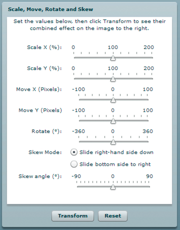
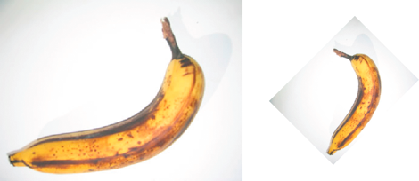

# Geometry example: Applying a matrix transformation to a display object

The DisplayObjectTransformer sample application shows a number of features of
using the Matrix class to transform a display object, including the following:

- Rotating the display object

- Scaling the display object

- Translating (repositioning) the display object

- Skewing the display object

The application provides an interface for adjusting the parameters of the matrix
transformation, as follows:



When the user clicks the Transform button, the application applies the
appropriate transformation.



The original display object, and the display object rotated by -45° _and scaled
by 50%_

To get the application files for this sample, see
[_FlashPlatformAS3DevGuideExamples.zip_](https://github.com/joshtynjala/flash-platform-as3-dev-guide-examples/releases/tag/original).
The DisplayObjectTransformer application files can be found in the folder
Samples/DisplayObjectTransformer. The application consists of the following
files:

<table>
<thead>
    <tr>
        <th><p>File</p></th>
        <th><p>Description</p></th>
    </tr>
</thead>
<tbody>
    <tr>
        <td>
            <p>DisplayObjectTransformer.mxml</p>
            <p>or</p>
            <p>DisplayObjectTransformer.fla</p>
        </td>
        <td><p>The main
        application file in Flash (FLA) or Flex (MXML)</p></td>
    </tr>
    <tr>
        <td><p>com/example/programmingas3/geometry/MatrixTransformer.as</p></td>
        <td><p>A class that
        contains methods for applying matrix transformations.</p></td>
    </tr>
    <tr>
        <td><p>img/</p></td>
        <td><p>A directory
        containing sample image files used by the application.</p></td>
    </tr>
</tbody>
</table>

## Defining the MatrixTransformer class

The MatrixTransformer class includes static methods that apply geometric
transformations of Matrix objects.

#### The transform() method

The `transform()` method includes parameters for each of the following:

- `sourceMatrix` —The input matrix, which the method transforms

- `xScale` and `yScale` —The _x_ and _y_ scale factor

- `dx` and `dy` —The _x_ and _y_ translation amounts, in pixels

- `rotation` —The rotation amount, in degrees

- `skew` —The skew factor, as a percentage

- `skewType` —The direction in which the skew, either `"right"` or `"left"`

The return value is the resulting matrix.

The `transform()` method calls the following static methods of the class:

- `skew()`

- `scale()`

- `translate()`

- `rotate()`

Each returns the source matrix with the applied transformation.

#### The skew() method

The `skew()` method skews the matrix by adjusting the `b` and `c` properties of
the matrix. An optional parameter, `unit`, determines the units used to define
the skew angle, and if necessary, the method converts the `angle` value to
radians:

```
if (unit == "degrees")
{
```

        angle = Math.PI * 2 * angle / 360;
```
}
if (unit == "gradients")
{
```

        angle = Math.PI * 2 * angle / 100;
```
}
```

A `skewMatrix` Matrix object is created and adjusted to apply the skew
transformation. Initially, it is the identity matrix, as follows:

```
var skewMatrix:Matrix = new Matrix();
```

The `skewSide` parameter determines the side to which the skew is applied. If it
is set to `"right"`, the following code sets the `b` property of the matrix:

```
skewMatrix.b = Math.tan(angle);
```

Otherwise, the bottom side is skewed by adjusting the `c` property of the
Matrix, as follows:

```
skewMatrix.c = Math.tan(angle);
```

The resulting skew is then applied to the existing matrix by concatenating the
two matrixes, as the following example shows:

```
sourceMatrix.concat(skewMatrix);
return sourceMatrix;
```

#### The scale() method

The following example shows the `scale()` method adjusts the scale factor if it
is provided as a percentage, first, and then uses the `scale()` method of the
matrix object:

```
if (percent)
{
```

        xScale = xScale / 100;
        yScale = yScale / 100;
```
}
sourceMatrix.scale(xScale, yScale);
return sourceMatrix;
```

#### The translate() method

The `translate()` method simply applies the `dx` and `dy` translation factors by
calling the `translate()` method of the matrix object, as follows:

```
sourceMatrix.translate(dx, dy);
return sourceMatrix;
```

#### The rotate() method

The `rotate()` method converts the input rotation factor to radians (if it is
provided in degrees or gradients), and then calls the `rotate()` method of the
matrix object:

```
if (unit == "degrees")
{
```

        angle = Math.PI * 2 * angle / 360;
```
}
if (unit == "gradients")
{
```

        angle = Math.PI * 2 * angle / 100;
```
}
sourceMatrix.rotate(angle);
return sourceMatrix;
```

## Calling the MatrixTransformer.transform() method from the application

The application contains a user interface for getting the transformation
parameters from the user. It then passes these values, along with the `matrix`
property of the `transform` property of the display object, to the
`Matrix.transform()` method, as follows:

```
tempMatrix = MatrixTransformer.transform(tempMatrix,
```

        xScaleSlider.value,
        yScaleSlider.value,
        dxSlider.value,
        dySlider.value,
        rotationSlider.value,
        skewSlider.value,
        skewSide);

The application then applies the return value to the `matrix` property of the
`transform` property of the display object, triggering the transformation:

```
img.content.transform.matrix = tempMatrix;
```
