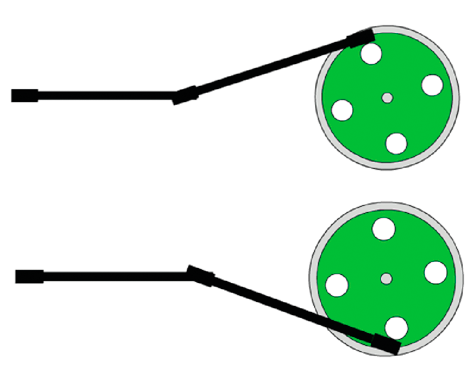

# Working with inverse kinematics

Inverse kinematics (IK) is a great technique for creating realistic motion.

IK lets you create coordinated movements within a chain of connected parts
called an IK armature, so that the parts move together in a lifelike way. The
parts of the armature are its bones and joints. Given the end point of the
armature, IK calculates the angles for the joints that are required to reach
that end point.

Calculating those angles manually yourself would be challenging. The beauty of
this feature is that you can create armatures interactively using Adobe® Flash®
Professional. Then animate them using ActionScript. The IK engine included with
Flash Professional performs the calculations to describe the movement of the
armature. You can limit the movement to certain parameters in your ActionScript
code.

New to the Flash Professional CS5 version of IK is the concept of bone spring,
typically associated with high-end animation applications. Used with the new
dynamic Physics Engine, this feature lets you configure life-like movement. And,
this effect is visible both at runtime and during authoring.

To create inverse kinematics armatures, you must have a license for Flash
Professional.

## Basics of Inverse Kinematics

Inverse kinematics (IK) lets you create life-like animation by linking parts so
they move in relation to one another in a realistic manner.

For example, using IK you can move a leg to a certain position by articulating
the movements of the joints in the leg required to achieve the desired pose. IK
uses a framework of bones chained together in a structure called an IK armature.
The `fl.ik` package helps you create animations resembling natural motion. It
lets you animate multiple IK armatures seamlessly without having to know a lot
about the physics behind the IK algorithms.

Create the IK armature with its ancillary bones and joints with Flash
Professional. Then you can access the IK classes to animate them at runtime.

See the Using inverse kinematics section in _Using Flash Professional_ for
detailed instructions on how to create an IK armature.

#### Important concepts and terms

The following reference list contains important terms that are relevant to this
feature:

Armature  
A kinematic chain, consisting of bones and joints, used in computer animation to
simulate realistic motion.

Bone  
A rigid segment in an armature, analogous to a bone in an animal skeleton.

Inverse Kinematics (IK)  
Process of determining the parameters of a jointed flexible object called a
kinematic chain or armature.

Joint  
The location at which two bones make contact, constructed to enable movement of
the bones; analogous to a joint in an animal.

Physics Engine  
A package of physics-related algorithms used to provide life-like actions to
animation.

Spring  
The quality of a bone that moves and reacts when the parent bone is moved and
then incrementally diminishes over time.

## Animating IK Armatures Overview

After creating an IK armature in Flash Professional, use the `fl.ik` classes to
limit its movement, track its events, and animate it at runtime.

The following figure shows a movie clip named `Wheel.` The axle is an instance
of an IKArmature named `Axle`. The IKMover class moves the armature in
synchronization with the rotation of wheel. The IKBone, `ikBone2`, in the
armature is attached to the wheel at its tail joint.

**A.** Wheel

**B.** Axle

**C.** ikBone2

At runtime, the wheel spins in association with the `__motion_Wheel` motion
tween discussed in
[Describing the animation](../working-with-motion-tweens/describing-the-animation.md).
An IKMover object initiates and controls the movement of the axle. The following
figure shows two snapshots of the axle armature attached to the spinning wheel
at different frames in the rotation.

At runtime, the following ActionScript:

- Gets information about the armature and its components

- Instantiates an IKMover object

- Moves the axle in conjunction with the rotation of the wheel

  import fl.ik.\*

  var tree:IKArmature = IKManager.getArmatureByName("Axle"); var bone:IKBone =
  tree.getBoneByName("ikBone2"); var endEffector:IKJoint = bone.tailJoint; var
  pos:Point = endEffector.position;

  var ik:IKMover = new IKMover(endEffector, pos); ik.limitByDistance = true;
  ik.distanceLimit = 0.1; ik.limitByIteration = true; ik.iterationLimit = 10;

  Wheel.addEventListener(Event.ENTER_FRAME, frameFunc);

  function frameFunc(event:Event) { if (Wheel != null) { var mat:Matrix =
  Wheel.transform.matrix; var pt = new Point(90, 0); pt =
  mat.transformPoint(pt);

            ik.moveTo(pt);
        }

  }

The IK classes used to move the axle are:

- IKArmature: describes the armature, a tree structure consisting of bones and
  joints; must be created with Flash Professional

- IKManager: container class for all the IK armatures in the document; must be
  created with Flash Professional

- IKBone: a segment of an IK armature

- IKJoint: a connection between two IK bones

- IKMover: initiates and controls IK movement of armatures

For complete and detailed descriptions of these classes, see the
[fl.ik package](https://help.adobe.com/en_US/FlashPlatform/reference/actionscript/3/fl/ik/package-detail.html)
in the
[ActionScript 3.0 Reference for the Adobe Flash Platform](https://help.adobe.com/en_US/FlashPlatform/reference/actionscript/3/index.html).

## Getting information about an IK armature

First, declare variables for the armature, the bone, and the joint that make up
the parts that you want to move.

The following code uses the `getArmatureByName()` method of the IKManager class
to assign the value of the Axle armature to the IKArmature variable `tree`. The
Axle armature was previously created with Flash Professional.

    var tree:IKArmature = IKManager.getArmatureByName("Axle");

Similarly, the following code uses the `getBoneByName()` method of the
IKArmature class to assign to the IKBone variable the value of the `ikBone2`
bone.

    var bone:IKBone = tree.getBoneByName("ikBone2");

The tail joint of the `ikBone2` bone is the part of the armature that attaches
to the spinning wheel.

The following line declares the variable `endEffector` and assigns to it the
`tailjoint` property of the `ikBone2` bone:

    var endEffector:IKJoint = home.tailjoint;

The variable `pos` is a point that stores the current position of the
`endEffector` joint.

    var pos:Point = endEffector.position;

In this example, `pos` is the position of the joint at the end of the axle where
it connects to the wheel. The original value of this variable is obtained from
the `position` property of the IKJoint.

## Instantiating an IK Mover and Limiting Its Movement

An instance of the IKMover class moves the axle.

The following line instantiates the IKMover object `ik`, passing to its
constructor the element to move and the starting point for the movement:

    var ik:IKMover = new IKMover(endEffector, pos);

The properties of the IKMover class let you limit the movement of an armature.
You can limit movement based on the distance, iterations, and time of the
movement.

The following pairs of properties enforce these limits. The pairs consist of a
Boolean value that indicates whether the movement is limited and an integer that
specifies the limit:

|                            |                      |                                                                                          |
| -------------------------- | -------------------- | ---------------------------------------------------------------------------------------- |
| Boolean property           | Integer property     | Limit set                                                                                |
| `limitByDistance:Boolean`  | `distanceLimit:int`  | Sets the maximum distance in pixels that the IK engine moves for each iteration.         |
| `limitByIteration:Boolean` | `iterationLimit:int` | Sets the maximum number of iterations the IK engine performs for each movement.          |
| `limitByTime:Boolean`      | `timeLimit:int`      | Sets the maximum time in milliseconds allotted to the IK engine to perform the movement. |

By default, all the Boolean values are set to `false`, so movement is not
limited unless you explicitly set a Boolean value to `true`. To enforce a limit,
set the appropriate property to `true` and then specify a value for the
corresponding integer property. If you set the limit to a value without setting
its corresponding Boolean property, the limit is ignored. In this case, the IK
engine continues to move the object until another limit or the target position
of the IKMover is reached.

In the following example, the maximum distance of the armature movement is set
to 0.1 pixels per iteration. The maximum number of iterations for every movement
is set to ten.

    ik.limitByDistance = true;
    ik.distanceLimit = 0.1;
    ik.limitByIteration = true;
    ik.iterationLimit = 10;

## Moving an IK Armature

The IKMover moves the axle inside the event listener for the wheel. On each
enterFrame event of the wheel, a new target position for the armature is
calculated. Using its `moveTo()` method, the IKMover moves the tail joint to its
target position or as far as it can within the constraints set by its
`limitByDistance`, `limitByIteration`, and `limitByTime` properties.

    Wheel.addEventListener(Event.ENTER_FRAME, frameFunc);

    function frameFunc(event:Event)
    {
        if (Wheel != null)
        {
            var mat:Matrix = Wheel.transform.matrix;
            var pt = new Point(90,0);
            pt = mat.transformPoint(pt);

            ik.moveTo(pt);
        }
    }

## Using Springs

Inverse kinematics in Flash Professional CS5 supports bone spring. Bone spring
can be set during authoring, and bone spring attributes can be added or modified
at runtime. Spring is a property of a bone and its joints. It has two
attributes: `IKJoint.springStrength`, which sets the amount of spring, and
`IKJoint.springDamping`, which adds resistance to the strength value and changes
the rate of decay of the spring.

Spring strength is a percent value from the default 0 (completely rigid) to 100
(very loose and controlled by physics). Bones with spring react to the movement
of their joint. If no other translation (rotation, x, or y) is enabled, the
spring settings have no effect.

Spring damping is a percent value from the default 0 (no resistance) to 100
(heavily damped). Damping changes the amount of time between a bone's initial
movement and its return to a rest position.

You can check to see if springs are enabled for an IKArmature object by checking
its `IKArmature.springsEnabled` property. The other spring properties and
methods belong to individual IKJoint objects. A joint can be enabled for angular
rotation and translation along the x- and y-axes. You can position a rotational
joint's spring angle with `IKJoint.setSpringAngle` and a translational joint's
spring position with `IKJoint.setSpringPt`.

This example selects a bone by name and identifies its tailJoint. The code tests
the parent armature to see if springs are enabled and then sets spring
properties for the joint.

    var arm:IKArmature = IKManager.getArmatureAt(0);
    var bone:IKBone = arm.getBoneByName("c");
    var joint:IKJoint = bone.tailJoint;
    if (arm.springsEnabled) {
        joint.springStrength = 50; //medium spring strength
        joint.springDamping = 10; //light damping resistance
        if (joint.hasSpringAngle) {
            joint.setSpringAngle(30); //set angle for rotational spring
        }
    }

## Using IK Events

The IKEvent class lets you create an event object that contains information
about IK Events. IKEvent information describes motion that has terminated
because the specified time, distance, or iteration limit was exceeded.

The following code shows an event listener and handler for tracking time limit
events. This event handler reports on the time, distance, iteration count, and
joint properties of an event that fires when the time limit of the IKMover is
exceeded.

    var ikmover:IKMover = new IKMover(endjoint, pos);
    ikMover.limitByTime = true;
    ikMover.timeLimit = 1000;

    ikmover.addEventListener(IKEvent.TIME_LIMIT, timeLimitFunction);

    function timeLimitFunction(evt:IKEvent):void
    {
        trace("timeLimit hit");
        trace("time is " + evt.time);
        trace("distance is " + evt.distance);
        trace("iterationCount is " + evt.iterationCount);
        trace("IKJoint is " + evt.joint.name);
    }

More Help Topics

[fl.ik package](https://help.adobe.com/en_US/FlashPlatform/reference/actionscript/3/fl/ik/package-detail.html)

[Inverse kinematics](https://web.archive.org/web/20150308055635/https://help.adobe.com/en_US/flash/cs/using/WS58BD3A02-DA25-488f-B534-AE5463A24833.html)
