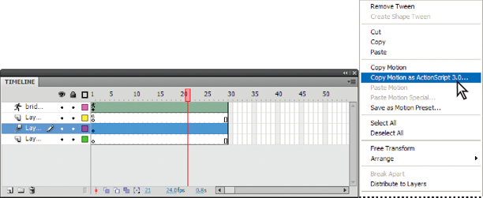
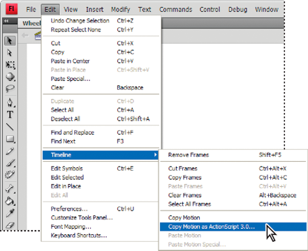

# Copying motion tween scripts in Flash

A tween generates intermediate frames that show a display object in different
states in two different frames on a timeline. It creates the appearance that the
image in the first frame evolves smoothly into the image in the second. In a
motion tween, the change in appearance typically involves changing the position
of the display object, thus creating movement. In addition to repositioning the
display object, a motion tween can also rotate, skew, resize, or apply filters
to it.

Create a motion tween in Flash by moving a display object between keyframes
along the timeline. Flash automatically generates the ActionScript code that
describes the tween, which you can copy and save in a file. See the Motion
Tweens section in _Using Flash Professional_ for information about creating a
motion tween.

You can access the Copy Motion as ActionScript 3.0 command in Flash two ways.
The first way is from a tween context menu on the stage:

1.  Select the motion tween on the stage.

2.  Right-click (Windows) or Control‑click (Macintosh).

3.  Choose Copy Motion as ActionScript 3.0...

    

The second way is to choose the command directly from the Flash Edit menu:

1.  Select the motion tween on the stage.

2.  Select Edit \> Timeline \> Copy Motion as ActionScript 3.0.

    

After copying the script, paste it into a file and save it.

After creating a motion tween and copying and saving the script, you can reuse
it as is or modify it in your own dynamic ActionScript-based animation.
