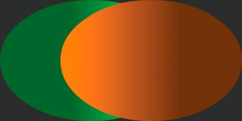
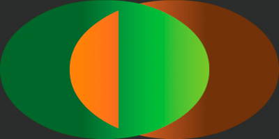

# Using a shader as a blend mode

Using a shader as a blend mode is like using other blend modes. The shader
defines the appearance resulting from two display objects being blended together
visually. To use a shader as a blend mode, assign your Shader object to the
`blendShader` property of the foreground display object. Assigning a value other
than `null` to the `blendShader` property automatically sets the display
object's `blendMode` property to `BlendMode.SHADER`. The following listing
demonstrates using a shader as a blend mode. Note that this example assumes that
there is a display object named `foreground` contained in the same parent on the
display list as other display content, with `foreground` overlapping the other
content:

    foreground.blendShader = myShader;

When you use a shader as a blend mode, the shader must be defined with at least
two inputs. As the example shows, you do not set the input values in your code.
Instead, the two blended images are automatically used as shader inputs. The
foreground image is set as the second image. (This is the display object to
which the blend mode is applied.) A background image is created by taking the
composite of all the pixels behind the foreground image's bounding box. This
background image is set as the first input image. If you use a shader that
expects more than two inputs, you provide a value for any input beyond the first
two.

The following example demonstrates using a shader as a blend mode. This example
uses a lighten blend mode based on luminosity. The result of the blend is that
the lightest pixel value from either of the blended objects becomes the pixel
that's displayed.

Note: The code for this example was written by Mario Klingemann. Thank you Mario
for sharing this example. You can see more of Mario's work and read his writing
at [www.quasimondo.com/](http://www.quasimondo.com/).

The important ActionScript code is in these two methods:

- `init()`: The `init()` method is called when the application loads. In this
  method the code loads the shader bytecode file.

- `onLoadComplete()`: In the `onLoadComplete()` method the code creates the
  Shader object named `shader`. It then draws three objects. The first,
  `backdrop`, is a dark gray background behind the blended objects. The second,
  `backgroundShape`, is a green gradient ellipse. The third object,
  `foregroundShape`, is an orange gradient ellipse.

  The `foregroundShape` ellipse is the foreground object of the blend. The
  background image of the blend is formed by the part of `backdrop` and the part
  of `backgroundShape` that are overlapped by the `foregroundShape` object's
  bounding box. The `foregroundShape` object is the front-most object in the
  display list. It partially overlaps `backgroundShape` and completely overlaps
  `backdrop`. Because of this overlap, without a blend mode applied, the orange
  ellipse (`foregroundShape`) shows completely and part of the green ellipse
  (`backgroundShape`) is hidden by it:

  

  However, with the blend mode applied, the brighter part of the green ellipse
  "shows through" because it is lighter than the portion of `foregroundShape`
  that overlaps it:

  

The following is the ActionScript code for this example. Use this class as the
main application class for an ActionScript-only project in Flash Builder, or as
the document class for the FLA file in Flash Professional:

    package
    {
        import flash.display.BlendMode;
        import flash.display.GradientType;
        import flash.display.Graphics;
        import flash.display.Shader;
        import flash.display.Shape;
        import flash.display.Sprite;
        import flash.events.Event;
        import flash.geom.Matrix;
        import flash.net.URLLoader;
        import flash.net.URLLoaderDataFormat;
        import flash.net.URLRequest;

        public class LumaLighten extends Sprite
        {
            private var shader:Shader;
            private var loader:URLLoader;

            public function LumaLighten()
            {
                init();
            }

            private function init():void
            {
                loader = new URLLoader();
                loader.dataFormat = URLLoaderDataFormat.BINARY;
                loader.addEventListener(Event.COMPLETE, onLoadComplete);
                loader.load(new URLRequest("LumaLighten.pbj"));
            }

            private function onLoadComplete(event:Event):void
            {
                shader = new Shader(loader.data);

                var backdrop:Shape = new Shape();
                var g0:Graphics = backdrop.graphics;
                g0.beginFill(0x303030);
                g0.drawRect(0, 0, 400, 200);
                g0.endFill();
                addChild(backdrop);

                var backgroundShape:Shape = new Shape();
                var g1:Graphics = backgroundShape.graphics;
                var c1:Array = [0x336600, 0x80ff00];
                var a1:Array = [255, 255];
                var r1:Array = [100, 255];
                var m1:Matrix = new Matrix();
                m1.createGradientBox(300, 200);
                g1.beginGradientFill(GradientType.LINEAR, c1, a1, r1, m1);
                g1.drawEllipse(0, 0, 300, 200);
                g1.endFill();
                addChild(backgroundShape);

                var foregroundShape:Shape = new Shape();
                var g2:Graphics = foregroundShape.graphics;
                var c2:Array = [0xff8000, 0x663300];
                var a2:Array = [255, 255];
                var r2:Array = [100, 255];
                var m2:Matrix = new Matrix();
                m2.createGradientBox(300, 200);
                g2.beginGradientFill(GradientType.LINEAR, c2, a2, r2, m2);
                g2.drawEllipse(100, 0, 300, 200);
                g2.endFill();
                addChild(foregroundShape);

                foregroundShape.blendShader = shader;
                foregroundShape.blendMode = BlendMode.SHADER;
            }
        }
    }

The following is the source code for the LumaLighten shader kernel, used to
create the "LumaLighten.pbj" Pixel Bender bytecode file:

    <languageVersion : 1.0;>
    kernel LumaLighten
    <
    namespace : "com.quasimondo.blendModes";
    vendor : "Quasimondo.com";
    version : 1;
    description : "Luminance based lighten blend mode";
    >
    {
        input image4 background;
        input image4 foreground;

        output pixel4 dst;

        const float3 LUMA = float3(0.212671, 0.715160, 0.072169);

        void evaluatePixel()
        {
            float4 a = sampleNearest(foreground, outCoord());
            float4 b = sampleNearest(background, outCoord());
            float luma_a = a.r * LUMA.r + a.g * LUMA.g + a.b * LUMA.b;
            float luma_b = b.r * LUMA.r + b.g * LUMA.g + b.b * LUMA.b;

            dst = luma_a > luma_b ? a : b;
        }
    }

For more information on using blend modes, see
[Applying blending modes](../display-programming/manipulating-display-objects/applying-blending-modes.md).

Note: When a Pixel Bender shader program is run as a blend in Flash Player or
AIR, the sampling and `outCoord()` functions behave differently than in other
contexts.In a blend, a sampling function will always return the current pixel
being evaluated by the shader. You cannot, for example, use add an offset to
`outCoord()` in order to sample a neighboring pixel. Likewise, if you use the
`outCoord()` function outside a sampling function, its coordinates always
evaluate to 0. You cannot, for example, use the position of a pixel to influence
how the blended images are combined.
