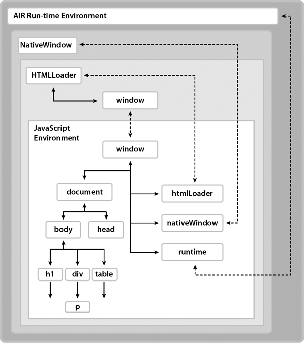

# Overview of the HTML environment

Adobe AIR provides a complete browser-like JavaScript environment with an HTML
renderer, document object model, and JavaScript interpreter. The JavaScript
environment is represented by the AIR HTMLLoader class. In HTML windows, an
HTMLLoader object contains all HTML content, and is, in turn, contained within a
NativeWindow object. In SWF content, the HTMLLoader class, which extends the
Sprite class, can be added to the display list of a stage like any other display
object. The Adobe® ActionScript® 3.0 properties of the class are described in
[Scripting the AIR HTML Container](../scripting-the-air-html-container/index.md)
and also in the
[HTMLLoader](https://airsdk.dev/reference/actionscript/3.0/flash/html/HTMLLoader.html)
class listing in the
[ActionScript 3.0 Reference for the Adobe Flash Platform](https://airsdk.dev/reference/actionscript/3.0/index.html).
In the Flex framework, the AIR HTMLLoader class is wrapped in a mx:HTML
component. The mx:HTML component extends the UIComponent class, so it can be
used directly with other Flex containers. The JavaScript environment within the
mx:HTML component is otherwise identical.

## About the JavaScript environment and its relationship to the AIR host

The following diagram illustrates the relationship between the JavaScript
environment and the AIR run-time environment. Although only a single native
window is shown, an AIR application can contain multiple windows. (And a single
window can contain multiple HTMLLoader objects.)

The JavaScript environment has its own Document and Window objects. JavaScript
code can interact with the AIR run-time environment through the runtime,
nativeWindow, and htmlLoader properties. ActionScript code can interact with the
JavaScript environment through the window _property of an HTMLLoader object,
which is a reference to the JavaScript Window object. In addition, both
ActionScript and JavaScript objects can listen for events dispatched by both AIR
and JavaScript objects._

The `runtime` property provides access to AIR API classes, allowing you to
create new AIR objects as well as access class (also called static) members. To
access an AIR API, you add the name of the class, with package, to the `runtime`
property. For example, to create a File object, you would use the statement:

    var file = new window.runtime.filesystem.File();

Note: The AIR SDK provides a JavaScript file, `AIRAliases.js`, that defines more
convenient aliases for the most commonly used AIR classes. When you import this
file, you can use the shorter form air.Class instead of
window.runtime.package.Class. For example, you could create the File object with
`new air.File()`.

The NativeWindow object provides properties for controlling the desktop window.
From within an HTML page, you can access the containing NativeWindow object with
the `window.nativeWindow` property.

The HTMLLoader object provides properties, methods, and events for controlling
how content is loaded and rendered. From within an HTML page, you can access the
parent HTMLLoader object with the `window.htmlLoader` property.

Important: Only pages installed as part of an application have the `htmlLoader`,
`nativeWindow`, or `runtime` properties and only when loaded as the top-level
document. These properties are not added when a document is loaded into a frame
or iframe. (A child document can access these properties on the parent document
as long as it is in the same security sandbox. For example, a document loaded in
a frame could access the `runtime` property of its parent with `parent.runtime`
_.)_

## About security

AIR executes all code within a security sandbox based on the domain of origin.
Application content, which is limited to content loaded from the application
installation directory, is placed into the _application_ sandbox. Access to the
run-time environment and the AIR APIs are only available to HTML and JavaScript
running within this sandbox. At the same time, most dynamic evaluation and
execution of JavaScript is blocked in the application sandbox after all handlers
for the page `load` event have returned.

You can map an application page into a non-application sandbox by loading the
page into a frame or iframe and setting the AIR-specific `sandboxRoot` and
`documentRoot` attributes of the frame. By setting the `sandboxRoot` value to an
actual remote domain, you can enable the sandboxed content to cross-script
content in that domain. Mapping pages in this way can be useful when loading and
scripting remote content, such as in a _mash-up_ application.

Another way to allow application and non-application content to cross-script
each other, and the only way to give non-application content access to AIR APIs,
is to create a _sandbox bridge_. A _parent-to-child_ bridge allows content in a
child frame, iframe, or window to access designated methods and properties
defined in the application sandbox. Conversely, a _child-to-parent_ bridge
allows application content to access designated methods and properties defined
in the sandbox of the child. Sandbox bridges are established by setting the
`parentSandboxBridge` and `childSandboxBridge` properties of the window object.
For more information, see
[HTML security in Adobe AIR](../../security/air-security/html-security-in-adobe-air.md)
and
[HTML frame and iframe elements](./html-in-air.md#html-frame-and-iframe-elements).

## About plug-ins and embedded objects

AIR supports the Adobe® Acrobat® plug-in. Users must have Acrobat or Adobe®
Reader® 8.1 (or better) to display PDF content. The HTMLLoader object provides a
property for checking whether a user's system can display PDF. SWF file content
can also be displayed within the HTML environment, but this capability is built
in to AIR and does not use an external plug-in.

No other WebKit plug-ins are supported in AIR.

More Help topics

[HTML security in Adobe AIR](../../security/air-security/html-security-in-adobe-air.md)

[HTML Sandboxes](./javascript-in-air.md#html-sandboxes)

[HTML frame and iframe elements](./html-in-air.md#html-frame-and-iframe-elements)

[JavaScript Window object](./javascript-in-air.md#javascript-window-object)

[The XMLHttpRequest object](./javascript-in-air.md#the-xmlhttprequest-object)

[Adding PDF content in AIR](../../rich-media-content/adding-pdf-content-in-air.md)
