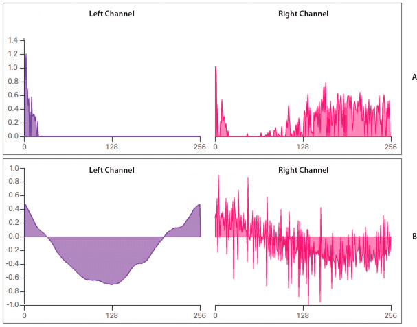
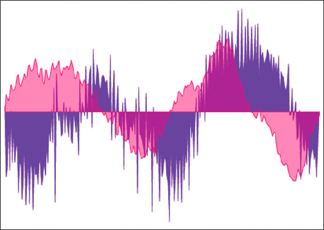

# Accessing raw sound data

The `SoundMixer.computeSpectrum()` method lets an application read the raw sound
data for the waveform that is currently being played. If more than one
SoundChannel object is currently playing the `SoundMixer.computeSpectrum()`
method shows the combined sound data of every SoundChannel object mixed
together.

The sound data is returned as a ByteArray object containing 512 bytes of data,
each of which contains a floating point value between -1 and 1. These values
represent the amplitude of the points in the sound waveform being played. The
values are delivered in two groups of 256, the first group for the left stereo
channel and the second group for the right stereo channel.

The `SoundMixer.computeSpectrum()` method returns frequency spectrum data rather
than waveform data if the `FFTMode` parameter is set to `true`. The frequency
spectrum shows amplitude arranged by sound frequency, from lowest frequency to
highest. A Fast Fourier Transform (FFT) is used to convert the waveform data
into frequency spectrum data. The resulting frequency spectrum values range from
0 to roughly 1.414 (the square root of 2).

The following diagram compares the data returned from the `computeSpectrum()`
method when the `FFTMode` parameter is set to `true` and when it is set to
`false`. The sound whose data was used for this diagram contains a loud bass
sound in the left channel and a drum hit sound in the right channel.



Values returned by the SoundMixer.computeSpectrum() method

**A.** fftMode=true

**B.** fftMode=false

The `computeSpectrum()` method can also return data that has been resampled at a
lower bit rate. Generally, this results in smoother waveform data or frequency
data at the expense of detail. The `stretchFactor` parameter controls the rate
at which the `computeSpectrum()` method data is sampled. When the
`stretchFactor` parameter is set to 0, the default, the sound data is sampled at
a rate of 44.1 kHz. The rate is halved at each successive value of the
stretchFactor parameter, so a value of 1 specifies a rate of 22.05 kHz, a value
of 2 specifies a rate of 11.025 kHz, and so on. The `computeSpectrum()` method
still returns 256 bytes per stereo channel when a higher `stretchFactor` value
is used.

The `SoundMixer.computeSpectrum()` method has some limitations:

- Because sound data from a microphone or from RTMP streams do not pass through
  the global SoundMixer object, the `SoundMixer.computeSpectrum()` method will
  not return data from those sources.

- If one or more of the sounds being played come from sources outside the
  current content sandbox, security restrictions will cause the
  `SoundMixer.computeSpectrum()` method to throw an error. For more detail about
  the security limitations of the `SoundMixer.computeSpectrum()` method please
  see
  [Security considerations when loading and playing sounds](./security-considerations-when-loading-and-playing-sounds.md)
  and
  [Accessing loaded media as data](../../security/accessing-loaded-media-as-data.md).

However, in an AIR application, content in the application security sandbox
(content installed with the AIR application) are not restricted by these
security limitations.

## Building a simple sound visualizer

The following example uses the `SoundMixer.computeSpectrum()` method to show a
chart of the sound waveform that animates with each frame:

```
import flash.display.Graphics;
import flash.events.Event;
import flash.media.Sound;
import flash.media.SoundChannel;
import flash.media.SoundMixer;
import flash.net.URLRequest;

const PLOT_HEIGHT:int = 200;
const CHANNEL_LENGTH:int = 256;

var snd:Sound = new Sound();
var req:URLRequest = new URLRequest("bigSound.mp3");
snd.load(req);

var channel:SoundChannel;
channel = snd.play();
addEventListener(Event.ENTER_FRAME, onEnterFrame);
snd.addEventListener(Event.SOUND_COMPLETE, onPlaybackComplete);

var bytes:ByteArray = new ByteArray();

function onEnterFrame(event:Event):void
{
	SoundMixer.computeSpectrum(bytes, false, 0);

	var g:Graphics = this.graphics;

	g.clear();
	g.lineStyle(0, 0x6600CC);
	g.beginFill(0x6600CC);
	g.moveTo(0, PLOT_HEIGHT);

	var n:Number = 0;

	// left channel
	for (var i:int = 0; i < CHANNEL_LENGTH; i++)
	{
		n = (bytes.readFloat() * PLOT_HEIGHT);
		g.lineTo(i * 2, PLOT_HEIGHT - n);
	}
	g.lineTo(CHANNEL_LENGTH * 2, PLOT_HEIGHT);
	g.endFill();

	// right channel
	g.lineStyle(0, 0xCC0066);
	g.beginFill(0xCC0066, 0.5);
	g.moveTo(CHANNEL_LENGTH * 2, PLOT_HEIGHT);

	for (i = CHANNEL_LENGTH; i > 0; i--)
	{
		n = (bytes.readFloat() * PLOT_HEIGHT);
		g.lineTo(i * 2, PLOT_HEIGHT - n);
	}
	g.lineTo(0, PLOT_HEIGHT);
	g.endFill();
}

function onPlaybackComplete(event:Event)
{
	removeEventListener(Event.ENTER_FRAME, onEnterFrame);
}
```

This example first loads and plays a sound file and then listens for the
`Event.ENTER_FRAME` event which will trigger the `onEnterFrame()` method while
the sound plays. The `onEnterFrame()` method starts by calling the
`SoundMixer.computeSpectrum()` method, which stores the sound wave data in the
`bytes` ByteArray object.

The sound waveform is plotted using the vector drawing API. A `for` loop cycles
through the first 256 data values, representing the left stereo channel, and
draws a line from each point to the next using the `Graphics.lineTo()` method. A
second `for` loop cycles through the next set of 256 values, plotting them in
reverse order this time, from right to left. The resulting waveform plots can
produce an interesting mirror-image effect, as shown in the following image.


