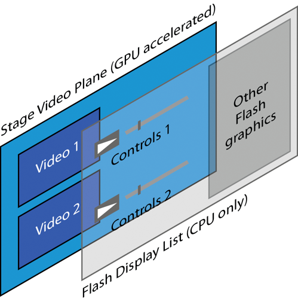

# About hardware acceleration using StageVideo

Hardware accelerated presentation—which includes video scaling, color
conversion, and blitting—enhances the performance benefits of hardware
accelerated decoding. On devices that offer GPU (hardware) acceleration, you can
use a flash.media.StageVideo object to process video directly on the device
hardware. Direct processing frees the CPU to perform other tasks while the GPU
handles video. The legacy Video class, on the other hand, typically uses
software presentation. Software presentation occurs in the CPU and can consume a
significant share of system resources.

Currently, few devices provide full GPU acceleration. However, stage video lets
applications take maximum advantage of whatever hardware acceleration is
available.

The StageVideo class does not make the Video class obsolete. Working together,
these two classes provide the optimal video display experience allowed by device
resources at any given time. Your application takes advantage of hardware
acceleration by listening to the appropriate events and switching between
StageVideo and Video as necessary.

The StageVideo class imposes certain restrictions on video usage. Before
implementing StageVideo, review the guidelines and make sure your application
can accept them. If you accept the restrictions, use the StageVideo class
whenever Flash Player detects that hardware accelerated presentation is
available. See [Guidelines and limitations](#guidelines-and-limitations).

## Parallel planes: Stage video and the Flash display list

With the stage video model, Flash Player can separate video from the display
list. Flash Player divides the composite display between two Z-ordered planes:

Stage video plane  
The stage video plane sits in the background. It displays only hardware
accelerated video. Because of this design, this plane is not available if
hardware acceleration is not supported or not available on the device. In
ActionScript, StageVideo objects handle videos played on the stage video plane.

Flash display list plane  
Flash display list entities are composited on a plane in front of the stage
video plane. Display list entities include anything that the runtime renders,
including playback controls. When hardware acceleration is not available, videos
can be played only on this plane, using the Video class object. Stage video
always displays behind Flash display list graphics.

Video display planes

The StageVideo object appears in a non-rotated, window-aligned rectangular
region of the screen. You cannot layer objects behind the stage video plane.
However, you can use the Flash display list plane to layer other graphics on top
of the stage video plane. Stage video runs concurrently with the display list.
Thus, you can use the two mechanisms together to create a unified visual effect
that uses two discreet planes. For example, you can use the front plane for
playback controls that operate on the stage video running in the background.

## Stage video and H.264 codec

In Flash Player applications, implementing video hardware acceleration involves
two steps:

1.  Encoding the video as H.264

2.  Implementing the StageVideo API

For best results, perform both steps. The H.264 codec lets you take maximum
advantage of hardware acceleration, from video decoding to presentation.

Stage video eliminates GPU-to-CPU read-back. In other words, the GPU no longer
sends decoded frames back to the CPU for compositing with display list objects.
Instead, the GPU blits decoded and rendered frames directly to the screen,
behind the display list objects. This technique reduces CPU and memory usage and
also provides better pixel fidelity.

## Guidelines and limitations

When video is running in full screen mode, stage video is always available if
the device supports hardware acceleration. Flash Player, however, also runs
within a browser. In the browser context, the `wmode` setting affects stage
video availability. Try to use `wmode="direct"` at all times if you want to use
stage video. Stage video is not compatible with other `wmode` settings when not
in full screen mode. This restriction means that, at run time, stage video can
vacillate unpredictably between being available and unavailable. For example, if
the user exits full screen mode while stage video is running, the video context
reverts to the browser. If the browser `wmode` parameter is not set to
`"direct"`, stage video can suddenly become unavailable. Flash Player
communicates playback context changes to applications through a set of events.
If you implement the StageVideo API, maintain a Video object as a backup when
stage video becomes unavailable.

Because of its direct relationship to hardware, stage video restricts some video
features. Stage video enforces the following constraints:

- For each SWF file, Flash Player limits the number of StageVideo objects that
  can concurrently display videos to four. However, the actual limit can be
  lower, depending on device hardware resources.

- The video timing is not synchronized with the timing of content that the
  runtime displays.

- The video display area can only be a rectangle. You cannot use more advanced
  display areas, such as elliptical or irregular shapes.

- You cannot rotate the video.

- You cannot bitmap cache the video or use BitmapData object to access it.

- You cannot apply filters to the video.

- You cannot apply color transforms to the video.

- You cannot apply an alpha value to the video.

- Blend modes that you apply to objects in the display list plane do not apply
  to stage video.

- You can place the video only on full pixel boundaries.

- Though GPU rendering is the best available for the given device hardware, it
  is not 100% "pixel identical" across devices. Slight variations occur due to
  driver and platform differences.

- A few devices do not support all required color spaces. For example, some
  devices do not support BT.709, the H.264 standard. In such cases, you can use
  BT.601 for fast display.

- You cannot use stage video with WMODE settings such as normal, opaque, or
  transparent. Stage video supports only `WMODE=direct` when not in full screen
  mode. WMODE has no effect in Safari 4 or higher and IE 9 or higher.

In most cases, these limitations do not affect video player applications. If you
can accept these limitations, use stage video whenever possible.

More Help topics

[Understanding video formats](./understanding-video-formats.md)

[Working with full-screen mode](../../display/display-programming/working-with-display-objects/setting-stage-properties.md#working-with-full-screen-mode)
