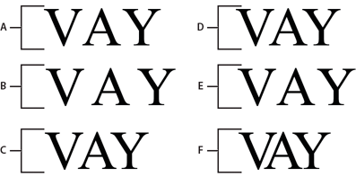

# Controlling text

FTE gives you a new set of text formatting controls to handle justification and
character spacing (kerning and tracking). There are also properties for
controlling that way lines are broken and for setting tab stops within lines.

## Justifying text

Justifying text makes all lines in a paragraph the same length by adjusting the
spacing between words and sometimes between letters. The effect is to align the
text on both sides, while the spacing between words and letters varies. Columns
of text in newspapers and magazines are frequently justified.

The `lineJustfication` property in the SpaceJustifier class allows you to
control the justification of lines in a block of text. The LineJustification
class defines constants that you can use to specify a justification option:
`ALL_BUT_LAST` justifies all but the last line of text; `ALL_INCLUDING_LAST`
justifies all text, including the last line; `UNJUSTIFIED`, which is the
default, leaves the text unjustified.

To justify text, set the `lineJustification` property to an instance of the
SpaceJustifier class and assign that instance to the `textJustifier` property of
a TextBlock instance. The following example creates a paragraph in which all but
the last line of text is justified.

    package
    {
    	import flash.text.engine.*;
    	import flash.display.Sprite;

    	public class JustifyExample extends Sprite
    	{
    		public function JustifyExample()
    		{
    			var str:String = "Lorem ipsum dolor sit amet, consectetur adipisicing elit, " +
    			"sed do eiusmod tempor incididunt ut labore et dolore magna aliqua. Ut " +
    			"enim ad minim veniam, quis nostrud exercitation ullamco laboris nisi ut " +
    			"aliquip ex ea commodo consequat.";

    			var format:ElementFormat = new ElementFormat();
    			var textElement:TextElement=new TextElement(str,format);
    			var spaceJustifier:SpaceJustifier=new SpaceJustifier("en",LineJustification.ALL_BUT_LAST);

    			var textBlock:TextBlock = new TextBlock();
    			textBlock.content=textElement;
    			textBlock.textJustifier=spaceJustifier;
    			createLines(textBlock);
    		}

    		private function createLines(textBlock:TextBlock):void {
    			var yPos=20;
    			var textLine:TextLine=textBlock.createTextLine(null,150);

    			while (textLine) {
    				addChild(textLine);
    				textLine.x=15;
    				yPos+=textLine.textHeight+2;
    				textLine.y=yPos;
    				textLine=textBlock.createTextLine(textLine,150);
    			}
    		}
    	}
    }

To vary spacing between letters as well as between words, set the
`SpaceJustifier.letterspacing` property to `true`. Turning on letterspacing can
reduce the occurrences of unsightly gaps between words, which can sometimes
occur with simple justification.

## Justifying East Asian text

Justifying East Asian text entails additional considerations. It can be written
from top to bottom and some characters, known as kinsoku, cannot appear at the
beginning or end of a line. The JustificationStyle class defines the following
constants, which specify the options for handling these characters.
`PRIORITIZE_LEAST_ADJUSTMENT` bases justification on either expanding or
compressing the line, depending on which one produces the most desirable result.
`PUSH_IN_KINSOKU` bases justification on compressing kinsoku at the end of the
line, or expanding it if no kinsoku occurs, or if that space is insufficient.

`PUSH_OUT_ONLY` bases justification on expanding the line. To create a block of
vertical Asian text, set the `TextBlock.lineRotation` property to
`TextRotation.ROTATE_90` and set the `ElementFormat.textRotation` property to
`TextRotation.AUTO`, which is the default. Setting the `textRotation` property
to `AUTO` causes the glyphs in the text to remain vertical instead of turning on
their side when the line is rotated. The `AUTO` setting rotates 90°
counter-clockwise for full width and wide glyphs only, as determined by the
Unicode properties of the glyph. The following example displays a vertical block
of Japanese text and justifies it using the `PUSH_IN_KINSOKU` option.

    package
    {
    	import flash.text.engine.*;
    	import flash.display.Stage;
    	import flash.display.Sprite;
    	import flash.system.Capabilities;

    	public class EastAsianJustifyExample extends Sprite
    	{
    		public function EastAsianJustifyExample()
    		{
    			var Japanese_txt:String = String.fromCharCode(
    			0x5185, 0x95A3, 0x5E9C, 0x304C, 0x300C, 0x653F, 0x5E9C, 0x30A4,
    			0x30F3, 0x30BF, 0x30FC, 0x30CD, 0x30C3, 0x30C8, 0x30C6, 0x30EC,
    			0x30D3, 0x300D, 0x306E, 0x52D5, 0x753B, 0x914D, 0x4FE1, 0x5411,
    			0x3051, 0x306B, 0x30A2, 0x30C9, 0x30D3, 0x30B7, 0x30B9, 0x30C6,
    			0x30E0, 0x30BA, 0x793E, 0x306E)
    			var textBlock:TextBlock = new TextBlock();
    			var font:FontDescription = new FontDescription();
    			var format:ElementFormat = new ElementFormat();
    			format.fontSize = 12;
    			format.color = 0xCC0000;
    			format.textRotation = TextRotation.AUTO;
    			textBlock.baselineZero = TextBaseline.IDEOGRAPHIC_CENTER;
    			var eastAsianJustifier:EastAsianJustifier = new EastAsianJustifier("ja", LineJustification.ALL_BUT_LAST);
    			eastAsianJustifier.justificationStyle = JustificationStyle.PUSH_IN_KINSOKU;
    			textBlock.textJustifier = eastAsianJustifier;
    			textBlock.lineRotation = TextRotation.ROTATE_90;
    			var linePosition:Number = this.stage.stageWidth - 75;
    			if (Capabilities.os.search("Mac OS") > -1)
    				// set fontName: Kozuka Mincho Pro R
    				font.fontName = String.fromCharCode(0x5C0F, 0x585A, 0x660E, 0x671D) + " Pro R";
    			else
    				font.fontName = "Kozuka Mincho Pro R";
    			textBlock.content = new TextElement(Japanese_txt, format);
    			var previousLine:TextLine = null;

    			while (true)
    			{
    				var textLine:TextLine = textBlock.createTextLine(previousLine, 200);
    				if (textLine == null)
    					break;
    				textLine.y = 20;
    				textLine.x = linePosition;
    				linePosition -= 25;
    				addChild(textLine);
    				previousLine = textLine;
    			}
    		}
    	}
    }

## Kerning and tracking

Kerning and tracking affect the distance between adjacent pairs of characters in
a text block. Kerning controls how character pairs "fit" together, such as the
pairs "WA" or "Va". Kerning is set in the `ElementFormat` object. It is enabled
by default ( `Kerning.ON`), and can be set to OFF or AUTO, in which case kerning
is only applied between characters if neither is Kanji, Hiragana, or Katakana.

Tracking adds or subtracts a set number of pixels between all characters in a
text block, and is also set in the `ElementFormat` object. It works with both
embedded and device fonts. FTE supports two tracking properties, `trackingLeft`,
which adds/subtracts pixels from the left side of a character, and
`trackingRight`, which adds/subtracts from the right side. If kerning is being
used, the tracking value is added to or subtracted from kerning values for each
character pair.

**A.** Kerning.OFF

**B.** TrackingRight=5, Kerning.OFF

**C.** TrackingRight=-5, Kerning.OFF

**D.** Kerning.ON

**E.** TrackingRight=-5, Kerning.ON

**F.** TrackingRight=-5, Kerning.ON

    var ef1:ElementFormat = new ElementFormat();
    ef1.kerning = Kerning.OFF;

    var ef2:ElementFormat = new ElementFormat();
    ef2.kerning = Kerning.ON;
    ef2.trackingLeft = 0.8;
    ef2.trackingRight = 0.8;

    var ef3:ElementFormat = new ElementFormat();
    ef3.trackingRight = -0.2;

## Line breaks for wrapped text

The `breakOpportunity` property of the `ElementFormat` object determines which
characters can be used for breaking when wrapping text is broken into multiple
lines. The default, `BreakOpportunity.AUTO`, uses standard Unicode properties,
such as breaking between words and on hyphens. Using `BreakOpportunity.ALL`
allows any character to be treated as a line break opportunity, which is useful
for creating effects like text along a path.

    var ef:ElementFormat = new ElementFormat();
    ef.breakOpportunity = BreakOpportunity.ALL;

## Tab stops

To set tab stops in a text block, define the tab stops by creating instances of
the TabStop class. The parameters to the `TabStop()` constructor specify how the
text aligns with the tab stop. These parameters specify the position of the tab
stop, and for decimal alignment, the value on which to align, expressed as a
string. Typically, this value is a decimal point but it could also be a comma, a
dollar sign, or the symbol for the Yen or the Euro, for example. The following
line of code creates a tab stop called tab1.

    var tab1:TabStop = new TabStop(TabAlignment.DECIMAL, 50, ".");

Once you've created the tab stops for a text block, assign them to the
`tabStops` property of a TextBlock instance. Because the `tabStops` property
requires a Vector, though, first create a Vector and add the tab stops to it.
The Vector allows you to assign a set of tab stops to the text block. The
following example creates a `Vector<TabStop>` instance and adds a set of TabStop
objects to it. Then it assigns the tab stops to the `tabStops` property of a
TextBlock instance.

    var tabStops:Vector.<TabStop> = new Vector.<TabStop>();
    tabStops.push(tab1, tab2, tab3, tab4);
    textBlock.tabStops = tabStops

For more information on Vectors, see
[Working with arrays](../../core-actionscript-classes/working-with-arrays/index.md).

The following example shows the effect of each of the TabStop alignment options.

    package {

    	import flash.text.engine.*;
    	import flash.display.Sprite;

    	public class TabStopExample extends Sprite
    	{
    		public function TabStopExample()
    		{
    			var format:ElementFormat = new ElementFormat();
    			format.fontDescription = new FontDescription("Arial");
    			format.fontSize = 16;

    			var tabStops:Vector.<TabStop> = new Vector.<TabStop>();
    			tabStops.push(
    				new TabStop(TabAlignment.START, 20),
    				new TabStop(TabAlignment.CENTER, 140),
    				new TabStop(TabAlignment.DECIMAL, 260, "."),
    				new TabStop(TabAlignment.END, 380));
    			var textBlock:TextBlock = new TextBlock();
    			textBlock.content = new TextElement(
    				"\tt1\tt2\tt3\tt4\n" +
    				"\tThis line aligns on 1st tab\n" +
    				"\t\t\t\tThis is the end\n" +
    				"\tThe following fragment centers on the 2nd tab:\t\t\n" +
    				"\t\tit's on me\t\t\n" +
    				"\tThe following amounts align on the decimal point:\n" +
    				"\t\t\t45.00\t\n" +
    				"\t\t\t75,320.00\t\n" +
    				"\t\t\t6,950.00\t\n" +
    				"\t\t\t7.01\t\n", format);

    			textBlock.tabStops = tabStops;
    			var yPosition:Number = 60;
    			var previousTextLine:TextLine = null;
    			var textLine:TextLine;
    			var i:int;
    			for (i = 0; i < 10; i++) {
    				textLine = textBlock.createTextLine(previousTextLine, 1000, 0);
    				textLine.x = 20;
    				textLine.y = yPosition;
    				addChild(textLine);
    				yPosition += 25;
    				previousTextLine = textLine;
    			}
    		}
    	}
    }
