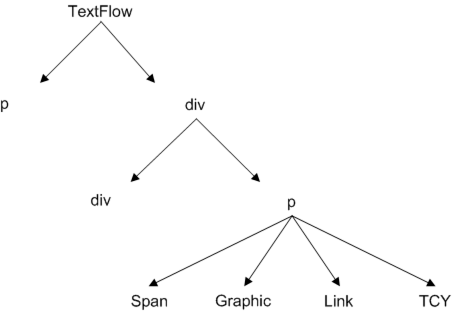

# Using the Text Layout Framework

## Overview of the Text Layout Framework

The Text Layout Framework (TLF) is an extensible ActionScript library. The TLF
is built on the text engine in Adobe® Flash® Player 10 and Adobe® AIR® 1.5. The
TLF provides advanced typographic and text layout features for innovative
typography on the web. The framework can be used with Adobe® Flex® or Adobe®
Flash® Professional. Developers can use or extend existing components, or they
can use the framework to create their own text components.

The TLF includes the following capabilities:

- Bidirectional text, vertical text, and over 30 writing scripts including
  Arabic, Hebrew, Chinese, Japanese, Korean, Thai, Lao, Vietnamese, and others

- Selection, editing, and flowing text across multiple columns and linked
  containers

- Vertical text, Tate-Chu-Yoko (horizontal within vertical text) and justifier
  for East Asian typography

- Rich typographical controls, including kerning, ligatures, typographic case,
  digit case, digit width, and discretionary hyphens

- Cut, copy, paste, undo, and standard keyboard and mouse gestures for editing

- Rich developer APIs to manipulate text content, layout, and markup and create
  custom text components

- Robust list support including custom markers and numbering formats

- Inline images and positioning rules

The TLF is an ActionScript 3.0 library built on the Flash Text Engine (FTE)
introduced in Flash Player 10. FTE can be accessed through the
`flash.text.engine` package, which is part of the Flash Player 10 Application
Programming Interface (API).

The Flash Player API, however, provides low-level access to the text engine,
which means that some tasks can require a relatively large amount of code. The
TLF encapsulates the low-level code into simpler APIs. The TLF also provides a
conceptual architecture that organizes the basic building blocks defined by FTE
into a system that is easier to use.

Unlike FTE, the TLF is not built in to Flash Player. Rather, it is an
independent component library written entirely in ActionScript 3.0. Because the
framework is extensible, it can be customized for specific environments. Both
Flash Professional and the Flex SDK include components that are based on the TLF
framework.

### Complex script support

The TLF provides complex script support. Complex script support includes the
ability to display and edit right-to-left scripts. The TLF also provides the
ability to display and edit a mixture of left-to-right and right-to-left scripts
such as Arabic and Hebrew. The framework not only supports vertical text layout
for Chinese, Japanese, and Korean, but also supports tate-chu-yoko (TCY
elements). TCY elements are blocks of horizontal text embedded into vertical
runs of text. The following scripts are supported:

- Latin (English, Spanish, French, Vietnamese, and so on)

- Greek, Cyrillic, Armenian, Georgian, and Ethiopic

- Arabic and Hebrew

- Han ideographs and Kana (Chinese, Japanese, and Korean) and Hangul Johab
  (Korean)

- Thai, Lao, and Khmer

- Devanagari, Bengali, Gurmukhi, Malayalam, Telugu, Tamil, Gujarati, Oriya,
  Kannada, and Tibetan

- Tifinagh, Yi, Cherokee, Canadian Syllabics, Deseret, Shavian, Vai, Tagalog,
  Hanunoo, Buhid, and Tagbanwa

### Using the Text Layout Framework in Flash Professional and Flex

You can use the TLF classes directly to create custom components in Flash. In
addition, Flash Professional CS5 provides a new class, fl.text.TLFTextField,
that encapsulates the TLF functionality. Use the TLFTextField class to create
text fields in ActionScript that use the advanced text display features of the
TLF. Create a TLFTextField object the same way you create a text field with the
TextField class. Then, use the `textFlow` property to assign advanced formatting
from the TLF classes.

You can also use Flash Professional to create the TLFTextField instance on the
stage using the text tool. Then you can use ActionScript to control the
formatting and layout of the text field content using the TLF classes. For more
information, see
[TLFTextField](https://help.adobe.com/en_US/FlashPlatform/reference/actionscript/3/fl/text/TLFTextField.html)
in the
[ActionScript 3.0 Reference for the Adobe Flash Platform](https://help.adobe.com/en_US/FlashPlatform/reference/actionscript/3/index.html).

If you are working in Flex, use the TLF classes. For more information, see
[Using the Text Layout Framework](#).

## Using the Text Layout Framework

If you are working in Flex or are building custom text components, use the TLF
classes. The TLF is an ActionScript 3.0 library contained entirely within the
textLayout.swc library. The TLF library contains about 100 ActionScript 3.0
classes and interfaces organized into ten packages. These packages are
subpackages of the flashx.textLayout package.

### The Text Layout Framework classes

The TLF classes can be grouped into three categories:

- Data structures and formatting classes

- Rendering classes

- User interaction classes

#### Data structures and formatting classes

The following packages contain the data structures and formatting classes for
the TLF:

- [flashx.textLayout.elements](https://help.adobe.com/en_US/FlashPlatform/reference/actionscript/3/flashx/textLayout/elements/package-detail.html)

- [flashx.textLayout.formats](https://help.adobe.com/en_US/FlashPlatform/reference/actionscript/3/flashx/textLayout/formats/package-detail.html)

- [flashx.textLayout.conversion](https://help.adobe.com/en_US/FlashPlatform/reference/actionscript/3/flashx/textLayout/conversion/package-detail.html)

The main data structure of the TLF is the text flow hierarchy, which is defined
in the elements package. Within this structure, you can assign styles and
attributes to runs of text with the formats package. You can also control how
text is imported to, and exported from, the data structure with the conversion
package.

#### Rendering classes

The following packages contain the rendering classes for the TLF:

- [flashx.textLayout.factory](https://help.adobe.com/en_US/FlashPlatform/reference/actionscript/3/flashx/textLayout/factory/package-detail.html)

- [flashx.textLayout.container](https://help.adobe.com/en_US/FlashPlatform/reference/actionscript/3/flashx/textLayout/container/package-detail.html)

- [flashx.textLayout.compose](https://help.adobe.com/en_US/FlashPlatform/reference/actionscript/3/flashx/textLayout/compose/package-detail.html)

The classes in these packages facilitate the rendering of text for display by
Flash Player. The factory package provides a simple way to display static text.
The container package includes classes and interfaces that define display
containers for dynamic text. The compose package defines techniques for
positioning and displaying dynamic text in containers.

#### User interaction classes

The following packages contain the user interaction classes for the TLF:

- [flashx.textLayout.edit](https://help.adobe.com/en_US/FlashPlatform/reference/actionscript/3/flashx/textLayout/edit/package-detail.html)

- [flashx.textLayout.operations](https://help.adobe.com/en_US/FlashPlatform/reference/actionscript/3/flashx/textLayout/operations/package-detail.html)

- [flashx.textLayout.events](https://help.adobe.com/en_US/FlashPlatform/reference/actionscript/3/flashx/textLayout/events/package-detail.html)

The edit and operations packages define classes that you can use to allow
editing of text stored in the data structures. The events package contains event
handling classes.

### General steps for creating text with the Text Layout Framework

The following steps describe the general process for creating text with the Text
Layout Format:

1.  Import formatted text into the TLF data structures. For more information,
```
see [Structuring text with TLF](#structuring-text-with-tlf) and
[Formatting text with TLF](#formatting-text-with-tlf).
```

2.  Create one or more linked display object containers for the text. For more
```
information, see
[Managing text containers with TLF](#managing-text-containers-with-tlf).
```

3.  Associate the text in the data structures with the containers and set
```
editing and scrolling options. For more information, see
[Enabling text selection, editing, and undo with TLF](#enabling-text-selection-editing-and-undo-with-tlf).
```

4.  Create an event handler to reflow the text in response to resize (or other)
```
events. For more information, see
[Event handling with TLF](#event-handling-with-tlf).
```

### Text Layout Framework example: News layout

The following example demonstrates using the TLF to lay out a simple newspaper
page. The page includes a large headline, a subhead, and a multicolumn body
section:

```
package
{
	import flash.display.Sprite;
	import flash.display.StageAlign;
	import flash.display.StageScaleMode;
	import flash.events.Event;
	import flash.geom.Rectangle;

	import flashx.textLayout.compose.StandardFlowComposer;
	import flashx.textLayout.container.ContainerController;
	import flashx.textLayout.container.ScrollPolicy;
	import flashx.textLayout.conversion.TextConverter;
	import flashx.textLayout.elements.TextFlow;
	import flashx.textLayout.formats.TextLayoutFormat;

	public class TLFNewsLayout extends Sprite
	{
		private var hTextFlow:TextFlow;
		private var headContainer:Sprite;
		private var headlineController:ContainerController;
		private var hContainerFormat:TextLayoutFormat;

		private var bTextFlow:TextFlow;
		private var bodyTextContainer:Sprite;
		private var bodyController:ContainerController;
		private var bodyTextContainerFormat:TextLayoutFormat;

		private const headlineMarkup:String = "<flow:TextFlow xmlns:flow='http://ns.adobe.com/textLayout/2008'><flow:p textAlign='center'><flow:span fontFamily='Helvetica' fontSize='18'>TLF News Layout Example</flow:span><flow:br/><flow:span fontFamily='Helvetica' fontSize='14'>This example formats text like a newspaper page with a headline, a subtitle, and multiple columns</flow:span></flow:p></flow:TextFlow>";

		private const bodyMarkup:String = "<flow:TextFlow xmlns:flow='http://ns.adobe.com/textLayout/2008' fontSize='12' textIndent='10' marginBottom='15' paddingTop='4' paddingLeft='4'><flow:p marginBottom='inherit'><flow:span>There are many </flow:span><flow:span fontStyle='italic'>such</flow:span><flow:span> lime-kilns in that tract of country, for the purpose of burning the white marble which composes a large part of the substance of the hills. Some of them, built years ago, and long deserted, with weeds growing in the vacant round of the interior, which is open to the sky, and grass and wild-flowers rooting themselves into the chinks of the stones, look already like relics of antiquity, and may yet be overspread with the lichens of centuries to come. Others, where the lime-burner still feeds his daily and nightlong fire, afford points of interest to the wanderer among the hills, who seats himself on a log of wood or a fragment of marble, to hold a chat with the solitary man. It is a lonesome, and, when the character is inclined to thought, may be an intensely thoughtful occupation; as it proved in the case of Ethan Brand, who had mused to such strange purpose, in days gone by, while the fire in this very kiln was burning.</flow:span></flow:p><flow:p marginBottom='inherit'><flow:span>The man who now watched the fire was of a different order, and troubled himself with no thoughts save the very few that were requisite to his business. At frequent intervals, he flung back the clashing weight of the iron door, and, turning his face from the insufferable glare, thrust in huge logs of oak, or stirred the immense brands with a long pole. Within the furnace were seen the curling and riotous flames, and the burning marble, almost molten with the intensity of heat; while without, the reflection of the fire quivered on the dark intricacy of the surrounding forest, and showed in the foreground a bright and ruddy little picture of the hut, the spring beside its door, the athletic and coal-begrimed figure of the lime-burner, and the half-frightened child, shrinking into the protection of his father's shadow. And when again the iron door was closed, then reappeared the tender light of the half-full moon, which vainly strove to trace out the indistinct shapes of the neighboring mountains; and, in the upper sky, there was a flitting congregation of clouds, still faintly tinged with the rosy sunset, though thus far down into the valley the sunshine had vanished long and long ago.</flow:span></flow:p></flow:TextFlow>";

		public function TLFNewsLayout()
		{
			//wait for stage to exist
			addEventListener(Event.ADDED_TO_STAGE, onAddedToStage);
		}

		private function onAddedToStage(evtObj:Event):void
		{
			removeEventListener(Event.ADDED_TO_STAGE, onAddedToStage);
			stage.scaleMode = StageScaleMode.NO_SCALE;
			stage.align = StageAlign.TOP_LEFT;

			// Headline text flow and flow composer
			hTextFlow = TextConverter.importToFlow(headlineMarkup, TextConverter.TEXT_LAYOUT_FORMAT);

			// initialize the headline container and controller objects
			headContainer = new Sprite();
			headlineController = new ContainerController(headContainer);
			headlineController.verticalScrollPolicy = ScrollPolicy.OFF;
			hContainerFormat = new TextLayoutFormat();
			hContainerFormat.paddingTop = 4;
			hContainerFormat.paddingRight = 4;
			hContainerFormat.paddingBottom = 4;
			hContainerFormat.paddingLeft = 4;

			headlineController.format = hContainerFormat;
			hTextFlow.flowComposer.addController(headlineController);
			addChild(headContainer);
			stage.addEventListener(flash.events.Event.RESIZE, resizeHandler);

			// Body text TextFlow and flow composer
			bTextFlow = TextConverter.importToFlow(bodyMarkup, TextConverter.TEXT_LAYOUT_FORMAT);

			// The body text container is below, and has three columns
			bodyTextContainer = new Sprite();
			bodyController = new ContainerController(bodyTextContainer);
			bodyTextContainerFormat = new TextLayoutFormat();
			bodyTextContainerFormat.columnCount = 3;
			bodyTextContainerFormat.columnGap = 30;

			bodyController.format = bodyTextContainerFormat;
			bTextFlow.flowComposer.addController(bodyController);
			addChild(bodyTextContainer);
			resizeHandler(null);
		}

		private function resizeHandler(event:Event):void
		{
			const verticalGap:Number = 25;
			const stagePadding:Number = 16;
			var stageWidth:Number = stage.stageWidth - stagePadding;
			var stageHeight:Number = stage.stageHeight - stagePadding;
			var headlineWidth:Number = stageWidth;
			var headlineContainerHeight:Number = stageHeight;

			// Initial compose to get height of headline after resize
			headlineController.setCompositionSize(headlineWidth,
	headlineContainerHeight);
			hTextFlow.flowComposer.compose();
			var rect:Rectangle = headlineController.getContentBounds();
			headlineContainerHeight = rect.height;

			// Resize and place headline text container
			// Call setCompositionSize() again with updated headline height
			headlineController.setCompositionSize(headlineWidth, headlineContainerHeight );
			headlineController.container.x = stagePadding / 2;
			headlineController.container.y = stagePadding / 2;
			hTextFlow.flowComposer.updateAllControllers();

			// Resize and place body text container
			var bodyContainerHeight:Number = (stageHeight - verticalGap - headlineContainerHeight);
			bodyController.format = bodyTextContainerFormat;
			bodyController.setCompositionSize(stageWidth, bodyContainerHeight );
			bodyController.container.x = (stagePadding/2);
			bodyController.container.y = (stagePadding/2) + headlineContainerHeight + verticalGap;
			bTextFlow.flowComposer.updateAllControllers();
		}
	}
}
```

The TLFNewsLayout class uses two text containers. One container displays a
headline and subhead, and the other displays three-column body text. For
simplicity, the text is hard-coded into the example as TLF Markup text. The
`headlineMarkup` variable contains both the headline and the subhead, and the
`bodyMarkup` variable contains the body text. For more information on TLF
Markup, see [Structuring text with TLF](#structuring-text-with-tlf).

After some initialization, the `onAddedToStage()` function imports the headline
text into a TextFlow object, which is the main data structure of the TLF:

```
hTextFlow = TextConverter.importToFlow(headlineMarkup, TextConverter.TEXT_LAYOUT_FORMAT);
```

Next, a Sprite object is created for the container, and a controller is created
and associated with the container:

```
headContainer = new Sprite();
headlineController = new ContainerController(headContainer);
```

The controller is initialized to set formatting, scrolling, and other options.
The controller contains geometry that defines the bounds of the container that
the text flows into. A TextLayoutFormat object contains the formatting options:

```
hContainerFormat = new TextLayoutFormat();
```

The controller is assigned to the flow composer and the function adds the
container to the display list. The actual composition and display of the
containers is deferred to the `resizeHandler()` method. The same sequence of
steps is performed to initialize the body TextFlow object.

The `resizeHandler()` method measures the space available for rendering the
containers and sizes the containers accordingly. An initial call to the
`compose()` method allows for the calculation of the proper height of the
headline container. The `resizeHandler()` method can then place and display the
headline container with the `updateAllControllers()` method. Finally, the
`resizeHandler()` method uses the size of the headline container to determine
the placement of the body text container.

## Structuring text with TLF

The TLF uses a hierarchical tree to represent text. Each node in the tree is an
instance of a class defined in the elements package. For example, the root node
of the tree is always an instance of the TextFlow class. The TextFlow class
represents an entire story of text. A story is a collection of text and other
elements that is treated as one unit, or flow. A single story can require more
than one column or text container to display.

Apart from the root node, the remaining elements are loosely based on XHTML
elements. The following diagram shows the hierarchy of the framework:



TextFlow Hierarchy

### Text Layout Framework markup

Understanding the structure of the TLF is also helpful when dealing with TLF
Markup. TLF Markup is an XML representation of text that is part of the TLF.
Although the framework also supports other XML formats, TLF Markup is unique in
that it is based specifically on the structure of the TextFlow hierarchy. If you
export XML from a TextFlow using this markup format, the XML is exported with
this hierarchy intact.

TLF Markup provides the highest fidelity representation of text in a TextFlow
hierarchy. The markup language provides tags for each of the TextFlow
hierarchy's basic elements, and also provides attributes for all formatting
properties available in the TextLayoutFormat class.

The following table contains the tags that can be used in TLF Markup.

| Element          | Description                                                                                                                              | Children                      | Class                                                                                                                                                    |
| ---------------- | ---------------------------------------------------------------------------------------------------------------------------------------- | ----------------------------- | -------------------------------------------------------------------------------------------------------------------------------------------------------- |
| textflow         | The root element of the markup.                                                                                                          | div, p                        | [TextFlow](https://help.adobe.com/en_US/FlashPlatform/reference/actionscript/3/flashx/textLayout/elements/TextFlow.html)                                 |
| div              | A division within a TextFlow. May contain a group of paragraphs.                                                                         | div, list, p                  | [DivElement](https://help.adobe.com/en_US/FlashPlatform/reference/actionscript/3/flashx/textLayout/elements/DivElement.html)                             |
| p                | A paragraph.                                                                                                                             | a, tcy, span, img, tab, br, g | [ParagraphElement](https://help.adobe.com/en_US/FlashPlatform/reference/actionscript/3/flashx/textLayout/elements/ParagraphElement.html)                 |
| a                | A link.                                                                                                                                  | tcy, span, img, tab, br, g    | [LinkElement](https://help.adobe.com/en_US/FlashPlatform/reference/actionscript/3/flashx/textLayout/elements/LinkElement.html)                           |
| tcy              | A run of horizontal text (used in a vertical TextFlow).                                                                                  | a, span, img, tab, br, g      | [TCYElement](https://help.adobe.com/en_US/FlashPlatform/reference/actionscript/3/flashx/textLayout/elements/TCYElement.html)                             |
| span             | A run of text within a paragraph.                                                                                                        |                               | [SpanElement](https://help.adobe.com/en_US/FlashPlatform/reference/actionscript/3/flashx/textLayout/elements/SpanElement.html)                           |
| img              | An image in a paragraph.                                                                                                                 |                               | [InlineGraphicElement](https://help.adobe.com/en_US/FlashPlatform/reference/actionscript/3/flashx/textLayout/elements/InlineGraphicElement.html)         |
| tab              | A tab character.                                                                                                                         |                               | [TabElement](https://help.adobe.com/en_US/FlashPlatform/reference/actionscript/3/flashx/textLayout/elements/TabElement.html)                             |
| br               | A break character. Used for ending a line within a paragraph; text continues on the next line, but remains in the same paragraph.        |                               | [BreakElement](https://help.adobe.com/en_US/FlashPlatform/reference/actionscript/3/flashx/textLayout/elements/BreakElement.html)                         |
| linkNormalFormat | Defines the formatting attributes used for links in normal state.                                                                        | TextLayoutFormat              | [TextLayoutFormat](https://help.adobe.com/en_US/FlashPlatform/reference/actionscript/3/flashx/textLayout/formats/TextLayoutFormat.html)                  |
| linkActiveFormat | Defines the formatting attributes used for links in active state, when the mouse is down on a link.                                      | TextLayoutFormat              | [TextLayoutFormat](https://help.adobe.com/en_US/FlashPlatform/reference/actionscript/3/flashx/textLayout/formats/TextLayoutFormat.html)                  |
| linkHoverFormat  | Defines the formatting attributes used for links in hover state, when the mouse is within the bounds (rolling over) a link.              | TextLayoutFormat              | [TextLayoutFormat](https://help.adobe.com/en_US/FlashPlatform/reference/actionscript/3/flashx/textLayout/formats/TextLayoutFormat.html)                  |
| li               | A list item element. Must be inside a list element.                                                                                      | div, li, list, p              | [ListItemElement](https://help.adobe.com/en_US/FlashPlatform/reference/actionscript/3/flashx/textLayout/elements/ListItemElement.html)                   |
| list             | A list. Lists can be nested, or placed adjacent to each other. Different labeling or numbering schemes can be applied to the list items. | div, li, list, p              | [ListElement](https://help.adobe.com/en_US/FlashPlatform/reference/actionscript/3/flashx/textLayout/elements/ListElement.html)                           |
| g                | A group element. Used for grouping elements in a paragraph. The lets you nest elements below the paragraph level.                        | a, tcy, span, img, tab, br, g | [SubParagraphGroupElement](https://help.adobe.com/en_US/FlashPlatform/reference/actionscript/3/flashx/textLayout/elements/SubParagraphGroupElement.html) |

### Using numbered and bulleted lists

You can use the
[ListElement](https://help.adobe.com/en_US/FlashPlatform/reference/actionscript/3/flashx/textLayout/elements/ListElement.html)
and
[ListItemElement](https://help.adobe.com/en_US/FlashPlatform/reference/actionscript/3/flashx/textLayout/elements/ListItemElement.html)
classes to add bulleted lists to your text controls. The bulleted lists can be
nested and can be customized to use different bullets (or markers) and
auto-numbering, as well as outline-style numbering.

To create lists in your text flows, use the `<list>` tag. You then use `<li>`
tags within the `<list>` tag for each list item in the list. You can customize
the appearance of the bullets by using the ListMarkerFormat class.

The following example creates simple lists:

```
<flow:list paddingRight="24" paddingLeft="24">
	<flow:li>Item 1</flow:li>
	<flow:li>Item 2</flow:li>
	<flow:li>Item 3</flow:li>
</flow:list>
```

You can nest lists within other lists, as the following example shows:

```
<flow:list paddingRight="24" paddingLeft="24">
	<flow:li>Item 1</flow:li>
	<flow:list paddingRight="24" paddingLeft="24">
		<flow:li>Item 1a</flow:li>
		<flow:li>Item 1b</flow:li>
		<flow:li>Item 1c</flow:li>
	</flow:list>
	<flow:li>Item 2</flow:li>
	<flow:li>Item 3</flow:li>
</flow:list>
```

To customize the type of marker in the list, use the `listStyleType` property of
the ListElement. This property can be any value defined by the ListStyleType
class (such as `check`, `circle`, `decimal`, and `box`). The following example
creates lists with various marker types and a custom counter increment:

```
<flow:list paddingRight="24" paddingLeft="24" listStyleType="upperAlpha">     <flow:li>upperAlpha item</flow:li>     <flow:li>another</flow:li> </flow:list> <flow:list paddingRight="24" paddingLeft="24" listStyleType="lowerAlpha">     <flow:li>lowerAlpha item</flow:li>     <flow:li>another</flow:li> </flow:list> <flow:list paddingRight="24" paddingLeft="24" listStyleType="upperRoman">     <flow:li>upperRoman item</flow:li>     <flow:li>another</flow:li> </flow:list> <flow:list paddingRight="24" paddingLeft="24" listStyleType="lowerRoman">     <flow:listMarkerFormat>         <!-- Increments the list by 2s rather than 1s. -->         <flow:ListMarkerFormat counterIncrement="ordered 2"/>     </flow:listMarkerFormat>     <flow:li>lowerRoman item</flow:li>     <flow:li>another</flow:li> </flow:list>
```

You use the
[ListMarkerFormat](https://help.adobe.com/en_US/FlashPlatform/reference/actionscript/3/flashx/textLayout/formats/ListMarkerFormat.html)
class to define the counter. In addition to defining the increment of a counter,
you can also customize the counter by resetting it with the `counterReset`
property.

You can further customize the appearance of the markers in your lists by using
the `beforeContent` and `afterContent` properties of the ListMarkerFormat. These
properties apply to content that appears before and after the content of the
marker.

The following example adds the string "XX" before the marker, and the string
"YY" after the marker:

```
<flow:list listStyleType="upperRoman" paddingLeft="36" paddingRight="24">
	<flow:listMarkerFormat>
		<flow:ListMarkerFormat fontSize="16"
			beforeContent="XX"
			afterContent="YY"
			counterIncrement="ordered -1"/>
		</flow:listMarkerFormat>
	<flow:li>Item 1</flow:li>
	<flow:li>Item 2</flow:li>
	<flow:li>Item 3</flow:li>
</flow:list>
```

The `content` property itself can define further customizations of the marker
format. The following example displays an ordered, uppercase Roman numeral
marker:

```
<flow:list listStyleType="disc" paddingLeft="96" paddingRight="24">
	<flow:listMarkerFormat>
		<flow:ListMarkerFormat fontSize="16"
			beforeContent="Section "
			content="counters(ordered,&quot;*&quot;,upperRoman)"
			afterContent=": "/>
	</flow:listMarkerFormat>
	<flow:li>Item 1</li>
	<flow:li>Item 2</li>
	<flow:li>Item 3</li>
</flow:list>
```

As the previous example shows, the `content` property can also insert a suffix:
a string that appears after the marker, but before the `afterContent`. To insert
this string when providing XML content to the flow, wrap the string in `&quote;`
HTML entities rather than quotation marks ( `"< string >"`).

### Using padding in TLF

Each
[FlowElement](https://help.adobe.com/en_US/FlashPlatform/reference/actionscript/3/flashx/textLayout/elements/FlowElement.html)
supports padding properties that you use to control the position of each
element's content area, and the space between the content areas.

The total width of an element is the sum of its content's width, plus the
`paddingLeft` and `paddingRight` properties. The total height of an element is
the sum of its content's height, plus the `paddingTop` and `paddingBottom`
properties.

The padding is the space between the border and the content. The padding
properties are `paddingBottom`, `paddingTop`, `paddingLeft`, and `paddingRight`.
Padding can be applied to the TextFlow object, as well as the following child
elements:

- div

- img

- li

- list

- p

Padding properties cannot be applied to span elements.

The following example sets padding properties on the TextFlow:

```
<flow:TextFlow version="2.0.0" xmlns:flow="http://ns.adobe.com/textLayout/2008" fontSize="14" textIndent="15" paddingTop="4" paddingLeft="4" fontFamily="Times New Roman">
```

Valid values for the padding properties are a number (in pixels), "auto", or
"inherit". The default value is "auto", which means it is calculated
automatically and set to 0, for all elements except the ListElement. For
ListElements, "auto" is 0 except on the start side of the list where the value
of the `listAutoPadding` property is used. The default value of
`listAutoPadding` is 40, which gives lists a default indent.

The padding properties do not, by default, inherit. The "auto" and "inherit"
values are constants defined by the
[FormatValue](https://help.adobe.com/en_US/FlashPlatform/reference/actionscript/3/flashx/textLayout/formats/FormatValue.html)
class.

Padding properties can be negative values.

## Formatting text with TLF

The flashx.textLayout.formats package contains interfaces and classes that allow
you to assign formats to any FlowElement in the text flow hierarchy tree. There
are two ways to apply formatting. You can assign a specific format individually
or assign a group of formats simultaneously with a special formatting object.

The ITextLayoutFormat interface contains all of the formats that can be applied
to a FlowElement. Some formats apply to an entire container or paragraph of
text, but do not logically apply to individual characters. For example, formats
such as justification and tab stops apply to whole paragraphs, but are not
applicable to individual characters.

### Assigning formats to a FlowElement with properties

You can set formats on any FlowElement through property assignment. The
FlowElement class implements the ITextLayoutFormat interface, so any subclass of
the FlowElement class must also implement that interface.

For example, the following code shows how to assign individual formats to an
instance of ParagraphElement:

```
var p:ParagraphElement = new ParagraphElement();
p.fontSize = 18;
p.fontFamily = "Arial";
```

### Assigning formats to a FlowElement with the TextLayoutFormat class

You can apply formats to a FlowElement with the TextLayoutFormat class. You use
this class to create a special formatting object that contains all of the
formatting values you want. You can then assign that object to the `format`
property of any FlowElement object. Both TextLayoutFormat and FlowElement
implement the ITextLayoutFormat interface. This arrangement ensures that both
classes contain the same format properties.

For more information, see
[TextLayoutFormat](https://help.adobe.com/en_US/FlashPlatform/reference/actionscript/3/flashx/textLayout/formats/TextLayoutFormat.html)
in the
[ActionScript 3.0 Reference for the Adobe Flash Platform](https://help.adobe.com/en_US/FlashPlatform/reference/actionscript/3/index.html).

### Format inheritance

Formats are inherited through the text flow hierarchy. If you assign an instance
of TextLayoutFormat to a FlowElement instance with children, the framework
initiates a process called a _cascade_. During a cascade, the framework
recursively examines each node in the hierarchy that inherits from your
FlowElement. It then determines whether to assign the inherited values to each
formatting property. The following rules are applied during the cascade:

1.  Property values are inherited only from an immediate ancestor (sometimes
```
called the parent).
```

2.  Property values are inherited only if a property does not already have a
```
value (that is, the value is `undefined`).
```

3.  Some attributes do not inherit values when undefined, unless the attribute's
```
value is set to "inherit" or the constant
`flashx.textLayout.formats.FormatValue.INHERIT`.
```

For example, if you set the `fontSize` value at the TextFlow level, the setting
applies to all elements in the TextFlow. In other words, the values cascade down
the text flow hierarchy. You can, however, override the value in a given element
by assigning a new value directly to the element. As a counter-example, if you
set the `backgroundColor` value for at the TextFlow level, the children of the
TextFlow do not inherit that value. The `backgroundColor` property is one that
does not inherit from its parent during a cascade. You can override this
behavior by setting the `backgroundColor` property on each child to
`flashx.textLayout.formats.FormatValue.INHERIT`.

For more information, see
[TextLayoutFormat](https://help.adobe.com/en_US/FlashPlatform/reference/actionscript/3/flashx/textLayout/formats/TextLayoutFormat.html)
in the
[ActionScript 3.0 Reference for the Adobe Flash Platform](https://help.adobe.com/en_US/FlashPlatform/reference/actionscript/3/index.html).

## Importing and exporting text with TLF

The TextConverter class in the flashx.textLayout.conversion.\* package lets you
import text to, and export text from, the TLF. Use this class if you plan to
load text at runtime instead of compiling the text into the SWF file. You can
also use this class to export text that is stored in a TextFlow instance into a
String or XML object.

Both import and export are straightforward procedures. You call either the
`export()` method or the `importToFlow()` method, both of which are part of the
TextConverter class. Both methods are static, which means that you call the
methods on the TextConverter class rather than on an instance of the
TextConverter class.

The classes in the flashx.textLayout.conversion package provide considerable
flexibility in where you choose to store your text. For example, if you store
your text in a database, you can import the text into the framework for display.
You can then use the classes in the flashx.textLayout.edit package to change the
text, and export the changed text back to your database.

For more information, see
[flashx.textLayout.conversion](https://help.adobe.com/en_US/FlashPlatform/reference/actionscript/3/flashx/textLayout/conversion/package-detail.html)
in the
[ActionScript 3.0 Reference for the Adobe Flash Platform](https://help.adobe.com/en_US/FlashPlatform/reference/actionscript/3/index.html).

## Managing text containers with TLF

Once text is stored in the TLF data structures, Flash Player can display it. The
text that is stored in the flow hierarchy must be converted into a format that
Flash Player can display. The TLF offers two ways to create display objects from
a flow. The first, more simple approach is suitable for displaying static text.
The second, more complicated approach lets you create dynamic text that can be
selected and edited. In both cases, the text is ultimately converted into
instances of the TextLine class, which is part of the flash.text.engine.\*
package in Flash Player 10.

### Creating static text

The simple approach uses the TextFlowTextLineFactory class, which can be found
in the
[flashx.textLayout.factory package](https://help.adobe.com/en_US/FlashPlatform/reference/actionscript/3/flashx/textLayout/factory/package-detail.html).
The advantage of this approach, beyond its simplicity, is that it has a smaller
memory footprint than does the FlowComposer approach. This approach is advisable
for static text that the user does not need to edit, select, or scroll.

For more information, see
[TextFlowTextLineFactory](https://help.adobe.com/en_US/FlashPlatform/reference/actionscript/3/flashx/textLayout/factory/TextFlowTextLineFactory.html)
in the
[ActionScript 3.0 Reference for the Adobe Flash Platform](https://help.adobe.com/en_US/FlashPlatform/reference/actionscript/3/index.html).

### Creating dynamic text and containers

Use a flow composer if you want to have more control over the display of text
than that provided by TextFlowTextLineFactory. For example, with a flow
composer, your users can select and edit the text. For more information, see
[Enabling text selection, editing, and undo with TLF](#enabling-text-selection-editing-and-undo-with-tlf).

A flow composer is an instance of the StandardFlowComposer class in the
[flashx.textLayout.compose package](https://help.adobe.com/en_US/FlashPlatform/reference/actionscript/3/flashx/textLayout/compose/package-detail.html).
A flow composer manages the conversion of TextFlow into TextLine instances, and
also the placement of those TextLine instances into one or more containers.


An IFlowComposer has zero or more ContainerControllers

Every TextFlow instance has a corresponding object that implements the
IFlowComposer interface. This IFlowComposer object is accessible through the
`TextFlow.flowComposer` property. You can call methods defined by the
IFlowComposer interface through this property. These methods allow you to
associate the text with one or more containers and prepare the text for display
within a container.

A container is an instance of the Sprite class, which is a subclass of the
DisplayObjectContainer class. Both of these classes are part of the Flash Player
display list API. A container is a more advanced form of the bounding rectangle
used in with TextLineFactory class. Like the bounding rectangle, a container
defines the area where TextLine instances appear. Unlike a bounding rectangle, a
container has a corresponding "controller" object. The controller manages
scrolling, composition, linking, formatting, and event handling for a container
or set of containers. Each container has a corresponding controller object that
is an instance of the ContainerController class in the
flashx.textLayout.container package.

To display text, create a controller object to manage the container and
associate it with the flow composer. Once you have the container associated,
compose the text so that it can be displayed. Accordingly, containers have two
states: composition and display. Composition is the process of converting the
text from the text flow hierarchy into TextLine instances and calculating
whether those instances fit into the container. Display is the process of
updating the Flash Player display list.

For more information, see
[IFlowComposer](https://help.adobe.com/en_US/FlashPlatform/reference/actionscript/3/flashx/textLayout/compose/IFlowComposer.html),
[StandardFlowComposer](https://help.adobe.com/en_US/FlashPlatform/reference/actionscript/3/flashx/textLayout/compose/StandardFlowComposer.html),
and
[ContainerController](https://help.adobe.com/en_US/FlashPlatform/reference/actionscript/3/flashx/textLayout/container/ContainerController.html)
in the
[ActionScript 3.0 Reference for the Adobe Flash Platform](https://help.adobe.com/en_US/FlashPlatform/reference/actionscript/3/index.html).

## Enabling text selection, editing, and undo with TLF

The ability to select or edit text is controlled at the text flow level. Every
instance of the TextFlow class has an associated interaction manager. You can
access a TextFlow object's interaction manager through the object's
`TextFlow.interactionManager` property. To enable text selection, assign an
instance of the SelectionManager class to the `interactionManager` property. To
enable both text selection and editing, assign an instance of the EditManager
class instead of an instance of the SelectionManager class. To enable undo
operations, create an instance of the UndoManager class and include it as an
argument when calling the constructor for EditManager. The UndoManager class
maintains a history of the user's most recent editing activities and lets the
user undo or redo specific edits. All three of these classes are part of the
edit package.

For more information, see
[SelectionManager](https://help.adobe.com/en_US/FlashPlatform/reference/actionscript/3/flashx/textLayout/edit/SelectionManager.html),
[EditManager](https://help.adobe.com/en_US/FlashPlatform/reference/actionscript/3/flashx/textLayout/edit/EditManager.html),
and
[UndoManager](https://help.adobe.com/en_US/FlashPlatform/reference/actionscript/3/flashx/undo/UndoManager.html)
in the
[ActionScript 3.0 Reference for the Adobe Flash Platform](https://help.adobe.com/en_US/FlashPlatform/reference/actionscript/3/index.html)

## Event handling with TLF

TextFlow objects dispatch events in many circumstances, including:

- When the text or layout changes

- Before an operation begins and after an operation completes

- When the status of a FlowElement object changes

- When a compose operation completes

For more information, see
[flashx.textLayout.events](https://help.adobe.com/en_US/FlashPlatform/reference/actionscript/3/flashx/textLayout/events/package-detail.html)
in the
[ActionScript 3.0 Reference for the Adobe Flash Platform](https://help.adobe.com/en_US/FlashPlatform/reference/actionscript/3/index.html).

## Positioning images within text

To position the
[InlineGraphicElement](https://help.adobe.com/en_US/FlashPlatform/reference/actionscript/3/flashx/textLayout/elements/InlineGraphicElement.html)
within the text, you use the following properties:

- `float` property of the InlineGraphicElement class

- `clearFloats` property of the
  [FlowElement](https://help.adobe.com/en_US/FlashPlatform/reference/actionscript/3/flashx/textLayout/elements/FlowElement.html)

The `float` property controls the placement of the graphic and the text around
it. The `clearFloats` property controls the placement of the paragraph elements
relative to the `float`.

To control the location of an image within a text element, you use the `float`
property. The following example adds an image to a paragraph and aligns it to
the left so the text wraps around the right:

```
<flow:p paragraphSpaceAfter="15" >Images in a flow are a good thing. For example, here is a float. It should show on the left: <flow:img float="left" height="50" width="19" source="../assets/bulldog.jpg"></flow:img> Don't you agree? Another sentence here. Another sentence here. Another sentence here. Another sentence here. Another sentence here. Another sentence here. Another sentence here. Another sentence here.</flow:p>
```

Valid values for the `float` property are "left", "right", "start", "end", and
"none". The Float class defines these constants. The default value is "none".

The `clearFloats` property is useful in cases where you want to adjust the
starting position of subsequent paragraphs that would normally wrap around the
image. For example, assume that you have an image that is larger than the first
paragraph. To be sure the second paragraph starts _after_ the image, set the
`clearFloats` property.

The following example uses an image that is taller than the text in the first
paragraph. To get the second paragraph to start after the image in the text
block, this example sets the `clearFloats` property on the second paragraph to
"end".

```
<flow:p paragraphSpaceAfter="15" >Here is another float, it should show up on the right: <flow:img float="right" height="50" elementHeight="200" width="19" source="../assets/bulldog.jpg"></flow:img>We'll add another paragraph that should clear past it.</flow:p><flow:p clearFloats="end" >This should appear after the previous float on the right.</flow:p>
```

Valid values for the `clearFloats` property are "left", "right", "end", "start",
"none", and "both". The
[ClearFloats](https://help.adobe.com/en_US/FlashPlatform/reference/actionscript/3/flashx/textLayout/formats/ClearFloats.html)
class defines these constants. You can also set the `clearFloats` property to
"inherit", which is a constant defined by the
[FormatValue](https://help.adobe.com/en_US/FlashPlatform/reference/actionscript/3/flashx/textLayout/formats/FormatValue.html)
class. The default value is "none".

More Help topics

["Flow" TLF markup application](http://sourceforge.net/projects/tlf.adobe/files/current/Flow.swf/download)

[TLF 2.0 Lists Markup](https://web.archive.org/web/20160126081245/http://blogs.adobe.com/tlf/2010/07/tlf-20-lists-markup.html)

[TLF 2.0 SubParagraphGroupElements and typeName](https://web.archive.org/web/20140202055559/http://blogs.adobe.com/tlf/2011/01/tlf-2-0-changes-subparagraphgroupelements-and-typename-applied-to-textfieldhtmlimporter-and-cssformatresolver.html)

[Padding changes in TLF 2.0](https://web.archive.org/web/20150118102558/http://blogs.adobe.com/tlf/2010/11/padding-changes-in-tlf-2-0.html)

[TLF FlowElement and LinkElement Events and EventMirrors](https://web.archive.org/web/20140202055554/http://blogs.adobe.com/tlf/2010/12/tlf-flowelement-linkelement-events-and-eventmirrors.html)

[TLF Floats](https://web.archive.org/web/20140203063550/http://blogs.adobe.com/tlf/2010/07/floats.html)
