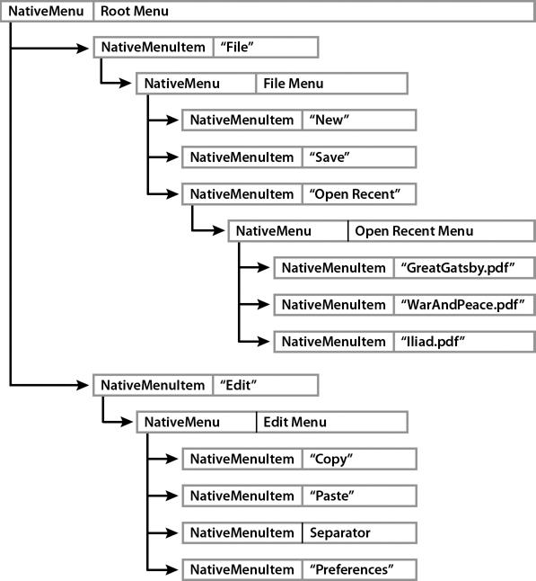

# Menu basics

For a quick explanation and code examples of creating native menus in AIR
applications, see the following quick start articles on the Adobe Developer
Connection:

- [Adding native menus to an AIR application](https://web.archive.org/web/20140309145436/http://www.adobe.com/devnet/air/flex/quickstart/articles/adding_menus.html)
  (Flex)

- [Adding native menus to an AIR application](https://web.archive.org/web/20140309145700/http://www.adobe.com/devnet/air/flash/quickstart/articles/adding_menus.html)
  (Flash)

The native menu classes allow you to access the native menu features of the
operating system on which your application is running. NativeMenu objects can be
used for application menus (available on Mac OS X), window menus (available on
Windows and Linux), context menus, and pop-up menus.

Outside of AIR, you can use the context menu classes to modify the context menu
that Flash Player automatically displays when a user right-clicks or cmd-clicks
on an object in your application. (An automatic context menu is not displayed
for AIR applications.)

## Menu classes

The menu classes include:

<table>
<thead>
    <tr>
        <th>
Package
</th>
        <th>
Classes
</th>
    </tr>
</thead>
<tbody>
    <tr>
        <td>
flash.display
</td>
        <td>
            

                <ul class="incremental">
                    <li>
                        
<a href="https://airsdk.dev/reference/actionscript/3.0/flash/display/NativeMenu.html">NativeMenu</a>

                    </li>
                    <li>
                        
<a href="https://airsdk.dev/reference/actionscript/3.0/flash/display/NativeMenuItem.html">NativeMenuItem</a>

                </li>
                </ul>
            

        </td>
    </tr>
    <tr>
        <td>
flash.ui
</td>
        <td>
            

                <ul class="incremental">
                    <li>
                        
<a href="https://airsdk.dev/reference/actionscript/3.0/flash/ui/ContextMenu.html">ContextMenu</a>

                    </li>
                    <li>
                        
<a href="https://airsdk.dev/reference/actionscript/3.0/flash/ui/ContextMenuItem.html">ContextMenuItem</a>

                    </li>
                </ul>
            

        </td>
    </tr>
    <tr>
        <td>
flash.events
</td>
        <td>
            

                <ul class="incremental">
                    <li>
                        
<a href="https://airsdk.dev/reference/actionscript/3.0/flash/events/Event.html">Event</a>

                    </li>
                    <li>
                        
<a href="https://airsdk.dev/reference/actionscript/3.0/flash/events/ContextMenuEvent.html">ContextMenuEvent</a>

                    </li>
                </ul>
            

        </td>
    </tr>
</tbody>
</table>

## Menu varieties

AIR supports the following types of menus:

Context menus  
Context menus open in response to a right-click or command-click on an
interactive object in SWF content or a document element in HTML content.

In the Flash Player runtime, a context menu is automatically displayed. You can
use the ContextMenu and ContextMenuItem classes to add your own commands to the
menu. You can also remove some, but not all, of the built-in commands.

In the AIR runtime, you can create a context menu using either the NativeMenu or
the ContextMenu class. In HTML content in AIR, you can use the Webkit HTML and
JavaScript APIs to add context menus to HTML elements.

Application menus (AIR only)  
An application menu is a global menu that applies to the entire application.
Application menus are supported on Mac OS X, but not on Windows or Linux. On Mac
OS X, the operating system automatically creates an application menu. You can
use the AIR menu API to add items and submenus to the standard menus. You can
add listeners for handling the existing menu commands. Or you can remove
existing items.

Window menus (AIR only)  
A window menu is associated with a single window and is displayed below the
title bar. Menus can be added to a window by creating a NativeMenu object and
assigning it to the `menu` property of the NativeWindow object. Window menus are
supported on the Windows and Linux operating systems, but not on Mac OS X.
Native window menus can only be used with windows that have system chrome.

Dock and system tray icon menus (AIR only)  
These icon menus are similar to context menus and are assigned to an application
icon in the Mac OS X dock or the Windows and Linux notification areas on the
taskbar. Dock and system tray icon menus use the NativeMenu class. On Mac OS X,
the items in the menu are added above the standard operating system items. On
Windows or Linux, there is no standard menu.

Pop-up menus (AIR only)  
An AIR pop-up menu is like a context menu, but is not necessarily associated
with a particular application object or component. Pop-up menus can be displayed
anywhere in a window by calling the `display()` method of any NativeMenu object.

Custom menus  
Native menus are drawn entirely by the operating system and, as such, exist
outside the Flash and HTML rendering models. Instead of using native menus, you
can always create your own custom, non-native menus using MXML, ActionScript, or
JavaScript (in AIR). Such menus must be fully rendered inside application
content.

Flex menus  
The Adobe® Flex™ framework provides a set of Flex menu components. The Flex
menus are drawn by the runtime rather than the operating system and are not
_native_ menus. A Flex menu component can be used for Flex windows that do not
have system chrome. Another benefit of using the Flex menu component is that you
can specify menus declaratively in MXML format. If you are using the Flex
Framework, use the Flex menu classes for window menus instead of the native
classes.

#### Default menus (AIR only)

The following default menus are provided by the operating system or a built-in
AIR class:

- Application menu on Mac OS X

- Dock icon menu on Mac OS X

- Context menu for selected text and images in HTML content

- Context menu for selected text in a TextField object (or an object that
  extends TextField)

## About context menus

In SWF content, any object that inherits from InteractiveObject can be given a
context menu by assigning a menu object to its `contextMenu` property. Several
commands are included by default, including Forward, Back, Print, Quality, and
Zoom. In the AIR runtime, the menu object assigned to `contextMenu` can either
be of type NativeMenu or of type ContextMenu. In the Flash Player runtime, only
the ContextMenu class is available.

You can listen for either native menu events or context menus events when using
the ContextMenu and ContextMenuItem classes; both are dispatched. One benefit
provided by the ContextMenuEvent object properties is that contextMenuOwner
identifies the object to which the menu is attached and `mouseTarget` identifies
the object that was clicked to open the menu. This information is not available
from the NativeMenuEvent object.

The following example creates a Sprite and adds a simple edit context menu:

    var sprite:Sprite = new Sprite();
    sprite.contextMenu = createContextMenu()
    private function createContextMenu():ContextMenu {
    	var editContextMenu:ContextMenu = new ContextMenu();
    	var cutItem:ContextMenuItem = new ContextMenuItem("Cut")
    	cutItem.addEventListener(ContextMenuEvent.MENU_ITEM_SELECT, doCutCommand);
    	editContextMenu.customItems.push(cutItem);

    	var copyItem:ContextMenuItem = new ContextMenuItem("Copy")
    	copyItem.addEventListener(ContextMenuEvent.MENU_ITEM_SELECT, doCopyCommand);
    	editContextMenu.customItems.push(copyItem);

    	var pasteItem:ContextMenuItem = new ContextMenuItem("Paste")
    	pasteItem.addEventListener(ContextMenuEvent.MENU_ITEM_SELECT, doPasteCommand);
    	editContextMenu.customItems.push(pasteItem);

    	return editContextMenu
    }
    private function doCutCommand(event:ContextMenuEvent):void {
        trace("cut");
    }
    private function doCopyCommand(event:ContextMenuEvent):void {
        trace("copy");
    }
    private function doPasteCommand(event:ContextMenuEvent):void {
        trace("paste");
    }

Note: In contrast to SWF content displayed in a browser environment, context
menus in AIR do not have any built-in commands.

#### Customizing a Flash Player context menu

In a browser or a projector, context menus in SWF content always have built-in
items. You can remove all of these default commands from the menu, except for
the Settings and About commands. Setting the Stage property
`showDefaultContextMenu` to `false` removes these commands from the context
menu.

To create a customized context menu for a specific display object, create a new
instance of the ContextMenu class, call the `hideBuiltInItems()` method, and
assign that instance to the `contextMenu` property of that DisplayObject
instance. The following example provides a dynamically drawn square with a
context menu command to change it to a random color:

    var square:Sprite = new Sprite();
    square.graphics.beginFill(0x000000);
    square.graphics.drawRect(0,0,100,100);
    square.graphics.endFill();
    square.x =
    square.y = 10;
    addChild(square);

    var menuItem:ContextMenuItem = new ContextMenuItem("Change Color");
    menuItem.addEventListener(ContextMenuEvent.MENU_ITEM_SELECT,changeColor);
    var customContextMenu:ContextMenu = new ContextMenu();
    customContextMenu.hideBuiltInItems();
    customContextMenu.customItems.push(menuItem);
    square.contextMenu = customContextMenu;

    function changeColor(event:ContextMenuEvent):void
    {
    	square.transform.colorTransform = getRandomColor();
    }
    function getRandomColor():ColorTransform
    {
    	return new ColorTransform(Math.random(), Math.random(), Math.random(),1,(Math.random() * 512) - 255, (Math.random() * 512) -255, (Math.random() * 512) - 255, 0);
    }

## Native menu structure (AIR)

Native menus are hierarchical in nature. NativeMenu objects contain child
NativeMenuItem objects. NativeMenuItem objects that represent submenus, in turn,
can contain NativeMenu objects. The top- or root-level menu object in the
structure represents the menu bar for application and window menus. (Context,
icon, and pop-up menus don't have a menu bar).

The following diagram illustrates the structure of a typical menu. The root menu
represents the menu bar and contains two menu items referencing a _File_ submenu
and an _Edit_ submenu. The File submenu in this structure contains two command
items and an item that references an _Open Recent Menu_ submenu, which, itself,
contains three items. The Edit submenu contains three commands and a separator.

Defining a submenu requires both a NativeMenu and a NativeMenuItem object. The
NativeMenuItem object defines the label displayed in the parent menu and allows
the user to open the submenu. The NativeMenu object serves as a container for
items in the submenu. The NativeMenuItem object references the NativeMenu object
through the NativeMenuItem `submenu` property.

To view a code example that creates this menu see
[Native menu example: Window and application menu (AIR)](./native-menu-example-window-and-application-menu-air.md).

## Menu events

NativeMenu and NativeMenuItem objects both dispatch `preparing`, `displaying`,
and `select` events:

**Preparing:** Whenever the object is about to begin a user interaction, the
menu and its menu items dispatch a `preparing` event to any registered
listeners. Interaction includes opening the menu or selecting an item with a
keyboard shortcut.

Note: The `preparing` event is available only for Adobe AIR 2.6 and later.

Displaying:  
Immediately before a menu is displayed, the menu and its menu items dispatch a
`displaying` event to any registered listeners.

The `preparing` and `displaying` events give you an opportunity to update the
menu contents or item appearance before it is shown to the user. For example, in
the listener for the `displaying` event of an "Open Recent" menu, you could
change the menu items to reflect the current list of recently viewed documents.

If you remove the menu item whose keyboard shortcut triggered a `preparing`
event, the menu interaction is effectively canceled and a `select` event is not
dispatched.

The `target` and `currentTarget` properties of the event are both the object on
which the listener is registered: either the menu itself, or one of its items.

The `preparing` event is dispatched before the `displaying` event. You typically
listen for one event or the other, not both.

Select:  
When a command item is chosen by the user, the item dispatches a `select` event
to any registered listeners. Submenu and separator items cannot be selected and
so never dispatch a `select` event.

A `select` event bubbles up from a menu item to its containing menu, on up to
the root menu. You can listen for `select` events directly on an item and you
can listen higher up in the menu structure. When you listen for the `select`
event on a menu, you can identify the selected item using the event `target`
property. As the event bubbles up through the menu hierarchy, the
`currentTarget` property of the event object identifies the current menu object.

Note: ContextMenu and ContextMenuItem objects dispatch `menuItemSelect` and
`menuSelect` events as well as `select`, `preparing`, and `displaying` events.

## Key equivalents for native menu commands (AIR)

You can assign a key equivalent (sometimes called an accelerator) to a menu
command. The menu item dispatches a `select` event to any registered listeners
when the key, or key combination is pressed. The menu containing the item must
be part of the menu of the application or the active window for the command to
be invoked.

Key equivalents have two parts, a string representing the primary key and an
array of modifier keys that must also be pressed. To assign the primary key, set
the menu item `keyEquivalent` property to the single character string for that
key. If you use an uppercase letter, the shift key is added to the modifier
array automatically.

On Mac OS X, the default modifier is the command key ( `Keyboard.COMMAND`). On
Windows and Linux, it is the control key ( `Keyboard.CONTROL`). These default
keys are automatically added to the modifier array. To assign different modifier
keys, assign a new array containing the desired key codes to the
`keyEquivalentModifiers` property. The default array is overwritten. Whether you
use the default modifiers or assign your own modifier array, the shift key is
added if the string you assign to the `keyEquivalent` property is an uppercase
letter. Constants for the key codes to use for the modifier keys are defined in
the Keyboard class.

The assigned key equivalent string is automatically displayed beside the menu
item name. The format depends on the user's operating system and system
preferences.

Note: If you assign the `Keyboard.COMMAND` value to a key modifier array on the
Windows operating system, no key equivalent is displayed in the menu. However,
the control key must be used to activate the menu command.

The following example assigns `Ctrl+Shift+G` as the key equivalent for a menu
item:

    var item:NativeMenuItem = new NativeMenuItem("Ungroup");
    item.keyEquivalent = "G";

This example assigns `Ctrl+Shift+G` as the key equivalent by setting the
modifier array directly:

    var item:NativeMenuItem = new NativeMenuItem("Ungroup");
    item.keyEquivalent = "G";
    item.keyEquivalentModifiers = [Keyboard.CONTROL];

Note: Key equivalents are only triggered for application and window menus. If
you add a key equivalent to a context or pop-up menu, the key equivalent is
displayed in the menu label, but the associated menu command is never invoked.

## Mnemonics (AIR)

Mnemonics are part of the operating system keyboard interface to menus. Linux,
Mac OS X, and Windows allow users to open menus and select commands with the
keyboard, but there are subtle differences.

On Mac OS X, the user types the first letter or two of the menu or command and
then presses the return key. The `mnemonicIndex` property is ignored.

On Windows, only a single letter is significant. By default, the significant
letter is the first character in the label, but if you assign a mnemonic to the
menu item, then the significant character becomes the designated letter. If two
items in a menu have the same significant character (whether or not a mnemonic
has been assigned), then the user's keyboard interaction with the menu changes
slightly. Instead of pressing a single letter to select the menu or command, the
user must press the letter as many times as necessary to highlight the desired
item and then press the enter key to complete the selection. To maintain a
consistent behavior, you should assign a unique mnemonic to each item in a menu
for window menus.

On Linux, no default mnemonic is provided. You must specify a value for the
`mnemonicIndex` property of a menu item to provide a mnemonic.

Specify the mnemonic character as an index into the label string. The index of
the first character in a label is 0. Thus, to use "r" as the mnemonic for a menu
item labeled, "Format," you would set the `mnemonicIndex` property equal to 2.

    var item:NativeMenuItem = new NativeMenuItem("Format");
    item.mnemonicIndex = 2;

## Menu item state

Menu items have the two state properties, `checked` and `enabled`:

checked  
Set to `true` to display a check mark next to the item label.

    var item:NativeMenuItem = new NativeMenuItem("Format");
    item.checked = true;

enabled  
Toggle the value between `true` and `false` to control whether the command is
enabled. Disabled items are visually "grayed-out" and do not dispatch `select`
events.

    var item:NativeMenuItem = new NativeMenuItem("Format");
    item.enabled = false;

## Attaching an object to a menu item

The `data` property of the NativeMenuItem class allows you to reference an
arbitrary object in each item. For example, in an "Open Recent" menu, you could
assign the File object for each document to each menu item.

    var file:File = File.applicationStorageDirectory.resolvePath("GreatGatsby.pdf")
    var menuItem:NativeMenuItem = docMenu.addItem(new NativeMenuItem(file.name));
    menuItem.data = file;

More Help topics

[About the FlexNativeMenu control](https://web.archive.org/web/20150115101918/https://help.adobe.com/en_US/Flex/4.0/UsingSDK/WSacd9bdd0c5c09f4a-690d4877120e8b878b0-7fea.html)
