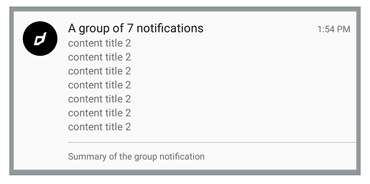
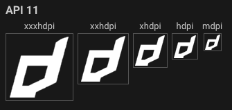

Resources are the additional files and static content that Android uses, such as bitmaps, layout definitions, user interface strings, animation instructions, and more.

They are used by native Android code in SDKs and ANEs that you may use in your application. For example, the following require custom resources:

- notification icons;
- layered application launch icons;
- Firebase configuration values;

In the past you may have created a ["Custom Resources" ANE](https://github.com/distriqt/ANE-CustomResources/), to package the resources into an extension and then included this extension in your application.

**This is no longer required!** We now have the ability to directly include resources in an AIR application.

## Resources Directory

Create a directory in your application source for storing your resources. We suggest you use `res` for the name of this directory to align with the official Android name for this directory but you can name it anything you desire.

This directory should be at the same level as your application descriptor, and your application swf when packaging your application.

eg

```
.
|____libs
  |____library.swc
|____src
  |____Application.as
  |____Application-app.xml
  |____res
|____values
  |____values.xml
```

You must include it as a packaged directory and ensure it ends up in your build directory. For example in IntelliJ, add it as a packaged directory in your module settings under the Android tab. Or if you are using `adt` directly add it as `-C . res` to the package command.

## Specify the `resdir`

Next you need to indicate to AIR that this directory is to be treated as a resource directory. To do this we add a `resdir` node to the application descriptor, just after the `android` node:

```
...
</android>
<resdir>res</resdir>
...
```

The value of this node should be the name of your resources directory.

## Creating Resources

There is no change to constructing the resources, follow the guide from whatever SDK or ANE you are using that requires the resources. Once you have created your resources you must place them in the directory you have created above in the Android resource directory structure. So you should have something like the following:

```
res
|____drawable-mdpi
  |____ic_stat_icon.png
|____drawable-hdpi
  |____ic_stat_icon.png
|____drawable-xhdpi
  |____ic_stat_icon.png
|____drawable-xxhdpi
  |____ic_stat_icon.png
|____drawable-xxxhdpi
  |____ic_stat_icon.png
|____values
  |____values.xml
```

### Notification Icons

The [Android Asset Studio](https://romannurik.github.io/AndroidAssetStudio/) is a great online resource which will convert your icon into the correct sizes and formats for an Android notification icon.

Your notification icon needs to be white(grey) and transparent and will be converted to meet these requirements if you provide something different.



To generate these goto the Android Asset Studio [Notification Icon Generator](https://romannurik.github.io/AndroidAssetStudio/icons-notification.html) and upload your source image. Make sure you change the name of the icon. You will be using this name to reference this icon in notifications.


