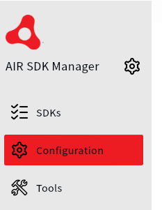
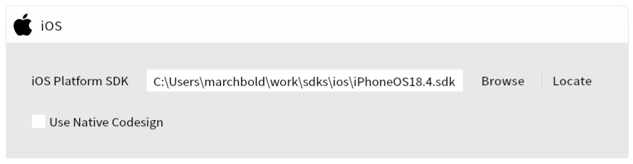

Packaging iOS applications on Windows is not supported by Apple, however, the AIR SDK has been able to get around this for a long time by creating stubs of the iOS SDK and using a specially packaged version of the open source Apple linker. 

More recently, however, this has become more difficult as Apple have made changes to their toolchain and the AIR SDK can no longer successfully package all iOS applications on Windows. This becomes more apparent when trying to package applications that use more recent iOS SDK features, frameworks or capabilities, and particularly when swift code is involved.

You may run into issues like: 

- Errors about missing symbols when packaging / linking (particularly related to swift)
- Errors about framework signatures 
- Installation verification errors when installing on device

The simplest solution to these issues is to package your iOS applications on a Mac. However if you need to package on Windows then please see the following suggestions that may help you resolve some of these issues.


## Providing an iOS SDK

The AIR SDK includes stubs of the iOS SDK to allow it to compile and link iOS applications. This may or may not include all the symbols and frameworks that your application needs.

However you can use a full version of the iOS SDK from a Mac to provide the missing symbols and frameworks.


### Obtaining the iOS SDK

You can copy the iOS SDK from a Mac that has Xcode installed. The SDKs are located in the following folder:

```
/Applications/Xcode.app/Contents/Developer/Platforms/iPhoneOS.platform/Developer/SDKs
```

You will see one or more folders named like `iPhoneOSXX.X.sdk` where `XX.X` is the version number of the SDK (e.g. `iPhoneOS18.4.sdk`).

:::note
Avoid using the generic `iPhoneOS.sdk` name as this is a symbolic link to the latest version
:::

You need to copy the entire `iPhoneOSXX.X.sdk` folder to your Windows machine. Due to the symbolic links in the SDK it is best to use a tool that can handle these correctly, such as `rsync` or `zip`. For example, you can use `zip` on the command line as below:

```
zip -r iPhoneOS18.4.sdk.zip /Applications/Xcode.app/Contents/Developer/Platforms/iPhoneOS.platform/Developer/SDKs/iPhoneOS18.4.sdk
```

:::note 
Make sure you use the actual version number of the SDK you are copying.
:::

Copy this zip file to your Windows machine and extract it to a folder where you want to keep the iOS SDK (e.g. `C:\Users\yourname\work\sdks\ios\iPhoneOS18.4.sdk`).


### Configuring the AIR SDK 

#### AIR SDK Manager

The easiest way to configure the AIR SDK to use the iOS SDK is to use the AIR SDK Manager application.

1. Open the AIR SDK Manager application
2. Select the "Configuration" tab



3. In the "iOS" section, find the "iOS Platform SDK" and either enter or browse for the path to the `iPhoneOSXX.X.sdk` folder that you extracted



4. Click "Apply" to save the configuration

Any iOS applications that you package using the AIR SDK will now use the provided iOS SDK.


#### Configuration File

You can also configure the iOS SDK by editing the `adt.cfg` file located in the `~/.airsdk` folder of your user directory.

:::note
This file is where the AIR SDK Manager saves its configuration, so if you have already configured the iOS SDK using the AIR SDK Manager then you should see the path already set in this file.
:::

Add or edit the following line to point to the path of the `iPhoneOSXX.X.sdk` folder that you copied from the Mac:


```
...

iOSPlatformSDK=C:/Users/yourname/work/sdks/ios/iPhoneOS18.4.sdk

...
```

This will configure the AIR SDK to use the provided iOS SDK for all iOS applications that you package.


#### Command line 

You can also configure a specific build command to use the iOS SDK by adding the `-platformsdk` option to your `adt` command.

```
adt -package -target 
    ... 
    -platformsdk "C:/Users/yourname/work/sdks/ios/iPhoneOS18.4.sdk" 
    ...
```

This will configure the AIR SDK to use the provided iOS SDK for this specific packaging command only.


## Installing the LLVM toolchain

:::info
A lot of issues are solved by simply providing a full iOS SDK, however some issues may still remain due to limitations in the version of the Apple linker included in the AIR SDK.
If after providing the iOS SDK you still have issues linking (for example, missing symbols when building) then you can try installing a more recent version of the LLVM toolchain for Windows.

This is not guaranteed to solve all issues, but it may help in some cases.
:::

The AIR SDK uses a custom version of the Apple linker to create iOS applications on Windows. 
This is included in the AIR SDK but it is based on an older version of the Apple toolchain and may not work with all applications.


### Installation

You can try installing a more recent version of the LLVM toolchain for Windows from here:

https://github.com/llvm/llvm-project

Download the installer executable appropriate for your system (e.g. `LLVM-15.0.7-win64.exe`) and run it to install the toolchain.

If you leave the default options selected it will install to `C:\Program Files\LLVM` and the AIR SDK will automatically find it.

However if you install it to a different location you will need to set the `LLVM_HOME` configuration in your `adt.cfg` file to point to the folder of the LLVM installation.
For example: 

```
AndroidPlatformSDK=C:/Users/yourname/work/sdks/android
iOSPlatformSDK=C:/Users/yourname/work/sdks/ios/iPhoneOS18.4.sdk
LLVM_HOME=C:/Program Files/LLVM
```

### Usage

You can confirm that the AIR SDK is using the LLVM toolchain by looking at the `adt.log` output when packaging an iOS application.
You should see something like this:

```
ld64 command line: C:/Program Files/LLVM/bin/ld64.lld.exe -pie -ObjC  ...
```

whereas if it is using the built-in linker you will see something like this (using `ld64.exe` from within the AIR SDK):

```
ld64 command line: C:\AIRSDK_51.2.2\lib\aot/bin/ld64/ld64.exe -pie -ObjC  ...
```